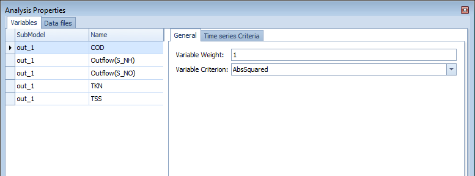
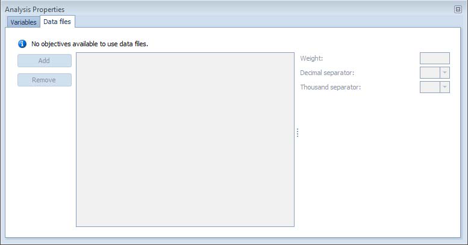
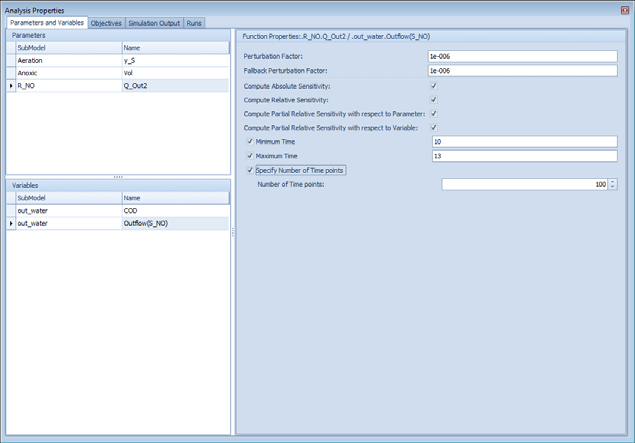
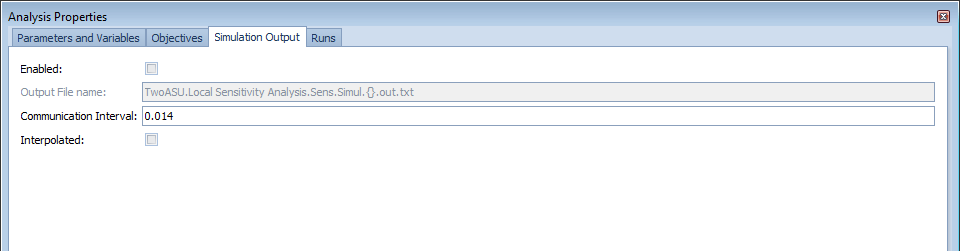

---
tags:
  - advanced-topics
  - calibration
---

# Calibration

**Summary:** Fitting WEST model parameters to measured plant data to achieve a validated model.

**Prerequisites:**

- A complete plant model with a realistic influent. See [Influent Characterisation](../technical-reference/influent-characterisation.md).
- Measured effluent and in-process data from the plant being modelled.

---

## Calibration workflow overview

1. Fix the influent characterisation before adjusting kinetic parameters.
2. Calibrate steady-state first, then dynamic.
3. Adjust only parameters with physical meaning; stay within literature ranges.
4. Validate against an independent dataset.

---

## Step 1 — Define calibration targets

Calibration targets are the measured plant variables that the model must reproduce. Selecting the right targets focuses parameter adjustment and makes it possible to detect when the model is wrong for the right reasons.

### Selecting measured data

Good calibration data has: (1) sufficient coverage of the process — effluent quality alone is insufficient; include internal measurements (MLSS, DO profiles, sludge blanket depth); (2) multiple operating conditions — ideally data spans different loads, temperatures, and control states; (3) known measurement uncertainty — assign realistic error bounds to each data point. A minimum dataset for ASM1 calibration typically includes: influent flow and COD/N fractions, effluent NH₄, NO₃, COD, TSS, at least one MLSS measurement per reactor zone, and sludge production (WAS flow × TSS).

- Assemble time-series or grab-sample data for the calibration period (typically 2–8 weeks of representative operation).
- Recommended minimum targets for a biological nutrient removal (BNR) plant:

| Variable | Location | Typical measurement frequency |
|---|---|---|
| Effluent NH₄-N | Final effluent | Daily composite |
| Effluent NO₃-N | Final effluent | Daily composite |
| Effluent TSS | Final effluent | Daily composite |
| Mixed liquor TSS (MLSS) | Aeration tank | Weekly grab |
| Effluent COD (total or filtered) | Final effluent | Daily composite |
| Reactor DO (if controlled) | Aeration tank | Continuous |

- For dynamic calibration, daily composite samples are the minimum; grab samples introduce too much variability to calibrate time-varying behaviour reliably.

### Defining the objective function

WEST's Parameter Estimation experiment type minimises a **sum of squared errors (SSE)** between simulated and measured values:

$$SSE = \sum_{i} w_i \left( y_{\text{sim},i} - y_{\text{meas},i} \right)^2$$

- Assign higher weights (`w_i`) to effluent quality variables that are critical for compliance (e.g. NH₄ and NO₃).
- Normalise weights by the measurement uncertainty or by the square of the measured mean so that variables with different magnitudes contribute comparably.
- A typical weighting scheme: NH₄ × 3, NO₃ × 2, TSS × 1.

### Measurement uncertainty

Each measurement has associated uncertainty that should be incorporated into the objective function weighting. Typical coefficients of variation (CV): flow meters 2–5 %, online sensors (DO, NH₄) 5–10 %, grab-sample lab analyses 5–15 %, composite samples 10–20 %. In WEST Parameter Estimation, set the measurement weight for each variable to 1/σ² where σ is the standard deviation of the measurement. This ensures that less certain measurements have less influence on the calibration.

- Do not expect the model to fit within instrument noise. Allow ±10–15 % relative tolerance for lab measurements and ±20 % for grab samples.
- If simulated values are consistently outside these tolerances, investigate whether the discrepancy is in the influent characterisation, the hydraulic model, or the kinetics.

---

## Step 2 — Manual parameter adjustment

Manual adjustment gives physical insight before running automated optimisation, and helps identify which parameters are sensitive.

### Parameters to adjust first

Work through parameters in this order to avoid over-fitting:

1. **Hydraulic retention time (HRT) / volume** — confirm tank volumes and flow rates match plant design. Errors here affect everything downstream.
2. **Sludge retention time (SRT)** — adjust waste sludge flow (`Q_w`) until MLSS matches. This is the most influential single parameter for biomass concentration.
3. **Yield coefficient (Y_H, Y_A)** — affects MLSS and oxygen demand. Adjust within ASM default ranges (Y_H: 0.60–0.67 g COD/g COD; Y_A: 0.24 g COD/g N).
4. **Maximum specific growth rates (µ_max, µ_A)** — controls nitrification rate and effluent NH₄. µ_A is highly temperature-sensitive; correct for in-situ temperature before adjusting.
5. **Half-saturation coefficients (K_S, K_NH)** — affects process behaviour at low substrate concentrations. Adjust only after µ_max is reasonable.
6. **Decay rates (b_H, b_A)** — affects MLSS at long SRT. Typically well-constrained by literature (b_H: 0.05–0.15 d⁻¹ at 20 °C).

### How to adjust parameters in WEST

1. Open **Block Details** for the biological reactor block.
2. Go to the **Parameters** tab.
3. Click the value of the parameter to edit it directly, or drag the parameter onto a Dashboard Sheet to create a **Slider** for interactive adjustment during a running simulation.
4. For batch adjustment of multiple parameters, use **Tools → Parameter Table** to view and edit all parameters in a spreadsheet-style table.

### Interpreting residuals

After calibration, plot model predictions vs measured data for all calibration variables. Good calibration shows: residuals (measured − predicted) scattered randomly around zero with no systematic trend; residuals within ±2σ of the measurement uncertainty for >95 % of points; no sustained bias in any variable. Systematic over- or under-prediction in a specific variable (e.g. always over-predicting NO₃) suggests a structural model issue or a missing process (e.g. incomplete denitrification in the secondary clarifier).

- Plot simulated and measured time-series on the same axes (see [Results & Output](../how-to/results-and-output.md)).
- A systematic bias (simulated always above or below measured) indicates the wrong value for a rate-controlling parameter.
- Random scatter around zero is acceptable and indicates measurement noise rather than a model structural error.
- If NH₄ is too high and NO₃ is too low, increase µ_A or check DO availability in the aerobic zone.
- If TSS is too high at steady-state, check SRT or increase b_H.

---

## Step 3 — Automated parameter estimation

WEST includes a **Parameter Estimation** experiment type that runs an optimisation algorithm to minimise the objective function defined in Step 1.

### Setting up a Parameter Estimation experiment

1. In the **Experiments** panel, click **New Experiment** → choose **Parameter Estimation**.
2. In the **Measured Data** tab, import your measured time-series (CSV format, columns: time, value). Assign each data series to the corresponding model variable.
3. In the **Parameters** tab, click **Add Parameter** and select each parameter to optimise:
   - Specify a **lower bound** and **upper bound** (use literature ranges as bounds to keep results physically meaningful).
   - Specify the **initial value** (use your manually calibrated value from Step 2 as the starting point).
4. In the **Objective Function** tab, configure weights for each measured variable.
5. In the **Optimisation Settings** tab:
   - Choose an algorithm. The default **Nelder-Mead simplex** method works well for 3–8 parameters. For larger parameter sets, use **Differential Evolution** (more robust but slower).
   - Set **maximum iterations** (500–2000 is typical) and a **convergence tolerance** (1 × 10⁻⁴ is a reasonable default).
6. Click **Run**. WEST runs repeated dynamic simulations, adjusting parameter values to reduce SSE.

### Reviewing optimisation results

- WEST displays the SSE trajectory (should decrease monotonically if converging).
- After the run, review the **estimated parameter values** — flag any that have hit their bounds, as this may indicate the model structure is wrong rather than just the parameter value.
- Compare simulated vs measured plots for each target variable before accepting results.

> **Caution:** Automated optimisation can over-fit if too many parameters are estimated simultaneously. Limit free parameters to 4–6 at a time and fix others at manually calibrated values.

### Acceptance criteria

Common quantitative acceptance criteria:

| Metric | Acceptable threshold |
|---|---|
| Mean relative error (MRE) | < 10 % for key effluent variables |
| Root mean square error (RMSE) | < 2× measurement uncertainty |
| R² (coefficient of determination) | > 0.85 for dynamic calibration |
| Mass balance closure | < 2 % error on COD, N, P |

Projects following the BIOMATH or STOWA calibration protocol use stricter criteria; always agree acceptance thresholds with the project client before starting calibration.

---

## Validation

Validation tests the calibrated model against an independent dataset — one not used during calibration. A minimum validation dataset should cover a different season or load condition from the calibration period. If the model meets the same acceptance criteria on the validation set as on the calibration set, it is considered validated. If validation fails (systematic bias), revisit the calibration: either the calibration dataset was not representative, or a structural model assumption is violated (e.g. the model assumes complete nitrification but the plant partially nitrifies in winter). Document all calibration and validation results, including the datasets used, parameters adjusted, and final goodness-of-fit metrics, as these are typically required deliverables in consulting projects.

### Procedure

1. Select an **independent dataset** — a period of measured data that was not used in calibration (typically a different season or hydraulic loading condition, at least 2–4 weeks long).
2. Without changing any calibrated parameters, set the simulation period to match the validation dataset and update the influent time-series.
3. Run the simulation and compare simulated vs measured using the same target variables as calibration.
4. Calculate SSE (or RMSE) for the validation period and compare it to the calibration period SSE. A validation SSE less than twice the calibration SSE is generally acceptable.

### Acceptance criteria

| Variable | Acceptable RMSE |
|---|---|
| Effluent NH₄-N | ≤ 1.5 mg N/L |
| Effluent NO₃-N | ≤ 2.0 mg N/L |
| Effluent TSS | ≤ 5 mg/L |

- If validation performance is significantly worse than calibration, the model may be over-fitted. Return to Step 2 and constrain parameter adjustments more tightly.
- Document the calibration and validation results (parameter values, SSE, plots) in a calibration report before using the model for design or operational decisions.

---

## Related

- [Process Models](../technical-reference/process-models.md)
- [Advanced Simulations](../manuals/advanced-simulations.md)
