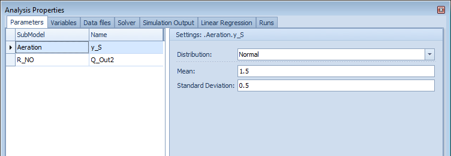
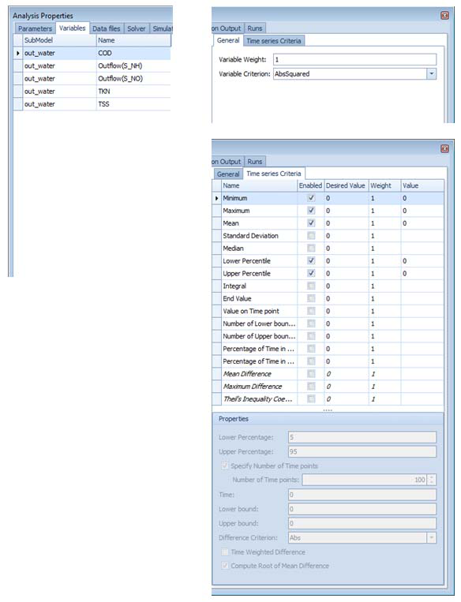

---
tags:
  - advanced-topics
  - performance
---

# Performance and Large Models

**Summary:** Keeping simulation run times manageable as plant models grow in complexity.

---

## Simulation speed factors

WEST solves a system of ordinary differential equations (ODEs) at every timestep. Run time scales with:

| Factor | Impact | Notes |
|---|---|---|
| Number of ODE states | High | Each compartment and each ASM component adds states. More tanks = more states. |
| Model complexity (ASM1 vs ASM2d vs ASM3) | High | ASM2d adds phosphorus; ASM3 adds storage polymers. Both roughly double state count vs ASM1. |
| Simulation duration | Linear | Doubling the simulated period roughly doubles run time. |
| Solver step size | High | Smaller steps = more evaluations = longer run. |
| Solver tolerance | Medium | Tighter tolerance forces smaller steps in stiff regions. |
| Output frequency | Low–Medium | Very high output frequency (every solver step) can add I/O overhead. |
| Hardware (CPU speed) | Direct | WEST uses a single CPU core per simulation run; clock speed matters more than core count. |

---

## Choosing the right solver

WEST exposes solver settings in the **Experiment Settings** dialogue (accessible from the Experiments panel).

### Explicit vs implicit solvers

| Solver type | Use case | Notes |
|---|---|---|
| **Explicit (e.g. Euler, Runge-Kutta 4)** | Fast dynamics, non-stiff systems | Simple and fast per step, but requires very small steps for stiff ODE systems (e.g. fast nitrification kinetics). Not recommended for full ASM models. |
| **Implicit (e.g. DASSL, LSODA, VODE)** | Stiff ODE systems, standard ASM models | Adapts step size automatically. Stable for stiff problems. WEST default. |
| **LSODA** | General purpose | Automatically switches between stiff and non-stiff methods. Good default choice when stiffness is uncertain. |

**Recommendation:** Use the default implicit solver (DASSL or LSODA) for all ASM-based models. Switch to an explicit method only for simple non-stiff sub-models where explicit integration is confirmed stable.

### Step size and tolerance settings

- **Maximum step size:** Limits how large a single integration step can be. Default is typically 0.01 d (≈ 15 min). For dynamic simulations driven by diurnal influent variation, set the maximum step size to ≤ 1 hour (0.042 d) to resolve diel patterns correctly.
- **Relative tolerance (`rtol`):** Default 1 × 10⁻³. Reducing to 1 × 10⁻⁴ increases accuracy but slows the run. For engineering decisions (not detailed kinetic studies), the default is usually sufficient.
- **Absolute tolerance (`atol`):** Default 1 × 10⁻⁶. Should be smaller than the smallest meaningful variable value (e.g. < 0.001 mg/L for trace nutrient components).

---

## Reducing run time

Key strategies to speed up slow simulations:

- **Increase communication interval**: A larger timestep between saved outputs reduces I/O overhead without affecting solver accuracy.
- **Remove unused output variables**: Deselect variables in Simulation → Output Configuration that you do not need.
- **Use steady-state initialisation**: Always run a steady-state simulation first and use it as the initial condition for dynamic runs (warm-start).
- **Simplify the model**: Replace detailed sub-models with simpler alternatives where precision is not required (e.g. point settler instead of 1D settler for preliminary runs).
- **Increase solver tolerances**: Loosen absolute and relative tolerances slightly (e.g. 1e-5 instead of 1e-6) for exploratory runs; tighten for final results.
- **Run on a machine with fast single-core performance**: WEST uses a single thread per simulation run; clock speed matters more than core count.

### 1. Simplify the clarifier model

Secondary clarifiers are often the most computationally expensive component. Options in order of increasing simplicity:

- **Takács 10-layer clarifier** → standard, but solves 10 coupled ODEs.
- **Takács 5-layer clarifier** → acceptable accuracy for most design work, roughly half the states.
- **Simple (1-layer) point settler** → use only for steady-state hydraulic checks or very long scenario runs where clarifier dynamics are not important.

For scenario comparisons where effluent solids are not the focus, switching from 10-layer to 5-layer can cut run time by 20–40 %.

### 2. Use steady-state initialisation

Starting a dynamic simulation from a poorly initialised state forces the solver to work through a long transient before reaching a realistic operating point.

1. Run a **Steady State** simulation first to get a converged initial condition.
2. Use **Save State** (in the Experiment Settings → Initial Conditions tab) to store the steady-state result.
3. Set the dynamic simulation's initial condition to **Load from saved state**.
4. The dynamic simulation then starts from a realistic operating point and reaches a stable diurnal pattern within 1–3 days rather than 20–30 days.

### 3. Reduce output frequency

- WEST stores output at the interval specified in **Experiment Settings → Output → Output Interval**.
- Default is often every solver step, which can generate millions of rows for a 30-day simulation.
- Set the output interval to **0.0417 d (1 hour)** or **0.0208 d (30 min)** for most dynamic simulations. This reduces file I/O without affecting solver accuracy.

### 4. Reduce the number of compartments

- More compartments improve plug-flow representation but add ODE states. As a rule of thumb, 3–5 compartments in series approximate plug-flow adequately for most biological models.
- Use 1 CSTR for completely mixed tanks; reserve 5–10 compartments for tanks where longitudinal concentration gradients are critical (e.g. step-feed or plug-flow reactors).

### 5. Shorten the warm-up period for dynamic calibration

- Use the steady-state initialisation approach above to avoid simulating many days of warm-up.
- Alternatively, save the model state after a spin-up run and re-use it across multiple parameter estimation runs, avoiding repeated long transients.

---

## Memory considerations for large models

- WEST stores in-memory time-series for all active output variables during a run. For a model with many blocks and long simulation periods, this can consume several GB of RAM.
- To reduce memory usage:
  - Deselect output variables that are not needed (in **Experiment Settings → Output**, uncheck variables from intermediate blocks).
  - Use the **Data Output** block to write specific variables to file instead of holding them in memory.
  - Close and reopen the project between long multi-scenario runs to release memory from previous results.
- Minimum recommended RAM: 8 GB. For models with more than 50 compartments or Scenario Analysis runs with 10+ scenarios, 16 GB or more is advisable.
- WEST does not parallelise individual simulation runs across CPU cores, but a **Scenario Analysis** or **Parameter Estimation** experiment can be configured to run scenarios in parallel if multiple licences are available on the same machine.

---

## Related

- [Running Simulations](../how-to/running-simulations.md)
- [Scenario Management](scenario-management.md)
- [Advanced Simulations](../manuals/advanced-simulations.md)
