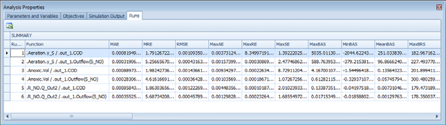
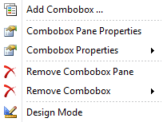
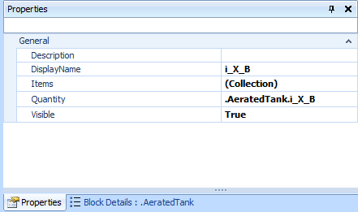

---
tags:
  - advanced-topics
---

# Scenario Management

**Summary:** Organising, running, and comparing multiple simulation scenarios in a single WEST project.

---

## What are scenarios in WEST?

A **scenario** in WEST is a named set of parameter values (and optionally a distinct process layout) stored within a single project file. Scenarios allow you to test "what-if" questions — different operating conditions, design variants, or future load projections — without duplicating the entire project.

Key distinctions:

| Concept | Description |
|---|---|
| **Layout** | The process flow diagram: which blocks are present and how they are connected. The hydraulic and process structure. |
| **Scenario** | A set of parameter values applied to a layout. Different scenarios can share the same layout but use different flow rates, kinetic parameters, controller setpoints, or influent time-series. |

A single project can hold many scenarios. For example:
- **Baseline** — current operating conditions
- **Peak load** — summer storm event influent
- **Upgrade A** — additional aeration tank volume
- **Upgrade B** — step-feed configuration

Scenarios that use a different physical configuration (e.g. an extra tank) require a separate layout; scenarios that only vary parameter values can share one layout.

---

## Creating and naming scenarios

In the Control Center, open the **Scenarios** tab. Click **Add Scenario** to create a new scenario. Give it a descriptive name (e.g. "Baseline", "High Load", "Upgraded Aeration"). Each scenario stores its own parameter values independently. Switch between scenarios using the dropdown at the top of the Control Center. Parameter values for the active scenario are highlighted in blue in the Block Details panel.

### Creating a new scenario from scratch

1. In the **Experiments** panel (left sidebar), right-click the project name → **New Scenario** (or use **Insert → New Scenario** from the menu).
2. WEST creates a scenario with default parameter values copied from the current layout defaults.
3. Double-click the scenario name to rename it. Use a descriptive name that identifies the variant (e.g. `Peak_Summer_2025`, `SRT_15d`, `Upgrade_A`).

### Copying an existing scenario

The most common workflow is to copy a calibrated baseline scenario and modify parameters:

1. Right-click an existing scenario in the Experiments panel → **Copy Scenario**.
2. WEST creates a duplicate with all parameter values from the source scenario.
3. Rename the copy and modify only the parameters relevant to the variant being tested.
4. Changes to one scenario do not affect other scenarios or the layout defaults.

### Modifying scenario parameters

1. Select the scenario in the Experiments panel to make it active (the scenario name is highlighted).
2. Open **Block Details** for any block; parameter values shown are the scenario-specific values.
3. Edit parameter values directly in Block Details, or use **Tools → Parameter Table** for a spreadsheet view of all parameters across the scenario.
4. Scenario-specific values are shown in **bold** to distinguish them from layout default values.

---

## Comparing scenarios using the Scenario Analysis experiment type

The **Scenario Analysis** experiment type runs multiple scenarios in sequence and presents their results side by side.

### Setting up a Scenario Analysis

1. In the **Experiments** panel, click **New Experiment** → choose **Scenario Analysis**.
2. In the **Scenarios** tab, click **Add** and select which scenarios to include in the comparison.
3. In the **Simulation Settings** tab, configure the simulation type (steady-state or dynamic) and duration — all selected scenarios will use the same settings.
4. In the **Output** tab, select the variables to compare (e.g. effluent NH₄, effluent NO₃, MLSS, energy demand). Add variables by clicking **Add Variable** and navigating to the relevant block and output.
5. Click **Run**. WEST executes each scenario simulation sequentially and collects results.

### Viewing comparison results

- After the run completes, the **Results** tab shows a comparison table with one column per scenario and one row per output variable (final value or time-averaged value, depending on the output type).
- Click any variable row to open a side-by-side time-series plot showing all scenarios on the same axes.
- Use **Plot Properties** to fix axis scales so that the same Y range is used for all scenarios, enabling fair visual comparison.

---

## Exporting scenario comparison results

After running all scenarios, go to **Experiment Types → Scenario Analysis**. Select the scenarios to compare and the output variables of interest. Click **Compare** to generate a side-by-side table and overlay plots. Export the comparison table with **File → Export → Scenario Comparison** — this produces a CSV with one column per scenario and one row per selected variable.

### Exporting to Excel

1. After a Scenario Analysis run, go to the **Results** tab.
2. Click **Export → Export to Excel**.
3. WEST generates a workbook with:
   - A **Summary** sheet containing the comparison table (one column per scenario, one row per variable).
   - Individual sheets for each scenario's full time-series data.
4. Choose a save location and click **Save**.

### Exporting to CSV

1. In the Results tab, right-click any plot → **Export → CSV**.
2. The exported CSV contains the time-series for the plotted variable for each scenario in separate columns, labelled with the scenario name.

### Tips for large scenario sets

- Run scenarios in batches of 5–10 to keep result files manageable.
- Use consistent naming conventions (e.g. prefixing with a date or version number) so exported files are easy to sort and identify later.
- Save the project after each Scenario Analysis run; WEST stores scenario results within the project file (`.wst`) so they can be re-examined without re-running.

---

## Related

- [Running Simulations](../how-to/running-simulations.md)
- [Results & Output](../how-to/results-and-output.md)
- [Calibration](calibration.md)
