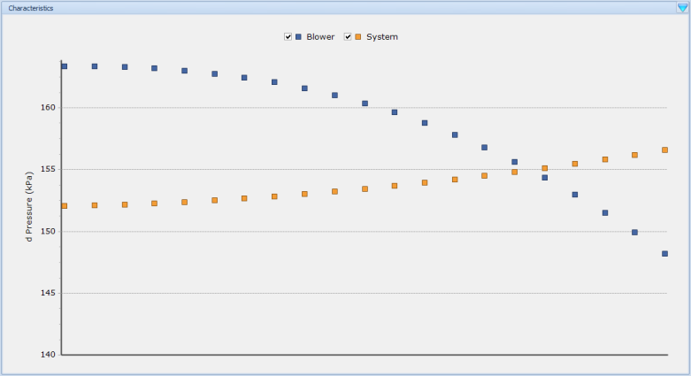
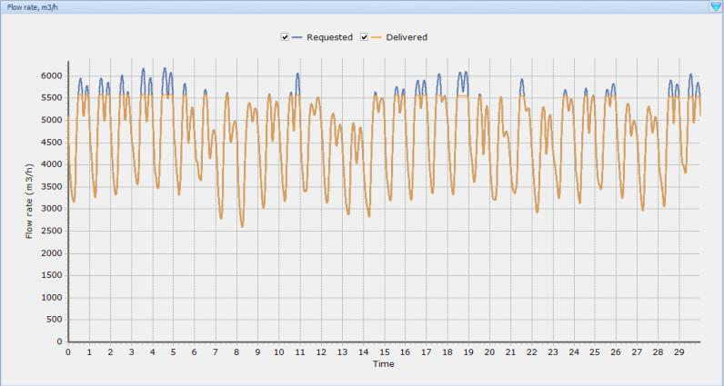
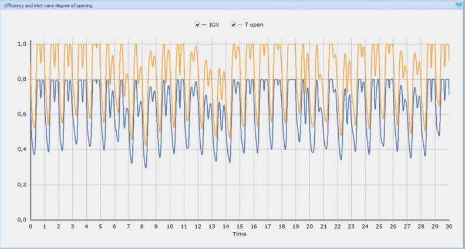
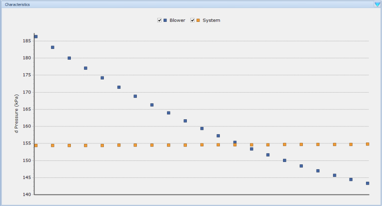
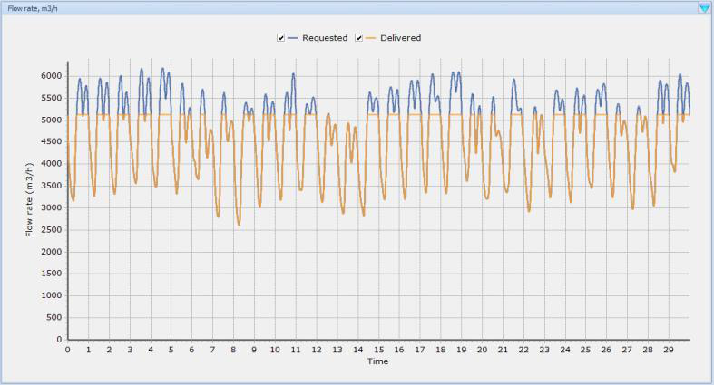
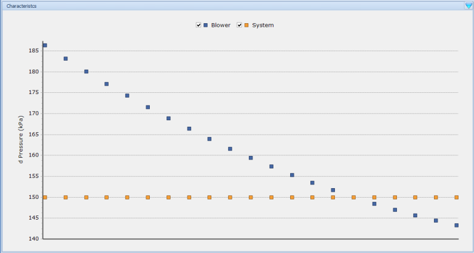
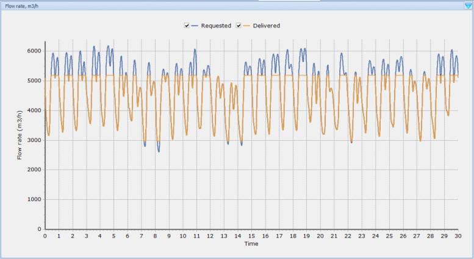

---
tags:
  - block-reference
  - bioreactors
---

# Activated Sludge Tanks

**Summary:** Reference for bioreactor block variants in the WEST model library.

**Source:** WEST Models Guide — Activated Sludge Tanks section (pp. 202–217).

---

## Overview

Activated sludge tanks are the biological reactor blocks. They implement the biological model assigned to the project Instance (ASM1, ASM2dMod, etc.).

| Model variant | Description |
|---|---|
| `VolumeConstant` | Fixed volume, single compartment — most common |
| `VolumePumped` | Volume with pump-driven outflow |
| `VolumeVariable` | Volume varies with weir overflow |
| `VolumeConstant02–10` | Multi-compartment variants (2–10 compartments) |
| `OxidationDitch.Sector` | Single sector of an oxidation ditch |
| `OxidationDitch.Ditch04 / Ditch06` | 4- or 6-sector oxidation ditch |
| `SBR_PS_R01–R08` | Sequencing Batch Reactor phases (fill, react, settle, decant) |

All variants share the same state variables and interface structure. The biological conversion model (ASM1, ASM2dMod, etc.) is set at the project Instance level.

---

## VolumeConstant

**Description:** Ideally mixed tank with constant volume. Outflow equals inflow:

$$Q_{out} = Q_{in}$$

Power consumption:

$$P_{aer} = \frac{1}{OTR} \cdot S_{O,sat} \cdot kLa \cdot V$$

$$P_{mix} = 24 \cdot E_{mix} \cdot V$$

### Parameters

| Parameter | Unit | Default | Description |
|---|---|---|---|
| Volume | m³ | 1000 | Tank working volume |
| Temperature | °C | 15 | Operating temperature |
| f_anox | — | 0 | Anoxic fraction (0 = fully aerobic) |
| KLa | d⁻¹ | 100 | Volumetric oxygen transfer coefficient |
| KLa_N2 | d⁻¹ | 0 | N₂ stripping coefficient (for denitrification gas) |
| DO_setpoint | g/m³ | 2.0 | Target DO (used if KLa is controlled) |

| Name | Description | Default | Units |
|---|---|---|---|
| `Vol` | Volume of the tank | 1000 | m³ |
| `Kla_Min` | Lowest kLa that ensures adequate mixing | 20.0 | 1/d |
| `Is_MixIfAer` | Is it actively mixed when aerated? | 0 | — |

### State Variables

Inherited from the selected biological model (ASM1, ASM2d, etc.). Common outputs available on every AST block regardless of model: DO (g O₂/m³), NH4 (g N/m³), NO3 (g N/m³), PO4 (g P/m³), TSS (g/m³), VSS (g/m³), COD_total (g/m³), BOD5 (g/m³), TN (g N/m³), TP (g P/m³), Volume (m³), HRT (d), SRT (d, plant-level).

| Name | Description | Units |
|---|---|---|
| `C` | Concentration of state components (vector) | g/m³ |
| `V` | Volume of the tank | m³ |
| `Q_In` | Influent flow rate | m³/d |
| `Q_Out` | Effluent flow rate | m³/d |
| `Kla_Actual` | Oxygen transfer coefficient | 1/d |
| `Temp_Actual` | Temperature | °C |
| `M` | Mass of state components (vector) — derived | — |

### Interface Variables

Inlet terminals: `Qin` (liquid stream, m³/d), `Qin2` (optional second inlet). Outlet terminals: `Qout` (liquid stream). Signal inputs: `KLa_control` (overrides KLa parameter when connected), `Volume_control` (for variable-volume tanks). Signal output: `DO_signal` (for connecting to a DO controller).

| Name | Terminal | Description | Default | Units |
|---|---|---|---|---|
| `Inflow` | in_1 | Inflow vector | — | g/d |
| `Outflow` | out_1 | Effluent flow (component vector) | — | g/d |
| `P_Aer` | out_2 | Power consumption for aeration | — | W |
| `P_Mix` | out_2 | Power consumption for mixing | — | W |
| `Temp` | in_2 | Temperature | 15.0 | °C |
| `T_air` | in_2 | Air temperature | 15.0 | °C |
| `Kla` | in_2 | Oxygen transfer coefficient | 50 | 1/d |
| `E_OTR` | in_2 | Oxygen Transfer Rate per unit energy | 1800.0 | g/kWh |
| `E_Mix_sp` | in_2 | Mixing energy per unit volume | 0.005 | kWh/m³/d |

---

## VolumePumped

**Description:** Ideally mixed tank where outflow is controlled by a pump. Volume can vary between `V_Min` and `V_Max`.

The outflow logic is:

- `V < V_Min`: if pump rate `Q_p > Q_in`, then `Q_out = Q_in`; otherwise `Q_out = Q_p`
- `V_Min ≤ V ≤ V_Max`: `Q_out = Q_p`
- `V > V_Max`: if `Q_p > Q_in`, then `Q_out = Q_p`; otherwise `Q_out = Q_in`

Power includes pumping:

$$P_{Pump} = E_{pump} \cdot Q_{out}$$

### Parameters

| Name | Description | Default | Units |
|---|---|---|---|
| `V_Max` | Maximum volume | 2000 | m³ |
| `V_Min` | Minimum volume | 10 | m³ |
| `Vol` | Initial volume | 1000 | m³ |
| `Kla_Min` | Lowest kLa ensuring adequate mixing | 20.0 | 1/d |
| `Is_MixIfAer` | Actively mixed when aerated? | 0 | — |

State variables and interface variables are the same as `VolumeConstant`, with an additional `E_Pump` interface input (pumping energy per unit flow, kWh/m³).

---

## VolumeVariable

**Description:** Ideally mixed tank where outflow is governed by weir overflow:

$$Q_{out} = N \cdot \alpha \cdot \left(\frac{V - V_c}{A}\right)^{\beta}$$

where:
- `α`, `β` — empirical factors for weir type/width and design
- `N` — number of weirs
- `V_c` — volume of tank below the weirs (m³)
- `A` — surface area of the tank (m²)

### Parameters

| Name | Description | Default | Units |
|---|---|---|---|
| `A` | Surface area below the weirs | 200 | m² |
| `N` | Number of weirs | 100 | — |
| `Alpha` | Empirical factor (weir type/width) | 1 | — |
| `Beta` | Empirical factor (weir design) | 1 | — |
| `Vol` | Volume of the tank (under the weir) | 2000 | m³ |
| `Kla_Min` | Lowest kLa ensuring adequate mixing | 20.0 | 1/d |
| `Is_MixIfAer` | Actively mixed when aerated? | 0 | — |

Interface variables are the same as `VolumeConstant` (power outputs in kWh/d for this variant).

---

## VolumeConstant02–10 (multi-compartment)

These variants model a tank as 2 to 10 ideally mixed compartments in series with constant volume.
Each compartment has its own volume parameter (`Vol01`, `Vol02`, …) and kLa input terminal (`kLa_01`, `kLa_02`, …).

### Example: VolumeConstant02 parameters

| Name | Description | Default | Units |
|---|---|---|---|
| `Vol01` | Volume of compartment 1 | 1000 | m³ |
| `Vol02` | Volume of compartment 2 | 1000 | m³ |

Interface inputs include a separate kLa for each compartment. There are no internal state variables at the wrapper level (each compartment is a `VolumeConstant` internally).

Use multi-compartment variants to represent plug-flow-like behaviour without adding separate blocks in the layout.

---

## Biofilm models

WEST also includes biofilm reactor blocks for attached-growth processes:

| Model | Process |
|---|---|
| `Filter1D` | 1D biofilm filter |
| `MBBR` | Moving Bed Biofilm Reactor |
| `GranuleCSTR` | Granular sludge CSTR |
| `MABR` | Membrane Aerated Biofilm Reactor |
| `FBBR` | Fixed Bed Biofilm Reactor |

See Models Guide pp. 254–265 for full parameter tables.

---

## Related

- [Biological Models](biological-models.md)
- [Aeration](aeration.md)
- [Controllers & Timers](controllers-timers.md)
