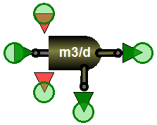

---
tags:
  - block-reference
  - advanced
---

# Advanced Processes

**Summary:** Chemical dosing, disinfection, energy, catchment, cost, anaerobic digestion, membrane bioreactors, granular sludge, and other specialised blocks.

**Source:** WEST Models Guide — various sections.

---

## Chemical dosing

| Model | Chemical | Purpose |
|---|---|---|
| `Dose_Acetate` | Acetate | Carbon source for denitrification |
| `Dose_Ethanol` | Ethanol | Carbon source |
| `Dose_Methanol` | Methanol | Carbon source |
| `Dose_Alum` | Alum (Al₂(SO₄)₃) | Chemical P-precipitation |
| `Dose_FeOH` | Iron hydroxide | P-precipitation |
| `Dose_FeCl3` | Ferric chloride | P-precipitation |
| `Dose_Fe2SO4` | Ferrous sulphate | P-precipitation |

---

## Screening & grit removal

| Model | Description |
|---|---|
| `Screening.Screen_Ideal` | Ideal bar screen (removes rags, large solids) |
| `GritRemoval.Grit_Ideal` | Ideal grit chamber |

---

## Buffer tanks

Used for flow equalisation:

| Model | Description |
|---|---|
| `Tanks_Buffer.VolumeConstant` | Fixed-volume buffer |
| `Tanks_Buffer.VolumePumped` | Buffer with pump drainage |
| `Tanks_Buffer.StormTank` | Storm overflow tank |

---

## Disinfection

| Model | Agent |
|---|---|
| `Disinfection.Chlorine` | Chlorination |
| `Disinfection.ChlorineInv` | Chlorination with inactivation |
| `Disinfection.PAA_02` | Peracetic acid |
| `Disinfection.UV` | UV disinfection |

---

## Quaternary treatment

| Model | Description |
|---|---|
| `GAC_01bed` | Granular activated carbon (single bed) |
| `CarbonActive.Default` | Generic activated carbon |
| `GAC_10beds` | 10-bed GAC system |

---

## Anaerobic digestion (ADM1-based)

WEST implements the IWA Anaerobic Digestion Model No. 1 (ADM1) for sludge stabilisation and biogas production modelling.

### Available blocks

| Model | Description |
|---|---|
| `AnaerobicDigester.ADM1` | Single-stage continuously stirred anaerobic digester using the full ADM1 formulation. |
| `AnaerobicDigester.ADM1_2stage` | Two-stage digester (hydrolysis/acidogenesis tank + methanogenesis tank) for improved biogas yield modelling. |
| `AnaerobicDigester.ADM1_Temperature` | ADM1 digester with explicit temperature correction factors for mesophilic (35 °C) or thermophilic (55 °C) operation. |
| `Biogas.GasHolder` | Gas holder for accumulation and flow-smoothing of digester biogas. |
| `Biogas.CHP_Simple` | Simple combined heat and power (CHP) unit that converts biogas to electricity and heat with fixed efficiencies. |

### Key ADM1 state variables

| Category | State variables |
|---|---|
| Soluble substrates | `S_su` (monosaccharides), `S_aa` (amino acids), `S_fa` (long-chain fatty acids), `S_va`, `S_bu`, `S_pro`, `S_ac` (volatile fatty acids), `S_h2`, `S_ch4` |
| Particulate substrates | `X_c` (composites), `X_ch` (carbohydrates), `X_pr` (proteins), `X_li` (lipids) |
| Biomass | `X_su`, `X_aa`, `X_fa`, `X_c4`, `X_pro`, `X_ac`, `X_h2` (seven trophic groups) |
| Gas phase | `S_gas_h2`, `S_gas_ch4`, `S_gas_co2` |
| Ion balance | `S_IC` (inorganic carbon), `S_IN` (inorganic nitrogen), `S_cat`, `S_an` |

### Key ADM1 parameters

| Parameter | Typical value | Description |
|---|---|---|
| `T_op` | 35 °C | Operating temperature |
| `V_liq` | design-specific | Liquid volume of digester (m³) |
| `V_gas` | ~10–15% of V_liq | Headspace gas volume (m³) |
| `f_dis` | 0.5 | Fraction of composite disintegrated to carbohydrates/proteins/lipids |
| `k_dis` | 0.5 d⁻¹ | Disintegration rate constant |
| `K_S_ac` | 0.15 g COD/l | Half-saturation constant for aceticlastic methanogens |

!!! tip
    Connect an ASM–ADM1 interface block (`Interface.ASM2d_ADM1` or `Interface.ASM1_ADM1`) between your biological treatment layout and the ADM1 digester to convert ASM state variables to ADM1 inputs automatically.

---

## Membrane bioreactors (MBR)

MBR blocks replace the secondary clarifier with a membrane filtration unit, enabling higher MLSS operation and superior effluent quality.

### Available blocks

| Model | Description |
|---|---|
| `MBR.SubmergedMembrane` | Submerged hollow-fibre or flat-sheet membrane tank. Models permeate flux, transmembrane pressure (TMP), and fouling resistance. |
| `MBR.SideStreamMembrane` | External cross-flow membrane module. Higher energy consumption but simpler fouling management. |
| `MBR.FoulingModel_Simple` | Empirical fouling model linked to a membrane block; tracks irreversible and reversible fouling resistance over time. |

### Key MBR parameters

| Parameter | Typical value | Description |
|---|---|---|
| `A_mem` | 500–5 000 m² | Total membrane area |
| `J_design` | 15–25 l/(m²·h) | Design permeate flux |
| `TMP_max` | 0.3–0.5 bar | Maximum allowable transmembrane pressure |
| `R_m` | 1×10¹² m⁻¹ | Clean membrane resistance |
| `f_backwash` | 0.1 | Fraction of permeate used for backwashing |

!!! note
    MBR blocks use the same biological model instance (ASM1, ASM2d, etc.) as the upstream bioreactor blocks. No interface conversion is needed within the aerobic zone.

---

## Granular sludge and MBBR

### Aerobic granular sludge (AGS)

| Model | Description |
|---|---|
| `GranularSludge.AGS_SBR` | Sequencing batch reactor (SBR) implementing the aerobic granular sludge process (e.g. Nereda®-type). Alternates fill, aeration, and draw phases; granule formation is represented through a simplified granule-size distribution. |
| `GranularSludge.AGS_Continuous` | Continuous-flow AGS reactor for configurations that achieve granulation under continuous feeding. |

### Moving bed biofilm reactor (MBBR) and integrated fixed-film activated sludge (IFAS)

| Model | Description |
|---|---|
| `Biofilm.MBBR` | MBBR with plastic carrier media. Biofilm kinetics are described by a simplified 1D biofilm model coupled to the bulk liquid ASM reactions. Key parameters: carrier fill fraction (`f_carrier`, typically 0.3–0.6), biofilm thickness (`L_f`), and specific surface area (`a_f`, m²/m³). |
| `Biofilm.IFAS` | Combined suspended-growth and attached-growth reactor (IFAS). Carriers are retained in an ASM bioreactor; the model accounts for both bulk suspended biomass and biofilm biomass simultaneously. |

### Key granular/MBBR parameters

| Parameter | Description |
|---|---|
| `f_carrier` | Volume fraction of reactor occupied by carrier media (MBBR/IFAS) |
| `a_specific` | Specific surface area of carrier (m² per m³ of carrier volume) |
| `L_f` | Biofilm thickness (m); determines diffusion limitations |
| `D_gran` | Granule diameter (m) for AGS diffusion calculations |
| `SBR_cycle` | Duration of one SBR cycle (h) for AGS-SBR |

---

## Energy & heat exchange

| Model | Description |
|---|---|
| `HeatExchanger.Simple` | Simple heat exchanger |
| `HeatExchanger.SludgeRaw` | Raw sludge heat recovery |
| `HeatExchanger.SludgeRecirc` | Recirculation heat exchanger |
| `HeatExchanger.HeatPump` | Heat pump |
| `Energy.SolarPV_Simple` | Solar PV power generation |
| `Energy.Wind_Simple` | Wind power generation |

---

## Cost calculators

| Model | Description |
|---|---|
| `CostCalculators.Operation_Simple` | Simple operational cost (energy + chemicals) |
| `CostCalculators.Operation_wCFootprint` | Cost with carbon footprint |

---

## Catchment and sewer (IUWS)

For integrated urban water system models (Tutorial ch 15):

| Category | Models |
|---|---|
| Generators | `DWF2` (dry weather flow), `Calc_Evaporation`, `Runoff` |
| Catchment | `Combined_NoVol`, `Combined_WithVol` |
| Sewer Tank | `Freeflow`, `Runoff2`, `Retention_NoVol` |

---

## Related

- [Worked Examples — IUWS](../worked-examples/iuws.md)
- [Sludge Treatment](sludge-treatment.md)
