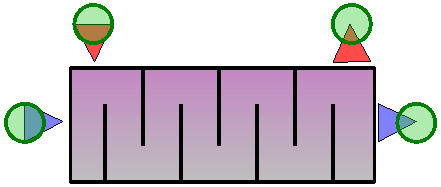
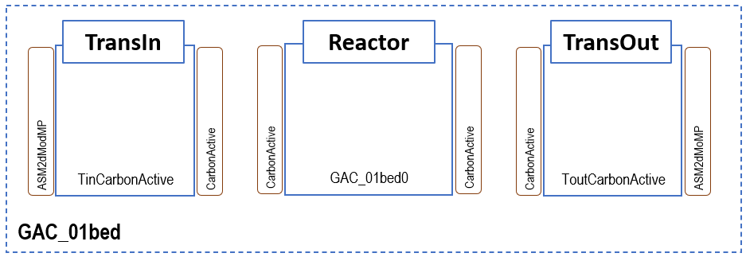
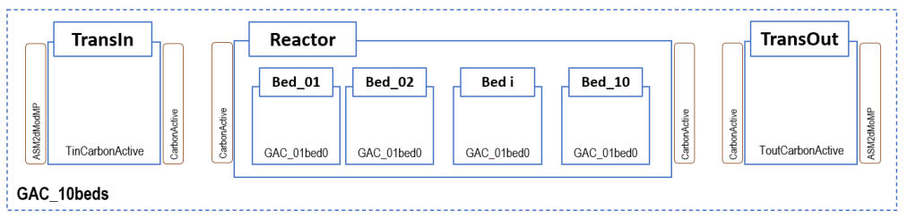

---
tags:
  - block-reference
  - advanced
---

# Advanced Processes

**Summary:** Chemical dosing, disinfection, energy, catchment, cost, anaerobic digestion, membrane bioreactors, granular sludge, and other specialised blocks.

**Source:** WEST Models Guide — various sections.

---

## Chemical dosing

WEST includes chemical dosing blocks for coagulation (FeCl₃, Al₂(SO₄)₃), precipitation, and pH adjustment. Blocks accept a dose rate signal (mg/L or g/d) and compute the resulting change in component concentrations using stoichiometric relationships. Commonly used upstream of clarifiers or for phosphorus removal.

| Model | Chemical | Purpose |
|---|---|---|
| `Dose_Acetate` | Acetate | Carbon source for denitrification |
| `Dose_Ethanol` | Ethanol | Carbon source |
| `Dose_Methanol` | Methanol | Carbon source |
| `Dose_Alum` | Alum (Al₂(SO₄)₃) | Chemical P-precipitation |
| `Dose_FeOH` | Iron hydroxide | P-precipitation |
| `Dose_FeCl3` | Ferric chloride | P-precipitation |
| `Dose_Fe2SO4` | Ferrous sulphate | P-precipitation |

---

## Screening & grit removal

Headworks blocks model physical pre-treatment. The Screening block removes a user-defined fraction of TSS and large solids; the Grit block settles inorganic grit based on a removal efficiency parameter. Both are typically used at the start of a plant layout to condition influent before biological treatment.

| Model | Description |
|---|---|
| `Screening.Screen_Ideal` | Ideal bar screen (removes rags, large solids) |
| `GritRemoval.Grit_Ideal` | Ideal grit chamber |

---

## Buffer tanks

Used for flow equalisation:

| Model | Description |
|---|---|
| `Tanks_Buffer.VolumeConstant` | Fixed-volume buffer |
| `Tanks_Buffer.VolumePumped` | Buffer with pump drainage |
| `Tanks_Buffer.StormTank` | Storm overflow tank |

---

## Disinfection

The Disinfection block applies a first-order or CT (concentration × time) model to estimate pathogen or indicator organism removal. Parameters: disinfectant dose (mg/L), contact time (min), CT₁₀ value, temperature correction. Used for UV, chlorination, and ozonation scenarios.

| Model | Agent |
|---|---|
| `Disinfection.Chlorine` | Chlorination |
| `Disinfection.ChlorineInv` | Chlorination with inactivation |
| `Disinfection.PAA_02` | Peracetic acid |
| `Disinfection.UV` | UV disinfection |

---

## Quaternary treatment

Quaternary treatment blocks model advanced polishing steps beyond secondary and tertiary treatment: micropollutant removal by ozonation, advanced oxidation processes (AOPs), and ion exchange. Parameters depend on the specific block; typically include removal rate constants for target compounds.

| Model | Description |
|---|---|
| `GAC_01bed` | Granular activated carbon (single bed) |
| `CarbonActive.Default` | Generic activated carbon |
| `GAC_10beds` | 10-bed GAC system |

---

## Tertiary Treatment and GAC

Tertiary treatment blocks model polishing steps applied after secondary clarification to meet stringent effluent quality standards or prepare water for reuse. Granular Activated Carbon (GAC) adsorption is the primary tertiary process block in WEST, targeting residual micropollutants, trace organics (pharmaceuticals, pesticides, endocrine disruptors), colour, and odour compounds that are not removed by biological treatment. The GAC model uses a simplified equilibrium-kinetic adsorption approach based on Freundlich isotherm parameters, combined with a hydraulic residence time determined by the empty-bed contact time (EBCT). Carbon capacity decreases over time as the bed approaches exhaustion, and the model tracks the cumulative adsorbed mass to signal when regeneration or replacement is required. GAC blocks are available in WEST+ and SDK editions only; they are not included in the standard licence.

**Key GAC parameters:**

| Parameter | Description | Typical value |
|---|---|---|
| `EBCT` | Empty-bed contact time (min) — primary design variable governing contact and removal | 10–20 min |
| `q_max` | Initial carbon adsorption capacity (mg pollutant / g GAC) | compound-specific |
| `t_regen` | Regeneration or replacement interval (d) | 180–365 d |
| `K_F`, `n_F` | Freundlich isotherm coefficients | compound-specific |

### Available blocks

`GAC_01bed`, `GAC_10beds`, `Ozonation`, `UV_Disinfection`, `ChlorineDosing`.

### Disinfection

See [Disinfection](#disinfection) for the full block list. The block outputs residual disinfectant concentration and log-removal of target organisms. Use `Disinfection.UV` for ultraviolet treatment or `Disinfection.Chlorine` / `Disinfection.ChlorineInv` for chemical disinfection with inactivation kinetics.

### GAC_01bed — Single-bed granular activated carbon filter

Single-bed GAC adsorption column. Key parameters: empty-bed contact time (EBCT, min, default 10), bed volume (m³), initial carbon capacity (mg COD/g carbon), regeneration threshold (% exhaustion). The model uses a homogeneous surface diffusion (HSDM) approximation. Output: effluent TOC/COD and cumulative bed volumes treated.

| Parameter | Description |
|---|---|
| `V_bed` | Bed volume (m³) |
| `EBCT` | Empty bed contact time (min); governs hydraulic loading |
| `q_max` | Maximum adsorption capacity (mg pollutant / g GAC) |
| `K_F` | Freundlich adsorption coefficient |
| `n_F` | Freundlich exponent |

### GAC_10beds — 10-bed GAC filter configuration

Parallel array of 10 GAC beds operated in a lead-lag sequence. When the lead bed reaches the regeneration threshold it is taken offline and a fresh bed is placed at the lag position. Provides smoother effluent quality than a single bed. Parameters: same as `GAC_01bed` plus switching threshold.

| Parameter | Description |
|---|---|
| `N_beds` | Number of beds (up to 10) |
| `t_regeneration` | Time between bed regeneration cycles (d) |
| `f_parallel` | Fraction of beds operating in parallel vs series |

---

## Anaerobic digestion (ADM1-based)

WEST implements the IWA Anaerobic Digestion Model No. 1 (ADM1) for sludge stabilisation and biogas production modelling.

### Available blocks

| Model | Description |
|---|---|
| `AnaerobicDigester.ADM1` | Single-stage continuously stirred anaerobic digester using the full ADM1 formulation. |
| `AnaerobicDigester.ADM1_2stage` | Two-stage digester (hydrolysis/acidogenesis tank + methanogenesis tank) for improved biogas yield modelling. |
| `AnaerobicDigester.ADM1_Temperature` | ADM1 digester with explicit temperature correction factors for mesophilic (35 °C) or thermophilic (55 °C) operation. |
| `Biogas.GasHolder` | Gas holder for accumulation and flow-smoothing of digester biogas. |
| `Biogas.CHP_Simple` | Simple combined heat and power (CHP) unit that converts biogas to electricity and heat with fixed efficiencies. |

### Key ADM1 state variables

| Category | State variables |
|---|---|
| Soluble substrates | `S_su` (monosaccharides), `S_aa` (amino acids), `S_fa` (long-chain fatty acids), `S_va`, `S_bu`, `S_pro`, `S_ac` (volatile fatty acids), `S_h2`, `S_ch4`, `S_IC` (inorganic carbon), `S_IN` (inorganic nitrogen), `S_I` (soluble inerts) |
| Particulate substrates | `X_c` (composite), `X_ch` (carbohydrates), `X_pr` (proteins), `X_li` (lipids), `X_I` (particulate inerts) |
| Biomass | `X_su`, `X_aa`, `X_fa`, `X_c4`, `X_pro`, `X_ac`, `X_h2` (seven trophic groups) |
| Gas phase | `S_gas_h2`, `S_gas_ch4`, `S_gas_co2` |
| Ion balance | `S_IC` (inorganic carbon), `S_IN` (inorganic nitrogen), `S_cat`, `S_an` |

### Key ADM1 parameters

| Parameter | Typical value | Description |
|---|---|---|
| `T_op` | 35 °C | Operating temperature |
| `V_liq` | design-specific | Liquid volume of digester (m³) |
| `V_gas` | ~10–15% of V_liq | Headspace gas volume (m³) |
| `f_dis` | 0.5 | Fraction of composite disintegrated to carbohydrates/proteins/lipids |
| `k_dis` | 0.5 d⁻¹ | Disintegration rate constant |
| `K_S_ac` | 0.15 g COD/l | Half-saturation constant for aceticlastic methanogens |

!!! tip
    Connect an ASM–ADM1 interface block (`Interface.ASM2d_ADM1` or `Interface.ASM1_ADM1`) between your biological treatment layout and the ADM1 digester to convert ASM state variables to ADM1 inputs automatically.

---

## Membrane bioreactors (MBR)

MBR blocks replace the secondary clarifier with a membrane filtration unit, enabling higher MLSS operation and superior effluent quality.

### Available blocks

| Model | Description |
|---|---|
| `MBR.SubmergedMembrane` | Submerged hollow-fibre or flat-sheet membrane tank. Models permeate flux, transmembrane pressure (TMP), and fouling resistance. |
| `MBR.SideStreamMembrane` | External cross-flow membrane module. Higher energy consumption but simpler fouling management. |
| `MBR.FoulingModel_Simple` | Empirical fouling model linked to a membrane block; tracks irreversible and reversible fouling resistance over time. |

### Key MBR parameters

| Parameter | Typical value | Description |
|---|---|---|
| `A_mem` | 500–5 000 m² | Total membrane area |
| `J_design` | 15–25 l/(m²·h) | Design permeate flux |
| `TMP_max` | 0.3–0.5 bar | Maximum allowable transmembrane pressure |
| `R_m` | 1×10¹² m⁻¹ | Clean membrane resistance |
| `f_backwash` | 0.1 | Fraction of permeate used for backwashing |

!!! note
    MBR blocks use the same biological model instance (ASM1, ASM2d, etc.) as the upstream bioreactor blocks. No interface conversion is needed within the aerobic zone.

---

## Granular sludge and MBBR

Granular sludge (aerobic granular sludge, AGS) and Moving Bed Biofilm Reactor (MBBR) models capture biofilm-based processes that cannot be adequately represented by conventional suspended-growth models. Both model types retain active biomass at high concentrations within structured biofilm communities, offering advantages in footprint, settleability, and simultaneous nutrient removal. Key parameters common to both approaches are biofilm thickness (`L_f`, µm), which governs internal oxygen and substrate diffusion limitations, specific surface area of the carrier or granule (`a_specific`, m²/m³), and fill fraction (volume of carriers or granules as a fraction of total reactor volume). The granular sludge model uses a layered diffusion-reaction approach in which concentration gradients across the granule radius are resolved numerically; the MBBR model uses a surface-flux formulation where the biofilm is treated as a single layer with an effective transfer coefficient. Both modules are available under the advanced biofilm module licence; they are not included in the base WEST licence.

### Available blocks

| Model | Description |
|---|---|
| `AGS_SBR` | Aerobic granular sludge sequencing batch reactor |
| `MBBR_Aerobic` | Aerobic moving bed biofilm reactor |
| `MBBR_Anoxic` | Anoxic moving bed biofilm reactor |
| `IFAS` | Integrated fixed-film activated sludge |

### Aerobic granular sludge (AGS)

AGS forms dense, fast-settling granules that combine aerobic, anoxic, and anaerobic zones within a single granule. The `AGS_SBR` block models simultaneous nitrification-denitrification and EBPR in a sequencing batch reactor. Key parameters: granule diameter (mm), feast/famine ratio, cycle time (h), fill fraction.

| Model | Description |
|---|---|
| `GranularSludge.AGS_SBR` | Sequencing batch reactor (SBR) implementing the aerobic granular sludge process (e.g. Nereda®-type). Alternates fill, aeration, and draw phases; granule formation is represented through a simplified granule-size distribution. |
| `GranularSludge.AGS_Continuous` | Continuous-flow AGS reactor for configurations that achieve granulation under continuous feeding. |

### Moving bed biofilm reactor (MBBR) and integrated fixed-film activated sludge (IFAS)

MBBR blocks use suspended plastic carriers as biofilm support. The surface-flux model computes substrate removal as a function of bulk concentration, biofilm surface area, and diffusion resistance. IFAS combines suspended and attached biomass in the same tank. Parameters: carrier fill fraction (%), specific surface area (m²/m³), biofilm thickness (µm).

| Model | Description |
|---|---|
| `Biofilm.MBBR` | MBBR with plastic carrier media. Biofilm kinetics are described by a simplified 1D biofilm model coupled to the bulk liquid ASM reactions. Key parameters: carrier fill fraction (`f_carrier`, typically 0.3–0.6), biofilm thickness (`L_f`), and specific surface area (`a_f`, m²/m³). |
| `Biofilm.IFAS` | Combined suspended-growth and attached-growth reactor (IFAS). Carriers are retained in an ASM bioreactor; the model accounts for both bulk suspended biomass and biofilm biomass simultaneously. |

### Key granular/MBBR parameters

`carrier_fill_fraction` (–, 0–0.7), `specific_surface_area` (m²/m³, 200–800), `biofilm_thickness` (µm, 50–300), `granule_diameter` (mm, 0.5–5), `cycle_time` (h, 3–8 for SBR).

| Parameter | Description |
|---|---|
| `carrier_fill_fraction` | Volume fraction of reactor occupied by carrier media (MBBR/IFAS), range 0–0.7 |
| `specific_surface_area` | Specific surface area of carrier (m²/m³), typical range 200–800 |
| `biofilm_thickness` | Biofilm thickness (µm), typical range 50–300; determines diffusion limitations |
| `granule_diameter` | Granule diameter (mm), typical range 0.5–5, for AGS diffusion calculations |
| `cycle_time` | Duration of one SBR cycle (h), typical range 3–8 for AGS-SBR |

---

## Energy & heat exchange

Energy blocks calculate aeration energy consumption (kWh/d) and heat transfer in digesters or heated tanks. The HeatExchanger block models heat losses to the environment using a UA-value (W/K) and ambient temperature input. Energy output blocks sum total plant energy demand for cost and carbon footprint calculations.

| Model | Description |
|---|---|
| `HeatExchanger.Simple` | Simple heat exchanger |
| `HeatExchanger.SludgeRaw` | Raw sludge heat recovery |
| `HeatExchanger.SludgeRecirc` | Recirculation heat exchanger |
| `HeatExchanger.HeatPump` | Heat pump |
| `Energy.SolarPV_Simple` | Solar PV power generation |
| `Energy.Wind_Simple` | Wind power generation |

---

## Cost calculators

Cost calculator blocks estimate capital and operating costs based on flow rates, sludge production, and energy consumption. Parameters include unit cost coefficients for electricity, chemicals, and sludge disposal. Outputs are in currency units per year or per m³ treated. Used for scenario cost comparisons.

| Model | Description |
|---|---|
| `CostCalculators.Operation_Simple` | Simple operational cost (energy + chemicals) |
| `CostCalculators.Operation_wCFootprint` | Cost with carbon footprint |

---

## Catchment and sewer (IUWS)

For integrated urban water system models (Tutorial ch 15):

| Category | Models |
|---|---|
| Generators | `DWF2` (dry weather flow), `Calc_Evaporation`, `Runoff` |
| Catchment | `Combined_NoVol`, `Combined_WithVol` |
| Sewer Tank | `Freeflow`, `Runoff2`, `Retention_NoVol` |

---

## Related

- [Worked Examples — IUWS](../worked-examples/iuws.md)
- [Sludge Treatment](sludge-treatment.md)
