---
tags:
  - block-reference
  - aeration
---

# Aeration

**Summary:** Aeration block models for dissolved oxygen transfer.

**Source:** WEST Models Guide — Aeration section (pp. 332–343).

---

## Overview

Aeration blocks are connected to bioreactor blocks via the aeration terminal. They translate an aeration input signal (e.g. air flow rate, blower speed, or DO set-point) into an oxygen transfer rate (`kLa`).

| Model | Description |
|---|---|
| `Aeration.Ideal` | `kLa` is directly the manipulated input (`y_S` = DO set-point) |
| `Aeration.IdealMulti` | Multiple zones with independent set-points |
| `Aeration.IdealMulti2` | Two-compartment ideal aeration |
| `Aeration.Surface` | Surface aeration model |
| `Aeration.FineBubble1` | Fine-bubble diffuser model (single-zone) |
| `Aeration.FineBubble2` | Fine-bubble diffuser model (two-zone) |

---

## Aeration.Ideal

The simplest and most commonly used aeration model. The controller drives the DO set-point `y_S`, and the aeration block computes `kLa` to maintain that set-point.

**Key parameters:**

| Parameter | Description |
|---|---|
| `y_S` | DO set-point (mg O₂/l) — typically 1.5–2.5 |
| `K_La_max` | Maximum oxygen transfer coefficient (h⁻¹) |

In the TwoASU example, a PI controller sets `y_S` and the `Aeration.Ideal` block (inside the Activated Sludge block) maintains it.

---

## Blowers

For energy modelling, replace `Aeration.Ideal` with a blower-connected model. Blower blocks simulate the physical delivery of air to diffusers, computing power consumption and translating air flow rate into the `Q_air` input expected by the aeration terminal of a bioreactor.

### Blower model overview

| Model | Description |
|---|---|
| `Blowers.CF_Q_VFD` | Centrifugal fan, flow-controlled via variable-frequency drive (VFD) |
| `Blowers.CF_HQ_VFD` | Centrifugal fan with H-Q (pressure–flow) characteristic curve, VFD speed control |
| `Blowers.CF_Q_IGV` | Centrifugal fan with inlet guide vane (IGV) throttle control |
| `Blowers.PD_Q_VFD` | Positive-displacement (Roots-type) blower, VFD-controlled |

### CF_Q_Throttle blower


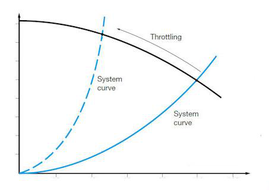

Constant-flow centrifugal blower controlled by a throttle valve on the discharge side. The valve position is fixed at a nominal setting, making this the simplest blower model in WEST. Air flow rate is set directly by the `Q_air_nominal` parameter and does not respond to downstream pressure changes. Use this model when the operating point is essentially fixed and energy accuracy is less important than simplicity.

**Key parameters:**

| Parameter | Description | Unit |
|---|---|---|
| `Q_air_nominal` | Nominal air flow rate delivered at the throttle position | m³/h |
| `p_max` | Maximum allowable discharge pressure | kPa |
| `eta` | Overall blower + motor efficiency | — |

### CF_Q_VFD blower


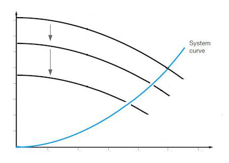

Variable-frequency drive (VFD) centrifugal blower that maintains a constant flow set-point. The incoming control signal specifies the target flow rate; the model adjusts motor speed to match. A ramp-rate limit prevents abrupt speed changes that would stress the motor. This model is suitable for most modern aeration control schemes where the blower controller outputs a flow demand.

**Key parameters:**

| Parameter | Description | Unit |
|---|---|---|
| `Q_air_min` | Minimum allowable flow rate | m³/h |
| `Q_air_max` | Maximum allowable flow rate | m³/h |
| `ramp_rate` | Maximum rate of change of flow set-point | m³/h per min |
| `eta` | Overall efficiency at nominal operating point | — |

### CF_HQ_VFD blower


VFD centrifugal blower with an explicit H-Q (pressure–flow) characteristic curve. The blower can operate in two modes: **flow priority**, where the VFD speed is set to deliver a requested flow regardless of header pressure, and **pressure priority**, where speed is set to maintain a target header pressure and flow is determined by the system curve intersection. The model automatically selects the active mode based on which constraint is binding. Use this model when the blower interacts with a shared air header or when detailed energy calculations are required.

**Key parameters:**

| Parameter | Description |
|---|---|
| `a0`, `a1`, `a2` | Polynomial H-Q curve coefficients (pressure = a0 + a1·Q + a2·Q²) |
| `n_min`, `n_max` | Minimum and maximum motor speed (rpm or normalised) |
| `p_setpoint` | Header pressure set-point for pressure-priority mode (kPa) |

### CF_Q_IGV blower

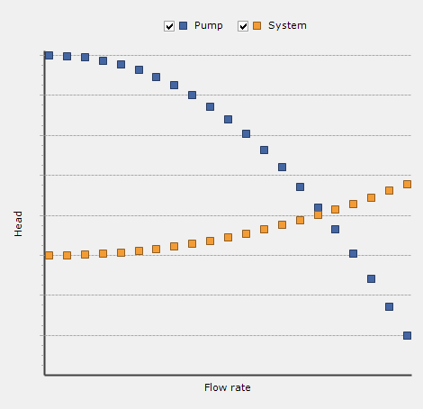


Centrifugal blower with inlet guide vanes (IGVs) that control air flow by varying the pre-swirl angle entering the impeller. Unlike throttle control, IGVs reduce the energy absorbed by the blower at part-load, making this model more efficient than `CF_Q_Throttle` at reduced flow rates. The control signal drives the guide vane angle, which the model converts to a delivered flow rate using a vane-angle/flow characteristic. Suitable for plants that operate frequently at partial aeration capacity.

**Key parameters:**

| Parameter | Description | Unit |
|---|---|---|
| `Q_air_max` | Rated flow at fully open vane position | m³/h |
| `vane_min` | Minimum vane angle (fully closed, minimum flow) | degrees |
| `eta_IGV` | Part-load efficiency correction factor relative to VFD baseline | — |

### PD_Q_VFD blower

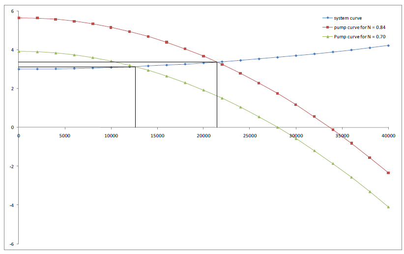

Positive-displacement (Roots-type or screw-type) blower with VFD speed control. Unlike centrifugal machines, PD blowers deliver a flow that is almost directly proportional to rotational speed and largely independent of discharge pressure. This makes them well-suited to applications with widely varying backpressure (e.g. deep tanks, variable submergence). Flow is calculated as the product of displacement per revolution and actual speed. Power consumption rises linearly with pressure differential across the unit.

**Key parameters:**

| Parameter | Description | Unit |
|---|---|---|
| `disp_per_rev` | Displaced air volume per shaft revolution | m³/rev |
| `n_min`, `n_max` | Minimum and maximum shaft speed | rpm |
| `p_max` | Maximum allowable discharge pressure | kPa |
| `eta` | Mechanical + motor efficiency | — |

### Parameters

| Parameter | Description | Unit | Typical value |
|---|---|---|---|
| `Q_air` | Nominal air flow rate delivered to the tank | m³/d | 5 000–50 000 |
| `Q_air_min` | Minimum allowable air flow rate | m³/d | 500–2 000 |
| `Q_air_max` | Maximum allowable air flow rate | m³/d | 10 000–80 000 |
| `P_blower` | Rated shaft power of the blower | kW | 15–500 |
| `eta` | Overall blower efficiency (motor + mechanical) | – (0–1) | 0.60–0.75 |
| `p_out` | Discharge pressure (absolute) | kPa | 115–160 |
| `p_in` | Inlet air pressure (atmospheric) | kPa | 101.3 |
| `T_in` | Inlet air temperature | °C | 15–20 |
| `n_blowers` | Number of blowers operating in parallel | – | 1–10 |

For `CF_HQ_VFD` and `CF_HN_VFD` models, the H-Q characteristic curve is defined by additional polynomial coefficients (`a0`, `a1`, `a2`) that describe pressure as a function of flow.

### Connecting blowers to a bioreactor

The blower block outputs `Q_air` (m³/d) on its air-supply terminal. This terminal must be connected to the `Q_air` input port on the aeration sub-model of an Activated Sludge (or similar bioreactor) block. The aeration sub-model then converts `Q_air` into `kLa` using the selected diffuser transfer model (`FineBubble1`, `FineBubble2`, etc.).

Typical connection path:

```
BlowerController --> Blowers.CF_Q_VFD --> [Q_air port] --> Aeration.FineBubble1 (inside ASU block)
```

A blower controller block (e.g. `BlowerControllers.Common10_CFHQVFD`) sits upstream and outputs a flow or speed set-point to the blower. Multiple blowers can be staged by the controller using the `n_blowers` signal.

### Energy calculation

Blower power consumption is computed from the isentropic compression equation adjusted by efficiency:

```
P_blower = (Q_air_actual / 86 400) × (p_out − p_in) / eta   [kW]
```

where `Q_air_actual` is in m³/s and pressures are in kPa. WEST integrates `P_blower` over the simulation horizon to report total energy use (kWh), which feeds into the Energy block for plant-wide energy accounting.

### Typical values

| Configuration | Q_air (m³/d) | P_blower (kW) | eta |
|---|---|---|---|
| Small WWTP (< 10 000 PE) | 3 000–8 000 | 15–45 | 0.62 |
| Medium WWTP (10 000–100 000 PE) | 8 000–30 000 | 45–200 | 0.68 |
| Large WWTP (> 100 000 PE) | 30 000–80 000 | 200–500 | 0.72 |

---

## Aeration diffuser blocks

Diffuser blocks model the oxygen transfer from air to mixed liquor. Transfer efficiency depends on diffuser type, submergence depth, and alpha factor. The diffuser block sits inside the bioreactor block and converts the incoming `Q_air` signal into a volumetric oxygen transfer coefficient (`kLa`) using empirical correlations. All diffuser models apply a process-water correction factor (alpha) and a salinity/surface tension correction (beta) to convert clean-water transfer data (SOTE) to process conditions.

| Model | Transfer mechanism | Typical SOTE |
|---|---|---|
| `Aeration.FineBubble1` | Fine-bubble disc/membrane (SOTE-based) | 4–6 %/m |
| `Aeration.FineBubble2` | Fine-bubble (KLa correlation) | 4–6 %/m equivalent |
| `Aeration.CoarseBubble` | Coarse-bubble sparger | 1–2 %/m |
| `Aeration.Surface` | Mechanical surface aerator | expressed as SOTR |

### Aeration FineBubble1


Fine-bubble disc or membrane diffuser model based on a standard oxygen transfer efficiency (SOTE) correlation. Oxygen transfer rate is calculated as:

```
OTR = Q_air × SOTE × (H_sub / H_ref) × alpha × beta × (C_sat − C) / C_sat_clean
```

where `H_sub` is diffuser submergence depth. SOTE is typically 4–6 % per metre of submergence for modern membrane diffusers. This model requires measured or manufacturer-supplied SOTE data and is the preferred choice when diffuser performance data is available.

**Key parameters:**

| Parameter | Description | Typical value |
|---|---|---|
| `SOTE` | Standard oxygen transfer efficiency per metre submergence | 0.05 (5 %/m) |
| `H_sub` | Diffuser submergence depth | m (tank-specific) |
| `A_floor` | Diffuser floor area | m² |
| `alpha` | Process-water correction factor (accounts for surfactants, MLSS) | 0.4–0.7 |
| `beta` | Salinity/surface-tension correction | 0.95–1.0 |

### Aeration FineBubble2


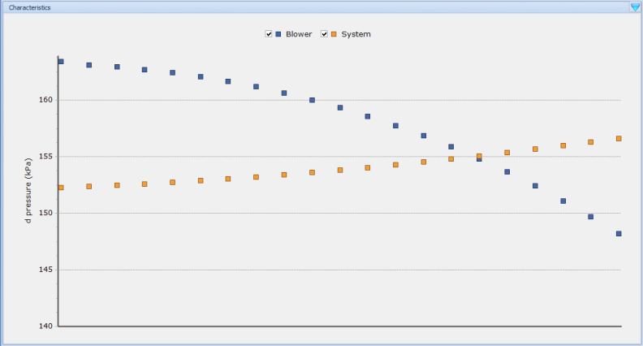

Alternative fine-bubble diffuser model that calculates the oxygen transfer coefficient `kLa` directly from a correlation with airflow rate, tank volume, and temperature. This approach is useful when SOTE data from the diffuser manufacturer is unavailable or when calibrating to measured `kLa` values from off-gas testing. The model uses the relationship:

```
kLa = K_transfer × (Q_air / V_tank)^n × theta^(T − 20)
```

where `K_transfer` and `n` are empirical coefficients fitted to plant data, and `theta` is the Arrhenius temperature coefficient (typically 1.024).

**Key parameters:**

| Parameter | Description |
|---|---|
| `K_transfer` | Empirical transfer coefficient (fitted to measured kLa) |
| `n` | Flow exponent (typically 0.8–1.0) |
| `V_tank` | Tank volume used in the normalisation (m³) |
| `theta` | Temperature correction coefficient |

### Aeration CoarseBubble

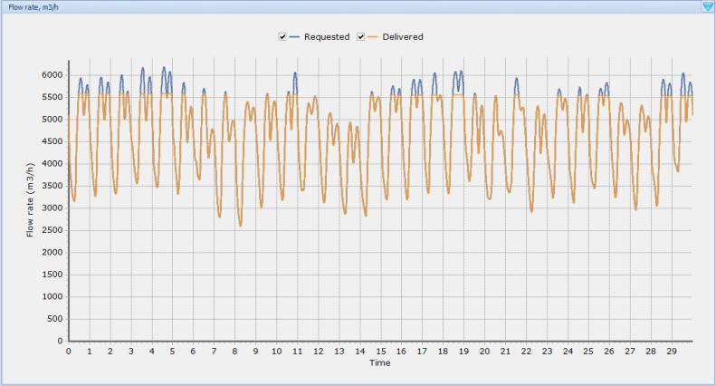

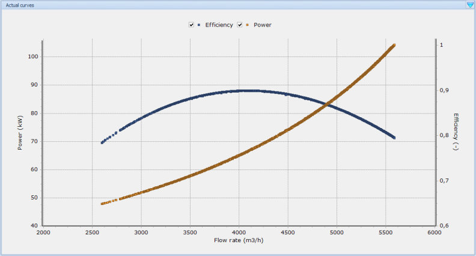

Coarse-bubble sparger model. Coarse-bubble systems generate larger bubbles (typically 6–10 mm diameter) that rise quickly through the tank, resulting in lower oxygen transfer efficiency (approximately 1–2 % per metre of submergence) compared to fine-bubble systems. However, they are substantially less prone to fouling and clogging, making them suitable for high-solids applications, sludge tanks, and tanks receiving raw wastewater. The model structure is identical to `FineBubble1` but uses lower default SOTE values.

**Key parameters:**

| Parameter | Description | Typical value |
|---|---|---|
| `SOTE` | Standard oxygen transfer efficiency per metre submergence | 0.015 (1.5 %/m) |
| `H_sub` | Diffuser submergence depth | m |
| `A_floor` | Diffuser floor area | m² |
| `alpha` | Process-water correction factor | 0.6–0.8 (less degradation than fine-bubble) |
| `beta` | Salinity correction | 0.95–1.0 |

### Surface aerator

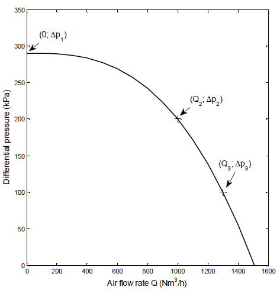

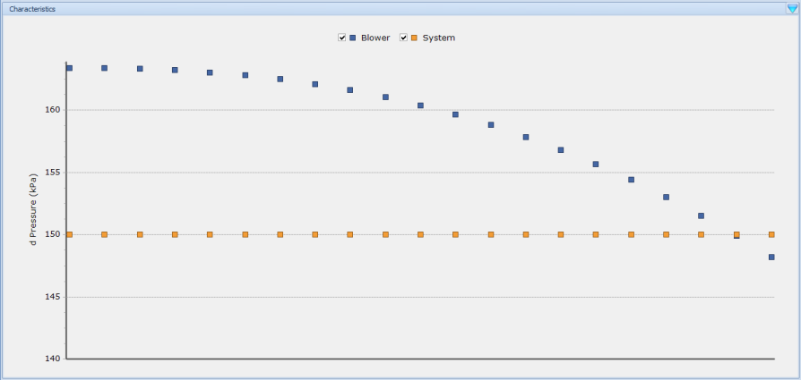

Mechanical surface aerator model. Surface aerators transfer oxygen by agitating the water surface and entraining atmospheric air, rather than by releasing bubbles from below. Oxygen transfer capacity is expressed as a standard oxygen transfer rate (SOTR, kg O₂/h) measured under clean-water conditions at 20 °C and zero DO. The actual transfer rate in process conditions is corrected by alpha and beta factors and the oxygen deficit. Power draw is a direct parameter, enabling energy calculations.

**Key parameters:**

| Parameter | Description | Unit |
|---|---|---|
| `SOTR` | Standard oxygen transfer rate (clean water, 20 °C, 0 mg/l DO) | kg O₂/h |
| `P_motor` | Motor power draw | kW |
| `alpha` | Process-water correction factor | — (0.6–0.9) |
| `beta` | Salinity/surface tension correction | — (0.95–1.0) |

Surface aerators are common in oxidation ditches, aerated lagoons, and SBRs. They are mechanically simple but consume more energy per kg O₂ transferred than fine-bubble diffuser systems at equivalent mixing levels.

### Jet aerator

Jet aerators inject pressurised liquid mixed with air into the tank through nozzles, creating high-velocity jets that entrain and disperse fine bubbles throughout the mixed liquor. The combined momentum and turbulence from the jets provide both oxygen transfer and mixing in a single unit, making them well suited to deep tanks or retrofit installations where diffuser grids are impractical.

**Key parameters:**

| Parameter | Description | Units |
|---|---|---|
| `Q_jet` | Jet liquid flow rate | m³/d |
| `alpha_jet` | Jet transfer efficiency factor (process water correction) | — |

Jet aerators typically achieve higher KLa values than fine-bubble diffusers at equivalent energy input in high-mixed-liquor-suspended-solids conditions, because the alpha factor (`alpha_jet`) degrades less with increasing MLSS. Typical standard oxygen transfer efficiency (SOTE) per metre of submergence is comparable to coarse-bubble systems, but the high mixing intensity reduces fouling risk on the nozzles.

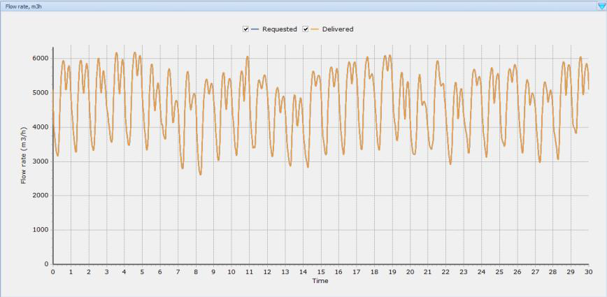

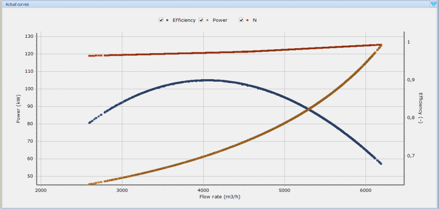

---

## Related

- [Activated Sludge Tanks](activated-sludge-tanks.md)
- [Controllers & Timers](controllers-timers.md)
- [Advanced Processes](advanced-processes.md)
