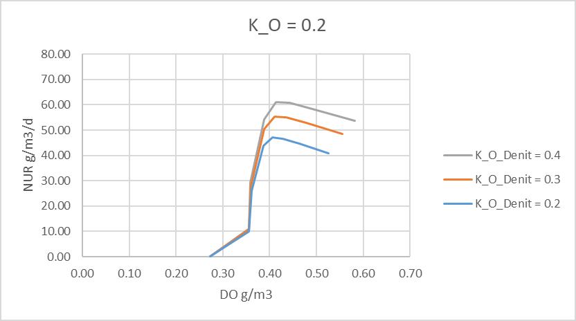
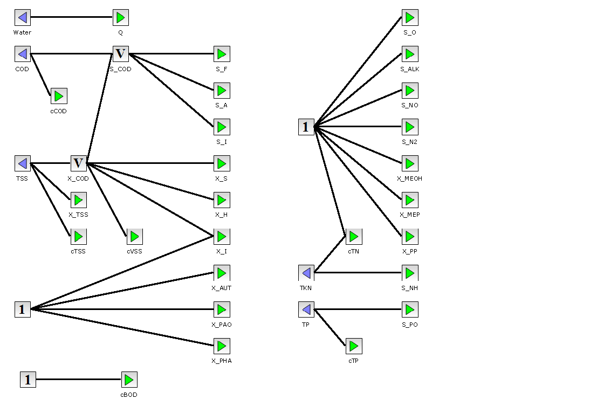
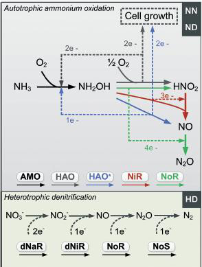
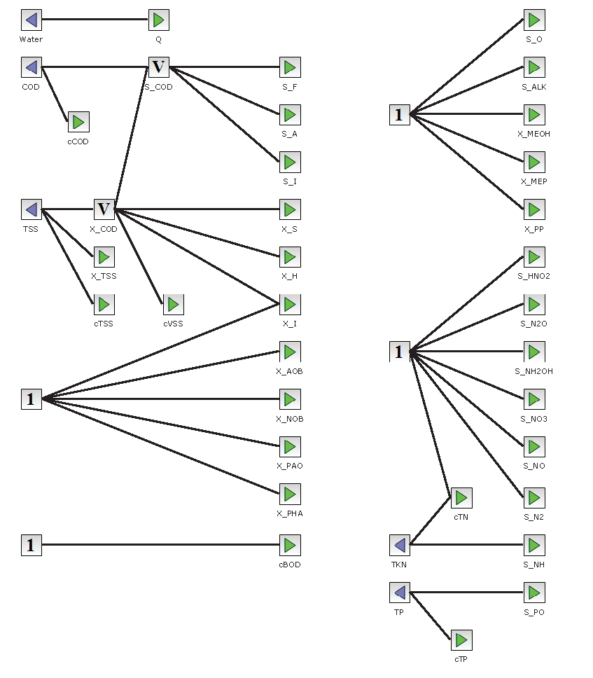
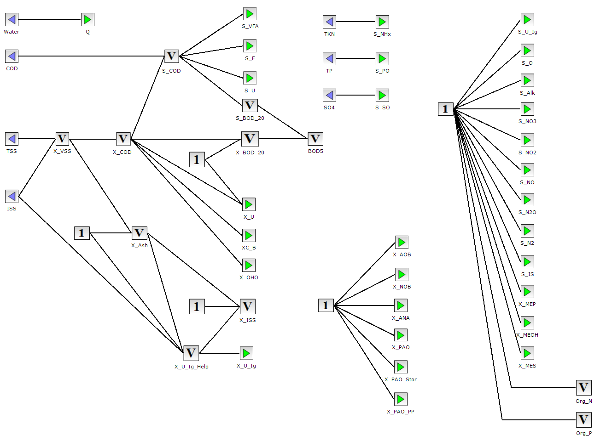
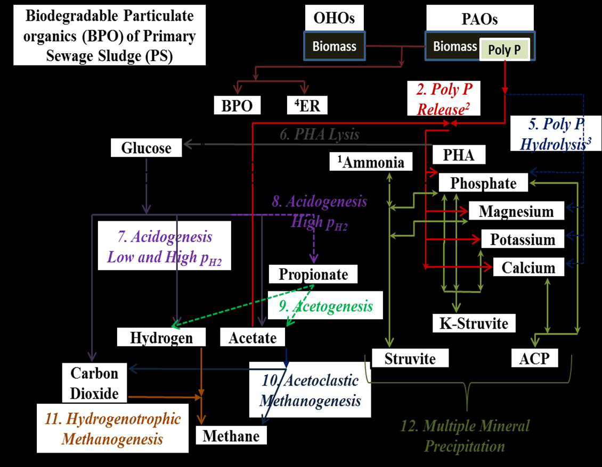

---
tags:
  - block-reference
  - biological-models
---

# Biological Models

**Summary:** The biological process models available in WEST — state variables, processes, and key parameters.

**Source:** WEST Models Guide, pp. 8–27 (ASM2dMod); WEST Getting Started Tutorial, ch 2–3.

---

## Model overview

WEST includes a family of activated sludge models derived from the IWA ASM family. All models share a common Petersen matrix structure: state variables (components) × processes (transformation rates). Each block instance solves the ODE system for one completely-mixed reactor volume. Models are selected at the block level; all blocks in a layout can use the same or different models.

| Model | Primary use | Nutrient removal | State variables |
|---|---|---|---|
| ASM1 | Carbon + nitrification/denitrification | N only | 13 |
| ASM2dMod | Biological N and P removal | N and P | 20 |
| ASM2dModNDHA | N, P + nitrous oxide | N, P, N₂O | 21 |
| ASM2dISS | N, P + inorganic suspended solids | N, P, mineral | 21 |
| PWM_SA | Plant-wide (WWTP + digester) | Full resource model | Multiple |

---

## ASM1

ASM1 is the IWA standard model for carbon removal, nitrification, and denitrification. It is the most widely calibrated biological model for municipal wastewater and the recommended starting point for most projects.

**Key assumptions:**

- Biomass divided into heterotrophs (`X_BH`) and autotrophs (`X_BA`)
- Oxygen and nitrate as electron acceptors
- No phosphorus dynamics

### State variables

13 components: S_S (readily biodegradable substrate), S_I (soluble inert COD), X_S (slowly biodegradable substrate), X_I (particulate inert COD), X_BH (heterotrophic biomass), X_BA (autotrophic biomass), X_P (endogenous products), S_O (dissolved oxygen), S_NO (nitrate+nitrite), S_NH (ammonium), S_ND (soluble organic nitrogen), X_ND (particulate organic nitrogen), S_ALK (alkalinity).

| Symbol | Description | Unit |
|---|---|---|
| `S_I` | Soluble inert organic matter | g COD/m³ |
| `S_S` | Readily biodegradable substrate | g COD/m³ |
| `X_I` | Particulate inert organic matter | g COD/m³ |
| `X_S` | Slowly biodegradable substrate | g COD/m³ |
| `X_BH` | Active heterotrophic biomass | g COD/m³ |
| `X_BA` | Active autotrophic biomass | g COD/m³ |
| `X_P` | Particulate products from biomass decay | g COD/m³ |
| `S_O` | Dissolved oxygen | g O₂/m³ |
| `S_NO` | Nitrate + nitrite nitrogen | g N/m³ |
| `S_NH` | Free and saline ammonia nitrogen | g N/m³ |
| `S_ND` | Soluble biodegradable organic nitrogen | g N/m³ |
| `X_ND` | Particulate biodegradable organic nitrogen | g N/m³ |
| `S_ALK` | Alkalinity | mol HCO₃⁻/m³ |

### Key processes

ASM1 defines eight biological conversion processes:

1. **Aerobic growth of heterotrophs** — consumption of S_S and S_O; production of X_BH
2. **Anoxic growth of heterotrophs** (denitrification) — consumption of S_S and S_NO; production of X_BH; requires S_O < inhibition threshold
3. **Aerobic growth of autotrophs** (nitrification) — consumption of S_NH and S_O; production of X_BA
4. **Decay of heterotrophs** — X_BH → X_P + X_S + X_ND
5. **Decay of autotrophs** — X_BA → X_P + X_S + X_ND
6. **Ammonification** — S_ND → S_NH (first-order, soluble organic N mineralisation)
7. **Hydrolysis of slowly biodegradable substrate** — X_S → S_S (surface-limited)
8. **Hydrolysis of entrapped organic nitrogen** — X_ND → S_ND

### Key kinetic parameters (typical values at 20 °C)

| Parameter | Symbol | Typical value | Unit |
|---|---|---|---|
| Max heterotrophic growth rate | μ_H | 6.0 | d⁻¹ |
| Half-saturation for substrate | K_S | 20 | g COD/m³ |
| Max autotrophic growth rate | μ_A | 0.8 | d⁻¹ |
| Half-saturation for NH₄ | K_NH | 1.0 | g N/m³ |
| Heterotrophic decay | b_H | 0.62 | d⁻¹ |
| Autotrophic decay | b_A | 0.20 | d⁻¹ |
| Yield (heterotrophic) | Y_H | 0.67 | g COD/g COD |

| Name | Description | Typical value | Unit |
|---|---|---|---|
| `mu_H_max` | Max growth rate, heterotrophs | 6.0 | 1/d |
| `K_S` | Half-saturation coeff for S_S | 20 | g COD/m³ |
| `K_O_H` | O₂ half-saturation coeff, heterotrophs | 0.2 | g O₂/m³ |
| `K_NO` | Nitrate half-saturation coeff | 0.5 | g N/m³ |
| `b_H` | Decay rate, heterotrophs | 0.62 | 1/d |
| `Y_H` | Yield, heterotrophs | 0.67 | g COD/g COD |
| `mu_AUT` | Max growth rate, autotrophs | 0.8 | 1/d |
| `K_NH` | NH₄ half-saturation coeff, autotrophs | 1.0 | g N/m³ |
| `K_O_A` | O₂ half-saturation coeff, autotrophs | 0.4 | g O₂/m³ |
| `b_AUT` | Decay rate, autotrophs | 0.05 | 1/d |
| `Y_AUT` | Yield, autotrophs | 0.24 | g COD/g N |
| `k_h` | Max hydrolysis rate | 3.0 | 1/d |
| `K_X` | Hydrolysis half-saturation coeff | 0.1 | g COD/g COD |

---

## ASM2dMod

ASM2dMod is a WEST modification of the IWA ASM2d model (Gernaey and Jørgenson, 2004). It extends ASM2d to make decay process rates electron-acceptor dependent. It covers carbon removal, nitrification, denitrification, and biological phosphorus removal (EBPR) via phosphate-accumulating organisms (PAOs).

### State variables (component vector)

19 components including ASM1 variables plus: S_F (fermentable substrate), S_A (acetate/VFAs), X_PAO (polyphosphate-accumulating organisms), X_PP (stored polyphosphate), X_PHA (stored PHA), S_PO4 (ortho-phosphate), X_MeOH (metal hydroxide), X_MeP (metal phosphate).

| Name | Description | Unit |
|---|---|---|
| Q | Water flow | m³/d |
| S_I | Inert soluble matter | g COD/m³ |
| S_O | Dissolved oxygen | g COD/m³ |
| S_N2 | Nitrogen gas | g N/m³ |
| S_F | Fermentable, readily biodegradable organic matter | g COD/m³ |
| S_A | Fermentation products (acetate) | g COD/m³ |
| S_NO | Nitrate + nitrite nitrogen (NO3-N + NO2-N) | g N/m³ |
| S_PO | Inorganic soluble phosphorus (ortho-phosphates) | g P/m³ |
| S_NH | Ammonium nitrogen (NH4-N) | g N/m³ |
| S_ALK | Alkalinity | mol |
| X_I | Inert particulate matter | g COD/m³ |
| X_S | Slowly biodegradable matter | g COD/m³ |
| X_H | Heterotrophic organisms | g COD/m³ |
| X_PAO | Phosphorus-accumulating organisms | g COD/m³ |
| X_PP | Poly-phosphate | g P/m³ |
| X_PHA | Cell internal storage product of PAOs | g COD/m³ |
| X_AUT | Autotrophic (nitrifying) biomass | g COD/m³ |
| X_TSS | Total suspended solids | g TSS/m³ |
| X_MeOH | Metal hydroxides | g COD/m³ |
| X_MeP | Metal phosphate | g COD/m³ |

### Processes (conversion model)

21 processes: aerobic/anoxic/anaerobic hydrolysis; aerobic/anoxic growth of heterotrophs; fermentation; storage and aerobic/anoxic growth of PAOs; PP storage; aerobic/anoxic endogenous respiration of PAOs; decay of PAOs, PP, PHA; nitrification; autotrophic decay; chemical P precipitation.

| # | Name | Description |
|---|---|---|
| P1 | AerHydrol | Aerobic hydrolysis of X_S |
| P2 | AnHydrol | Anoxic hydrolysis of X_S |
| P3 | AnaerHydrol | Anaerobic hydrolysis of X_S |
| P4 | AerGrowthOnSf | Aerobic growth of X_H on fermentable substrate S_F |
| P5 | AerGrowthOnSa | Aerobic growth of X_H on fermentation products S_A |
| P6 | AnGrowthOnSfDenitrif | Anoxic growth of X_H on S_F (denitrification) |
| P7 | AnGrowthOnSaDenitrif | Anoxic growth of X_H on S_A (denitrification) |
| P8 | Fermentation | Conversion of S_F → S_A (anaerobic) |
| P9 | LysisOfHetero | Lysis of heterotrophic organisms X_H |
| P10 | StorageOfXPHA | Storage of cell internal organic material X_PHA |
| P11 | AerStorageOfXPP | Aerobic storage of poly-phosphate X_PP |
| P12 | AnStorageOfXPP | Anoxic storage of poly-phosphate X_PP |
| P13 | AerGrowthOnXPHA | Aerobic growth of PAOs on X_PHA |
| P14 | AnGrowthOnXPHADenitrif | Anoxic growth of PAOs on X_PHA (denitrification) |
| P15 | LysisOfXPAO | Lysis of X_PAO |
| P16 | LysisOfXPP | Lysis of X_PP |
| P17 | LysisOfXPHA | Lysis of X_PHA |
| P18 | GrowthOfAuto | Growth of autotrophic (nitrifying) organisms X_AUT |
| P19 | LysisOfAuto | Lysis of X_AUT |
| P20 | Precipitation | Simultaneous phosphorus precipitation |
| P21 | Redissolution | Phosphorus redissolution |
| P22 | Aeration | Oxygen transfer |

### Nitrification–denitrification inhibition

Denitrification is inhibited by dissolved oxygen via a separate parameter **K_O_Denit** (default 0.2 mg O₂/l). Increasing `K_O_Denit` increases the denitrification rate at a given DO level without affecting other processes that use `K_O`.



*Nitrate Utilisation Rate (NUR) vs DO at three values of K_O_Denit. Default is 0.2 for both K_O and K_O_Denit.*

### Temperature dependency

Kinetic parameters are corrected for temperature using Arrhenius expressions:

```
k_i(Temp) = k_i(TempRef) × θ_ki ^ (Temp_Actual − Temp_Ref)
```

where `Temp_Ref` = 20°C and `θ_ki` is the Arrhenius coefficient for parameter `k_i`.

Oxygen saturation concentration:

```
S_O_Saturation = 14.65 − 0.41·T + 0.00799·T² − 7.78×10⁻⁵·T³   [g/m³]
```

### Parameters — Kinetics (default values at 20°C)

Key additions over ASM1: q_fe (fermentation rate, 3.0 d⁻¹), q_PHA (PHA storage rate, 3.0 d⁻¹), q_PP (PP storage rate, 1.50 d⁻¹), μ_PAO (PAO growth rate, 1.0 d⁻¹), b_PAO (PAO decay, 0.2 d⁻¹).

| Name | Description | Default | Unit |
|---|---|---|---|
| `mu_H` | Maximum growth rate for heterotrophs | 6 | 1/d |
| `mu_AUT` | Maximum growth rate for autotrophs | 1 | 1/d |
| `mu_PAO` | Maximum growth rate for PAOs | 1 | 1/d |
| `b_H` | Lysis/decay rate for heterotrophs | 0.4 | 1/d |
| `b_AUT` | Decay rate for autotrophs | 0.15 | 1/d |
| `b_PAO` | Lysis rate for X_PAO | 0.2 | 1/d |
| `b_PHA` | Lysis rate for X_PHA | 0.2 | 1/d |
| `b_PP` | Lysis rate for X_PP | 0.2 | 1/d |
| `k_h` | Hydrolysis rate constant | 3 | 1/d |
| `Q_fe` | Maximum fermentation rate | 3 | 1/d |
| `Q_PHA` | Rate constant for PHA storage | 3 | 1/d |
| `Q_PP` | Rate constant for PP storage | 1.5 | 1/d |
| `k_PRE` | Rate constant for P precipitation | 1 | 1/d |
| `k_RED` | Rate constant for P redissolution | 0.6 | 1/d |
| `K_O` | Saturation/inhibition coeff for oxygen | 0.2 | g/m³ |
| `K_O_AUT` | Saturation/inhibition coeff for autotrophs for O₂ | 0.5 | g/m³ |
| `K_O_Denit` | Inhibition coeff of denitrifiers for O₂ | 0.2 | g/m³ |
| `K_NH` | Saturation coeff for ammonium | 0.05 | g/m³ |
| `K_NH_AUT` | Saturation coeff of autotrophs for NH₄ | 1 | g/m³ |
| `K_NO` | Saturation/inhibition coeff for nitrate | 0.5 | g/m³ |
| `K_F` | Saturation coeff for growth on S_F | 4 | g/m³ |
| `K_A` | Saturation coeff for S_A (acetate) | 4 | g/m³ |
| `K_P` | Saturation coeff for phosphorus | 0.01 | g/m³ |
| `K_ALK` | Saturation coeff for alkalinity | 0.1 | g/m³ |
| `K_ALK_AUT` | Saturation coeff of autotrophs for alkalinity | 0.5 | g/m³ |
| `K_X` | Saturation coeff for particulate COD | 0.1 | g/g |
| `K_MAX` | Maximum ratio X_PP/X_PAO | 0.34 | g/m³ |
| `K_IPP` | Inhibition coeff for X_PP storage | 0.02 | g/m³ |
| `K_PHA` | Saturation coeff for PHA | 0.01 | g/m³ |
| `K_PP` | Saturation coeff for poly-phosphate | 0.01 | g/g |
| `K_PS` | Saturation coeff for P in PP storage | 0.2 | g/m³ |
| `K_fe` | Saturation coeff for fermentation on S_F | 4 | g/m³ |
| `n_NO_Het` | Reduction factor for denitrification | 0.8 | — |
| `n_NO_Hyd` | Anoxic hydrolysis reduction factor | 0.6 | — |
| `n_fe` | Anaerobic hydrolysis reduction factor | 0.4 | — |
| `n_NO_PAO` | PAO activity under anoxic conditions | 0.6 | — |
| `n_NO_Het_d` | Anoxic reduction factor for decay of heterotrophs | 0.5 | — |
| `n_NO_AUT_d` | Anoxic reduction factor for decay of autotrophs | 0.33 | — |
| `n_NO_P_d` | Anoxic reduction factor for decay of PAO/PP/PHA | 0.33 | — |

### Parameters — Stoichiometry

Yield coefficients: Y_H=0.625 g COD/g COD, Y_PAO=0.625 g COD/g COD, Y_PO4=0.40 g P/g COD (PP stored per PHA). Fractions: f_SI=0.0 (soluble inert from hydrolysis), f_XI=0.10 (particulate inert from decay), i_BM=0.07 g N/g COD (N content of biomass), i_P=0.02 g P/g COD.

| Name | Description | Default | Unit |
|---|---|---|---|
| `Y_H` | Yield for heterotrophic biomass | 0.625 | g COD/g COD |
| `Y_AUT` | Yield for autotrophic biomass | 0.24 | g COD/g COD |
| `Y_PAO` | Yield for PAOs | 0.625 | g COD/g COD |
| `Y_PHA` | PHA requirement for PP storage | 0.2 | g COD/g COD |
| `Y_PO` | PP release per PHA stored | 0.4 | g COD/g COD |
| `f_X_I` | Fraction of inert COD generated in biomass lysis | 0.1 | — |
| `f_S_I` | Fraction of inert COD in particulate substrate | 0.0 | — |

### Parameters — Composition

Elemental composition factors used for COD, N, P, and charge balances. i_NSF=0.03 g N/g COD (N in S_F), i_NSI=0.01 g N/g COD (N in S_I), i_NXI=0.02, i_NXS=0.04, i_NBM=0.07. i_PSF=0.01, i_PSI=0, i_PXI=0.01, i_PXS=0.01, i_PBM=0.02.

| Name | Description | Default | Unit |
|---|---|---|---|
| `i_N_BM` | Nitrogen content of biomass | 0.07 | g N/g COD |
| `i_N_S_F` | Nitrogen content of soluble substrate S_F | 0.03 | g N/g COD |
| `i_P_BM` | Phosphorus content of biomass | 0.02 | g P/g COD |
| `i_P_S_F` | Phosphorus content of S_F | 0.01 | g P/g COD |
| `i_TSS_BM` | TSS to biomass ratio (X_H, X_PAO, X_AUT) | 0.9 | g TSS/g COD |
| `i_TSS_X_I` | TSS to X_I ratio | 0.75 | g TSS/g COD |
| `i_TSS_X_S` | TSS to X_S ratio | 0.75 | g TSS/g COD |

### Parameters — Temperature corrections (Arrhenius θ values)

All kinetic rates are corrected by θ^(T−20). Typical θ values: heterotrophic growth 1.07, autotrophic growth 1.11, hydrolysis 1.04, decay 1.05, PAO processes 1.07. Temperature significantly affects nitrification — a 5 °C drop roughly halves μ_A at θ=1.11.

| Name | Parameter corrected | Default |
|---|---|---|
| `theta_mu_H` | mu_H | 1.072 |
| `theta_mu_AUT` | mu_AUT | 1.111 |
| `theta_mu_PAO` | mu_PAO | 1.041 |
| `theta_b_H` | b_H | 1.072 |
| `theta_b_AUT` | b_AUT | 1.116 |
| `theta_b_PAO` | b_PAO | 1.072 |
| `theta_b_PHA` | b_PHA | 1.072 |
| `theta_b_PP` | b_PP | 1.072 |
| `theta_k_h` | k_h | 1.041 |
| `theta_Q_fe` | Q_fe | 1.072 |
| `theta_Q_PHA` | Q_PHA | 1.041 |
| `theta_Q_PP` | Q_PP | 1.041 |
| `theta_K_X` | K_X | 0.896 |

### Fractionation parameters (influent characterisation)

Influent COD is split into fractions assigned to ASM2d components. Key fractions: f_SS (readily biodegradable, 0.15–0.25), f_SA (acetate fraction of f_SS, 0.10), f_XI (particulate inert, 0.10–0.15), f_XS (slowly biodegradable, 0.50–0.60), f_SI (soluble inert, 0.05). See Influent Characterisation for the full procedure.

| Name | Description | Default | Unit |
|---|---|---|---|
| `F_BOD_COD` | Ratio of BOD to COD | 0.65 | g BOD/g COD |
| `F_TSS_COD` | Ratio of TSS to COD | 0.75 | g TSS/g COD |
| `f_S_A` | Soluble COD to S_A ratio | 0.25 | — |
| `f_S_F` | Soluble COD to S_F ratio | 0.375 | — |
| `f_S_NH` | Total N to ammonia ratio | 0.6 | — |
| `f_S_PO` | Total P to PO ratio | 0.6 | — |
| `f_X_H` | Particulate COD to X_H ratio | 0.17 | — |
| `f_X_S` | Particulate COD to X_S ratio | 0.69 | — |

### Interface variables (measurable outputs from bioreactor block)

S_NH4 (ammonium, g N/m³), S_NO3 (nitrate, g N/m³), S_PO4 (ortho-P, g P/m³), S_O2 (DO, g O₂/m³), TSS (total suspended solids, g/m³), VSS (volatile SS), COD_total, BOD₅, TN (total nitrogen), TP (total phosphorus), Alkalinity (mol HCO₃⁻/m³).

| Name | Terminal | Description | Unit |
|---|---|---|---|
| `DO` | out_2 | Dissolved oxygen | g/m³ |
| `NH4` | out_2 | Ammonium concentration | g/m³ |
| `NO3` | out_2 | Nitrate + nitrite | g/m³ |
| `PO4` | out_2 | Phosphate | g/m³ |
| `TSS` | out_2 | Total suspended solids | g/m³ |
| `OnlineCOD` | out_2 | Chemical oxygen demand | g/m³ |
| `OnlineTN` | out_2 | Total nitrogen | g/m³ |
| `OnlineTP` | out_2 | Total phosphorus | g/m³ |
| `OUR_ASU` | out_2 | Oxygen uptake rate | g/m³/d |
| `NUR` | out_2 | Nitrate utilisation rate | g/m³/d |
| `PUR` | out_2 | Phosphate uptake rate | g/m³/d |
| `Kla_ASU` | out_2 | kLa | 1/d |
| `V_ASU` | out_2 | Volume | m³ |



### References

Gernay, K.V. and Jørgenson, S.B. (2004) Benchmarking combined biological phosphorous and nitrogen removal wastewater treatment processes. *Control Engineering Practice* 12:357–373.

Henze, M., Gujer, W., Mino, T. and van Loosdrecht, M. (2006) *Activated Sludge Models ASM1, ASM2, ASM2d and ASM3*. IWA Publishing.

---

## ASM2dModNDHA

Extension of ASM2dMod adding nitrous oxide (N₂O) as an intermediate in denitrification. Used for greenhouse gas (GHG) modelling.



### State variables

ASM2dModNDHA uses the same 20 components as ASM2dMod plus one additional species:

| Name | Description | Unit |
|---|---|---|
| S_N2O | Nitrous oxide (dissolved) | g N/m³ |

All other components (S_A, S_ALK, S_F, S_I, S_N2, S_NH4, S_NO3, S_O2, S_PO4, X_AUT, X_H, X_I, X_MeOH, X_MeP, X_PAO, X_PP, X_PHA, X_S, X_TSS) are identical to ASM2dMod.

### Key processes

ASM2dModNDHA extends ASM2dMod by splitting the denitrification pathway into two sequential steps:

- **NO₃ → NO₂ → N₂O → N₂** — nitrous oxide is an explicit intermediate rather than being lumped with N₂
- Separate half-saturation and inhibition coefficients govern each reduction step
- N₂O stripping to the gas phase is modelled as a mass-transfer process analogous to oxygen transfer

This allows prediction of dissolved and off-gas N₂O concentrations, enabling greenhouse gas inventories and identification of operational conditions that promote N₂O accumulation (e.g. transient aeration, low DO, high nitrite).

### When to use

Use ASM2dModNDHA when the project objective includes estimation of N₂O emissions or compliance with GHG reporting requirements. For standard nutrient removal studies, ASM2dMod is sufficient and computationally cheaper.

---

## ASM2dISS

Extension of ASM2dMod adding inorganic suspended solids dynamics (mineral precipitation/dissolution). Relevant for plants with chemical P-removal or high mineral loads.

### Additional state variable

| Name | Description | Unit |
|---|---|---|
| `X_ISS` | Inorganic (mineral) suspended solids | g ISS/m³ |

All other 20 ASM2dMod components are retained unchanged.

### Additional components (beyond ASM2dMod)

X_ISS (inorganic suspended solids, g ISS/m³). ISS accumulate in the system through influent inorganic fraction and chemical precipitation. Required for accurate TSS prediction and sludge volume calculations.

### ISS processes

ASM2dISS tracks the inorganic fraction of TSS explicitly through three mechanisms:

1. **Biomass-associated ISS** — each active biomass fraction (X_H, X_AUT, X_PAO) carries a fixed ISS content defined by the composition parameter `i_ISS_BM` (default 0.02 g ISS/g COD). When biomass grows or decays, the corresponding ISS is produced or released.

2. **Storage and decay products** — X_PP and X_PHA also contribute inorganic and organic solids respectively; X_PP is counted directly as ISS since poly-phosphate is inorganic.

3. **Chemical precipitation contributions** — simultaneous chemical P-removal with metal salts (e.g. ferric chloride, alum) produces metal phosphate precipitates (X_MeP) and metal hydroxide floc (X_MeOH), both of which are inorganic and contribute to X_ISS rather than to the COD-based solids fractions.

### TSS calculation

In ASM2dMod, TSS is estimated from COD-based components using fixed conversion factors (`i_TSS_BM`, `i_TSS_X_I`, etc.). In ASM2dISS, total TSS is the sum of the COD-based volatile fraction plus X_ISS:

```
TSS = VSS + X_ISS
VSS = i_TSS_BM·(X_H + X_AUT + X_PAO) + i_TSS_X_I·X_I + i_TSS_X_S·X_S + X_PP + X_PHA
```



### When to use

Select ASM2dISS when:

- The influent has a high inorganic suspended solids load (e.g. combined sewer overflow, industrial co-treatment) and accurate TSS effluent prediction is required.
- The plant uses chemical P-removal with iron or aluminium salts, generating significant inorganic sludge fractions that would distort VSS/TSS ratios if ignored.
- Sludge production estimates need to distinguish volatile and fixed fractions for dewatering or incineration calculations.

For standard municipal plants with low ISS influent and no chemical dosing, ASM2dMod with fixed composition factors is adequate.

---

## PWM_SA

Plant-Wide Model combining ASM-based WWTP activated sludge processes with anaerobic digestion, enabling full carbon, energy, and resource balances across the entire plant.

### Overview

PWM_SA (Plant-Wide Model with Sulphur and Aluminium chemistry) extends ASM2dMod and ADM1 (Anaerobic Digestion Model No. 1) to include:

- **Sulphur cycle** — tracking of sulphate (S_SO4), hydrogen sulphide (S_H2S), and sulphur-oxidising bacteria (X_SOB) through the liquid and gas phases
- **Aluminium/iron–phosphorus precipitation** — explicit chemistry for alum (Al³⁺) and ferric (Fe³⁺) dosing, generating aluminium phosphate and iron phosphate precipitates
- **Biogas composition** — H₂S partial pressure in biogas calculated from liquid-phase equilibrium, enabling prediction of biogas quality and H₂S scrubbing requirements

### Additional components (beyond ASM2dMod)

| Name | Description | Unit |
|---|---|---|
| `S_SO4` | Dissolved sulphate | g S/m³ |
| `S_H2S` | Dissolved hydrogen sulphide (total) | g S/m³ |
| `X_SOB` | Sulphur-oxidising bacteria | g COD/m³ |
| `S_Al` | Dissolved aluminium (from alum dosing) | g Al/m³ |
| `S_Fe` | Dissolved iron (from ferric dosing) | g Fe/m³ |
| `X_AlP` | Aluminium phosphate precipitate | g/m³ |
| `X_FeP` | Iron phosphate precipitate | g/m³ |

### Key processes added

ADM1-based anaerobic digestion processes added to the plant-wide model: hydrolysis of carbohydrates/proteins/lipids, acidogenesis, acetogenesis, methanogenesis (acetoclastic and hydrogenotrophic). Enables simulation of digesters alongside activated sludge in the same plant model.

| Process | Description |
|---|---|
| Sulphate reduction | Anaerobic oxidation of organics coupled to SO₄²⁻ reduction; produces S_H2S; inhibits methanogens |
| H₂S stripping | Mass transfer of dissolved H₂S to biogas phase |
| Sulphide oxidation | Aerobic oxidation of H₂S by X_SOB (relevant in trickling filters or partial aeration) |
| Alum precipitation | Al³⁺ + PO₄³⁻ → AlPO₄ (X_AlP); reduces S_PO4 |
| Ferric precipitation | Fe³⁺ + PO₄³⁻ → FePO₄ (X_FeP); reduces S_PO4 |
| Fe/Al hydrolysis | Excess metal ion forms hydroxide floc (X_MeOH), contributing to ISS |

### ISS/VSS fractionation



Inorganic suspended solids (ISS) and volatile suspended solids (VSS) fractionation splits total suspended solids into organic (volatile) and inorganic fractions. ISS accumulate in the sludge and affect settling behaviour, thickening performance, and sludge volume. The fractionation is governed by the ratio `f_ISS` (g ISS / g TSS in the influent), which is used to initialise the `X_ISS` state variable from measured influent TSS data. In PWM_SA, ISS are also generated internally through chemical precipitation (X_MeP, X_MeOH) and through the inorganic content of active biomass (`i_ISS_BM`). Accurate ISS fractionation is important when modelling plants with chemical P-removal or high-mineral-load influents, and when estimating sludge production for dewatering or incineration design. ASM2d and PWM models that include the X_ISS state variable track ISS explicitly; ASM1 does not.

### Key additional parameters

ADM1 interface parameters: f_ch_xc (carbohydrate fraction of composite, 0.2), f_pr_xc (protein fraction, 0.2), f_li_xc (lipid fraction, 0.3), f_xi_xc (inert fraction, 0.2). Disintegration rate k_dis (0.5 d⁻¹). Maximum acetoclastic methanogen growth rate k_m_ac (0.08 d⁻¹).

| Parameter | Description | Typical value | Unit |
|---|---|---|---|
| `k_SOB` | Growth rate of sulphur-oxidising bacteria | 5.0 | 1/d |
| `K_H2S_SOB` | H₂S half-saturation coeff for SOB | 0.5 | g S/m³ |
| `K_H2S_inh` | H₂S inhibition coeff for acetogens/methanogens | 150–300 | g S/m³ |
| `k_La_H2S` | H₂S mass-transfer coefficient | plant-specific | 1/d |
| `k_prec_Al` | Alum precipitation rate constant | 100 | m³/g·d |
| `k_prec_Fe` | Ferric precipitation rate constant | 100 | m³/g·d |
| `K_solub_AlP` | Solubility product for AlPO₄ | 1×10⁻⁷ | (g/m³)² |

### Anaerobic sub-model process scheme



The anaerobic sub-model within PWM_SA handles the fermentation, acetogenesis, and methanogenesis zones that occur in the anaerobic selector and digester sections of a combined aerobic/anaerobic process. The process scheme proceeds through four sequential stages:

1. **Hydrolysis** — slowly biodegradable particulate substrate (X_S) is enzymatically broken down to readily biodegradable soluble substrate (S_F) under anaerobic conditions, following first-order kinetics.
2. **Fermentation** — readily biodegradable COD (S_F) is fermented to volatile fatty acids (VFAs), primarily acetate (S_A), by facultative fermentative heterotrophs. This step is the carbon source for PAO anaerobic metabolism.
3. **VFA uptake by PAOs** — phosphate-accumulating organisms (X_PAO) take up acetate (S_A) under strictly anaerobic conditions and store it intracellularly as polyhydroxyalkanoates (X_PHA), simultaneously releasing orthophosphate (S_PO). This anaerobic P-release is a prerequisite for the subsequent aerobic/anoxic P-uptake that achieves net biological phosphorus removal.
4. **Phosphorus release** — net release of S_PO to the bulk liquid occurs as PAOs hydrolyse intracellular X_PP to provide energy for PHA storage. The magnitude of P-release is proportional to VFA availability and is a key diagnostic indicator of EBPR performance.

This sub-model is active when using ASM2d or PWM_SA in layouts that include an anaerobic zone (e.g. UCT, A²O, or Bardenpho configurations) and is essential for simulating enhanced biological phosphorus removal (EBPR).

### When to use

PWM_SA is appropriate when:

- **Biogas H₂S** must be predicted for energy recovery planning or compliance (e.g. cogeneration engine limits)
- **Chemical P-removal** with alum or ferric is practised and the model must account for the resulting inorganic sludge production and phosphorus recovery interactions
- **Sulphide toxicity** to anaerobic digesters is a concern (e.g. high-sulphate industrial co-digestion)
- A **plant-wide mass balance** is required that couples the liquid-treatment train and the sludge-treatment train in a single model

For activated sludge studies without anaerobic digestion coupling or chemical dosing, ASM2dMod or ASM2dISS is more appropriate and computationally lighter.

---

## Related

- [Choosing a Biological Model](choosing-a-model.md)
- [Activated Sludge Tanks](activated-sludge-tanks.md)
- [Glossary](../getting-started/glossary.md)
