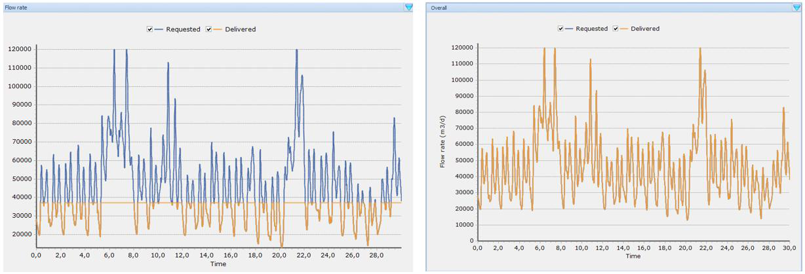
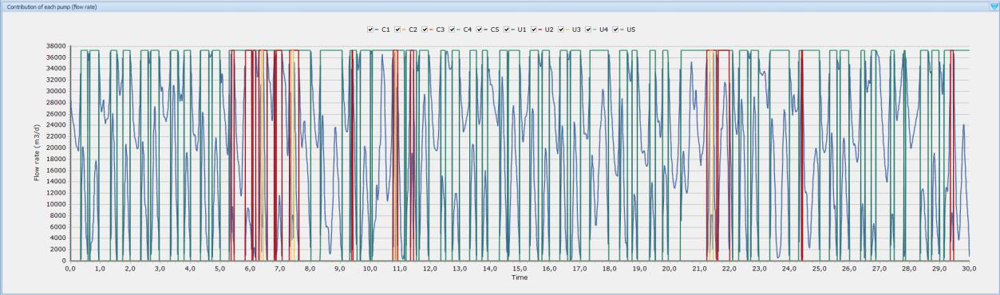
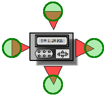
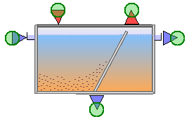
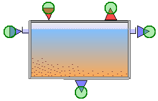
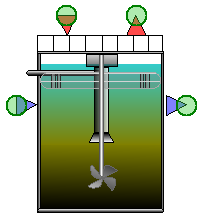
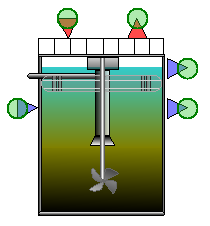
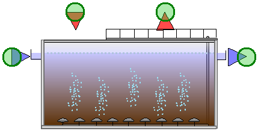

---
tags:
  - block-reference
  - clarifiers
---

# Clarifiers

**Summary:** Primary and secondary clarifier block variants in the WEST model library.

**Source:** WEST Models Guide — Primary Clarifiers (pp. 266–276), Secondary Clarifiers (pp. 278–296).

---

## Primary clarifiers

**Palette group:** Separation  
**Category:** `Settlers_PST`

| Model | Description |
|---|---|
| `Point` | Ideal phase separator — no volume, no retention time |
| `OtterpohlFreund` | Empirical removal model based on hydraulic retention time |
| `Takacs_SVI` | 1D layer model with SVI-corrected settling velocity |
| `Lamellae_Takacs` | Takács model extended for lamella packs |
| `BSM2` | Benchmark Simulation Model No. 2 primary clarifier |

---

### PrimaryClarifier.Point

Ideal separator with no volume. Soluble components pass through unchanged; particulate components are split by `f_ns`.

Mass balance:
- Effluent: C_out,Si = C_in,Si ; C_out,Xi = f_ns · C_in,Xi
- Underflow: C_under,Xi = (1 − f_ns) · C_in,Xi

**Interface variables:**

| Name | Terminal | Description | Default | Units |
|---|---|---|---|---|
| `Inflow` | in_1 | Influent flow | — | g/d |
| `Outflow` | out_1 | Effluent flow | — | g/d |
| `Underflow` | out_2 | Underflow | — | g/d |
| `f_ns` | in_2 | Non-settleable solids fraction | 0.6 | — |
| `E_Pump_sp` | in_2 | Pumping energy per unit flow | 0.04 | kWh/m³ |
| `Q_Under` | in_2 | Desired sludge flow | 50 | m³/d |
| `P_Pump` | out_3 | Pumping power | — | kWh/d |

---

### PrimaryClarifier.OtterpohlFreund

Empirical model where removal efficiency depends on hydraulic retention time (Otterpohl et al. 1994):

$$E_{eff,COD} = f_{corr} \cdot (2.88 \cdot f_X - 0.118) \cdot (1.45 + 6.15 \cdot \log HRT)$$

All COD removed is assumed particulate. No biological reactions.

**Parameters:**

| Name | Description | Default | Units |
|---|---|---|---|
| `Vol` | Tank volume | 1000 | m³ |
| `f_corr` | Correction factor for removal efficiency | 0.65 | — |
| `f_X` | Particulate COD / total COD ratio | 0.85 | — |
| `t_m` | Smoothing time constant | 0.125 | d |

---

### PrimaryClarifier.Takacs_SVI

1D layer model (Takács/Vitasovic). Settling velocity follows double-exponential Vesilind equation, corrected for SVI:

r_H = (0.148 + 0.0021 · SVI) / 1000

**Parameters:**

| Name | Description | Default | Units |
|---|---|---|---|
| `A` | Surface area | 1500 | m² |
| `H` | Height | 4 | m |
| `X_T` | Threshold TSS concentration | 3000 | g/m³ |
| `X_Lim` | Minimum concentration in sludge blanket | 900 | g/m³ |
| `r_P` | Low-concentration settling parameter | 0.0007 | m³/g |
| `v0` | Maximum theoretical settling velocity | 96 | m/d |
| `v00` | Maximum practical settling velocity | 45 | m/d |
| `n_Feed` | Index of the feed layer | 5 | — |

**Interface variables:**

| Name | Terminal | Description | Default | Units |
|---|---|---|---|---|
| `Inflow` | in_1 | Influent flow (component vector) | — | g/d |
| `Outflow` | out_1 | Effluent flow (component vector) | — | g/d |
| `Underflow` | out_2 | Underflow (component vector) | — | g/d |
| `Q_Under` | in_2 | Desired underflow rate | 50.0 | m³/d |
| `E_Pump_sp` | in_2 | Pumping energy per unit flow | 0.04 | kWh/m³ |
| `SVI` | in_2 | Sludge Volume Index | 100 | mL/g |
| `f_ns` | in_2 | Non-settleable fraction | 0.0024 | — |
| `P_Pump` | out_3 | Pumping power | — | kWh/d |
| `V_Clarifier` | out_3 | Tank volume | — | m³ |
| `y_HS` | out_3 | Sludge blanket height | — | m |

---

### PrimaryClarifier.Lamellae_Takacs

Extension of Takacs_SVI with lamella packs, increasing effective settling area:

A = N · A_sp · cos(θ)

where N = number of lamellae, A_sp = specific surface per lamella (m²), θ = inclination angle.

**Additional parameters:**

| Name | Description | Default | Units |
|---|---|---|---|
| `L_n` | Number of lamellae | 10 | — |
| `L_S` | Specific area per lamella | 100 | m² |
| `L_Theta` | Inclination angle | 45 | deg |

---

### PrimaryClarifier.BSM2

Simplified model from Benchmark Simulation Model No. 2. Acts as ideal phase separator — no volume, no retention time. Thickening factor `f_th` computed from desired solid removal `R` and incoming/underflow solid fractions.

---

## Secondary clarifiers

**Palette group:** Separation  
**Category:** `Settlers_SST`

| Model | Description |
|---|---|
| `Point` | Ideal phase separator |
| `Takacs_SVI` | 1D Takács model with SVI — **most common** |
| `BurgerDiehl30` | 30-layer Bürger-Diehl PDE model (high accuracy) |
| `Lamellae_Takacs` | Takács model extended for lamella packs |
| `Point_wVolumePre` | Point-settler with pre-thickening zone |
| `TakacsSVI_wVolumePre` | Takács with pre-thickening zone |

---

### SecondaryClarifier.Point

---

### SecondaryClarifier.Takacs_SVI

The standard secondary clarifier for most WWTP models (used in BSM1). 1D layer model with SVI-corrected settling velocity.

**Parameters:**

| Name | Description | Default | Units |
|---|---|---|---|
| `A` | Surface area | 1500 | m² |
| `H` | Height | 4 | m |
| `X_T` | Threshold TSS concentration | 3000 | g/m³ |
| `X_Lim` | Minimum concentration in sludge blanket | 900 | g/m³ |
| `r_P` | Low-concentration settling parameter | 0.0007 | m³/g |
| `v0` | Maximum theoretical settling velocity | 96 | m/d |
| `v00` | Maximum practical settling velocity | 45 | m/d |
| `n_Feed` | Index of the feed layer | 5 | — |

**Interface variables:**

| Name | Terminal | Description | Default | Units |
|---|---|---|---|---|
| `Inflow` | in_1 | Influent flow (component vector) | — | g/d |
| `Outflow` | out_1 | Effluent flow (component vector) | — | g/d |
| `Underflow` | out_2 | Underflow / RAS (component vector) | — | g/d |
| `Q_Under` | in_2 | Desired underflow (RAS) rate | 50.0 | m³/d |
| `E_Pump_sp` | in_2 | Pumping energy per unit flow | 0.04 | kWh/m³ |
| `SVI` | in_2 | Sludge Volume Index | 100 | mL/g |
| `f_ns` | in_2 | Non-settleable TSS fraction | 0.00228 | — |
| `P_Pump` | out_3 | Pumping power | — | kWh/d |
| `V_Clarifier` | out_3 | Tank volume | — | m³ |
| `y_HS` | out_3 | Sludge blanket height | — | m |

**State variables:**

| Name | Description | Units |
|---|---|---|
| `Q_In` | Influent flow rate | m³/d |
| `Q_Out` | Effluent flow rate | m³/d |
| `Q_Out2` | Underflow (RAS) rate | m³/d |
| `X_In` | Influent TSS | g/m³ |
| `X_Out` | Effluent TSS | g/m³ |
| `X_Under` | Underflow TSS | g/m³ |
| `DS` | Dry solids content of sludge | % |
| `H_S` | Sludge blanket height | m |
| `r_H` | Hindered settling parameter (computed from SVI) | m³/g |
| `X_Layer` | TSS per layer (vector) — derived | g/m³ |

---

### SecondaryClarifier.BurgerDiehl30

High-accuracy 30-layer model based on a 1D partial differential equation (Bürger et al. 2011/2012). More robust than Takács for extreme or rapidly-varying inputs. Optionally includes sludge compressibility and dispersion terms. Use when settling dynamics need to be accurately captured (storm events, wet-weather peaks, calibration studies).

---

## Guidance: which model to choose?

| Situation | Recommended model |
|---|---|
| Standard municipal WWTP (carbon/nitrogen) | `Takacs_SVI` (secondary) |
| BSM1/BSM2 benchmark replication | `Takacs_SVI` / `BSM2` |
| Lamella clarifier | `Lamellae_Takacs` |
| Extreme loading or storm events | `BurgerDiehl30` |
| Quick model build / connectivity check | `Point` |

---

## Related

- [Activated Sludge Tanks](activated-sludge-tanks.md)
- [Sludge Treatment](sludge-treatment.md)
- [Flow Management](flow-management.md)
