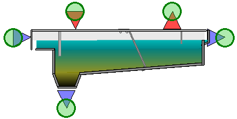
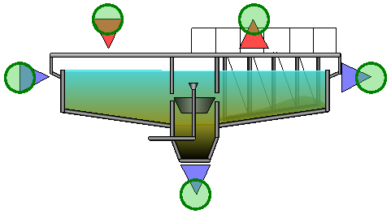
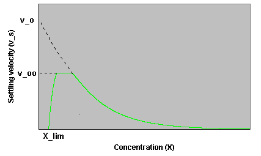

---
tags:
  - block-reference
  - controllers
  - timers
---

# Controllers & Timers

**Summary:** Controller block types available in the WEST model library.

**Source:** WEST Models Guide — Controllers (pp. 345–363), Timers (pp. 364–378).

---

## Standard controllers

Standard controllers implement basic signal processing and feedback control. Includes: On/Off controller (bang-bang), PID controller (proportional-integral-derivative), and Dead-band controller (suppresses control action within a tolerance band around the setpoint). All output a control signal (0–1 or engineering units) suitable for connecting to actuator blocks.

| Model | Type | Notes |
|---|---|---|
| `Controllers.P_Saturation` | P | Proportional only |
| `Controllers.PI_Saturation` | PI | PI with anti-windup saturation — recommended for most loops |
| `Controllers.PI05_Saturation` | PI | PI with 0.5× output scaling |
| `Controllers.PID_Saturation` | PID | Full PID with saturation |
| `Controllers.PID_SaturationAW` | PID | Anti-windup PID |
| `Controllers.OnOff` | On/Off | Simple bang-bang |
| `Controllers.OnOff_Band` | On/Off with dead-band | |
| `Controllers.Ratio` | Ratio | Output = K × input |
| `Ratio2` | Ratio | Two-input ratio |

### PID controller




Classic Proportional-Integral-Derivative (PID) controller. The output signal is calculated as:

```
u(t) = Kp · e(t) + Ki · ∫e dt + Kd · de/dt
```

where `e = setpoint − measurement`. The integral term eliminates steady-state offset; the derivative term damps oscillation by anticipating the rate of change of the error. In practice, `Ki = Kp / Ti` and `Kd = Kp · Td`, so tuning is performed via the gain `Kp`, integral time `Ti` (min), and derivative time `Td` (min).

**Key parameters:**

| Parameter | Description | Typical value |
|---|---|---|
| `Kp` | Proportional gain | 1–10 (loop-dependent) |
| `Ti` | Integral time (min) | 5–60 min |
| `Td` | Derivative time (min) | 0–10 min (often 0 for DO/NH4 loops) |
| `u_min` | Minimum controller output (lower saturation limit) | 0 |
| `u_max` | Maximum controller output (upper saturation limit) | 1 or Q_max |
| `anti_windup` | Enable integrator clamping when output saturates | true |

**Typical uses:** DO control (sensor → PID → blower flow set-point), effluent NH4-based aeration control, flow-pacing of chemical dosing pumps, SBR level control. For most biological control loops in WEST, `Controllers.PI_Saturation` (derivative disabled, `Td = 0`) is the recommended starting point because derivative action amplifies sensor noise.

### On/Off controller

The On/Off controller (bang-bang controller) switches an actuator fully on or off based on a threshold comparison of a measured signal against two set-points. It is the simplest control strategy in WEST and requires no tuning beyond the two thresholds.

**How it works:** When the measured process variable falls below `SP_on`, the controller output switches to `output_on`. When the measurement rises above `SP_off`, the output switches to `output_off`. The dead-band between `SP_on` and `SP_off` prevents rapid cycling (chattering) around the switch point.

**Parameters:**

| Parameter | Description | Typical value |
|---|---|---|
| `SP_on` | Measurement threshold below which the actuator turns on | e.g. 1.0 mg O₂/l |
| `SP_off` | Measurement threshold above which the actuator turns off | e.g. 3.0 mg O₂/l |
| `output_on` | Controller output value when the actuator is on | 1.0 |
| `output_off` | Controller output value when the actuator is off | 0.0 |

**Typical use — intermittent aeration:** Connect a DO sensor output to the On/Off controller measurement input, set `SP_on = 1.0 mg O₂/l` and `SP_off = 3.0 mg O₂/l`. Connect the controller output to a blower or valve block. The blower switches on when DO drops below 1 mg/l and off when DO exceeds 3 mg/l, implementing intermittent aeration for simultaneous nitrification–denitrification (SND) or energy saving.



---

## Operational controllers

Operational controllers implement higher-level plant control logic: time-based switching (day/night, weekday/weekend), cascade control (outer loop sets setpoint for inner loop), feed-forward compensation, and ratio control (maintain fixed ratio between two flows). Used for DO cascade control, flow pacing, and aeration scheduling.

| Model | Purpose |
|---|---|
| `ControllerOp.OnOff11` | On/Off with 11 operating points |
| `ControllerOp.PI11` | PI with 11 operating points |
| `ControllerOp.PID11` | PID with 11 operating points |
| `ControllerOp.PID11_aw` | PID with anti-windup and 11 points |
| `ControllerOp.PID_SRT` | Sludge retention time controller |
| `ControllerOp.Ratio` | Ratio controller |

---

## Pump and blower controllers

Dedicated controllers for pump and blower actuators. The pump controller converts a flow demand signal (m³/d) to a pump speed or on/off command. The blower controller converts an airflow demand (m³/h) to a VFD frequency or valve position signal. Both include protection logic for minimum run time and ramp rate limits.

| Model | Controls |
|---|---|
| `Separate10_CFQThrottle` | 10 centrifugal pumps, throttle |
| `Separate10_CFQVFD` | 10 centrifugal pumps, VFD |
| `Common10_CFHQVFD` | Common header, 10 centrifugal pumps |
| `Common10_CFHNVFD` | Common header, speed control |
| `BlowerControllers.Common10_CFHQVFD` | 10 blowers, H-Q control |
| `BlowerControllers.Common10_PDHQVFD` | 10 positive displacement blowers |

---

## Timers

Timers generate a periodic signal for time-based control (e.g. SBR phase sequencing).



| Model | Period outputs |
|---|---|
| `Timer21–Timer22` | 2-phase, 1 or 2 signals |
| `Timer31–Timer32` | 3-phase |
| `Timer41–Timer42` | 4-phase |
| `Timer51–Timer82` | 5–8 phase timers |

---

## Related

- [Controllers how-to](../how-to/controllers.md)
- [Activated Sludge Tanks](activated-sludge-tanks.md)
