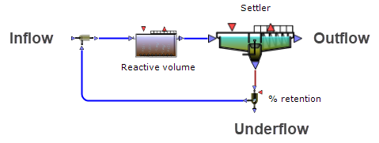
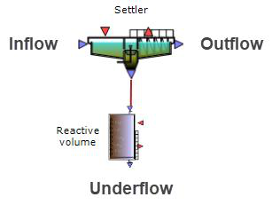
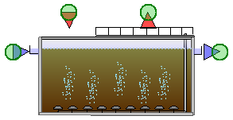
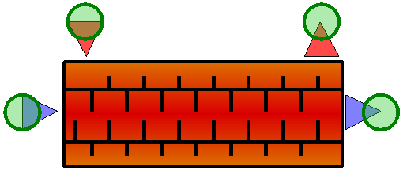
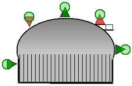
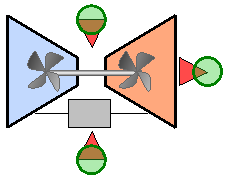

---
tags:
  - block-reference
  - flow
---

# Flow Management

**Summary:** Combiners, splitters, pumps, and loop breakers.

**Source:** WEST Models Guide — Combiners (pp. 121–124), Splitters (pp. 125–129), Pumps (pp. 133–150), Miscellaneous (pp. 453–456).

---

## Combiners

Mix two or more inflow streams.

| Model | Inlets |
|---|---|
| `Mix_02` | 2 inlets |
| `Mix_03` | 3 inlets |
| `Mix_03s` | 3 inlets with settling |

---

## Splitters

Divide one stream into two outflows.

| Model | Description |
|---|---|
| `SplitAbs02` | Absolute flow split — `Q_Out2` sets the second outflow rate in m³/d |
| `SplitRel02` | Relative flow split — `Q_Out2` sets the fraction to the second outlet |
| `SplitRel02w` | Relative split with wastage |
| `SplitRel02s` | Relative split with settling |

**TwoASU example:** `SplitAbs02` is used for the internal recycle (`Q_Out2 = 55 338 m³/d`) and wastage (`Q_Out2 = 385 m³/d`) splitters.

---

## Pumps

| Model | Description |
|---|---|
| `Pumps.SimpleQ` | Constant-flow pump |
| `Pumps.CF_Q_Throttle` | Centrifugal pump, throttle-controlled |
| `Pumps.CF_Q_VFD` | Centrifugal pump, VFD-controlled |
| `Pumps.CF_HQ_VFD` | Centrifugal pump with H-Q characteristic |
| `Pumps.CF_HN_VFD` | Centrifugal pump with speed control |

### Valve block

---

## Loop breakers

Loop breakers must be placed on recycle connections that create algebraic loops (circular dependencies that prevent the Newton solver from converging).

| Model | Description |
|---|---|
| `LoopBreakers.MainDiff` | Differential loop breaker — recommended default |
| `LoopBreakers.MainExplicit` | Explicit loop breaker |
| `LoopBreakers.SignalDiff` | Signal-level loop breaker |

In the TwoASU example, two Loop Breakers are used: one on the internal recycle and one on the return sludge line.

---

## Related

- [Building a Plant Layout](../how-to/building-layouts.md)
- [Quick Start Tutorial](../getting-started/quick-start.md)
