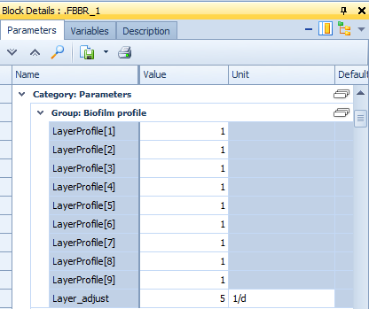
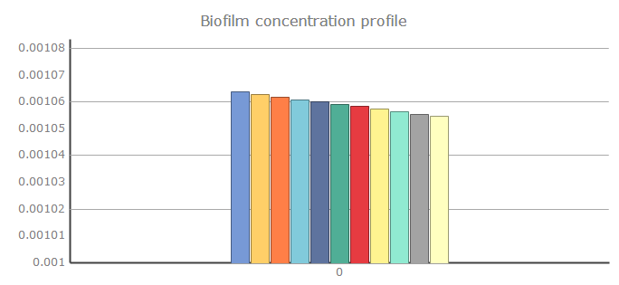
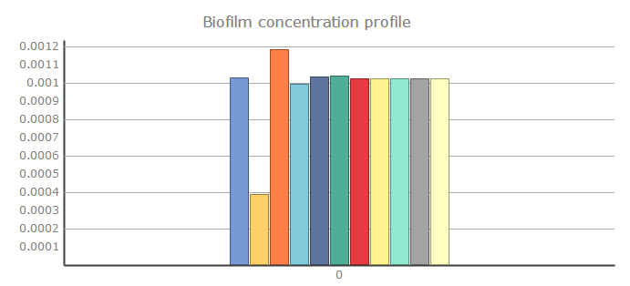
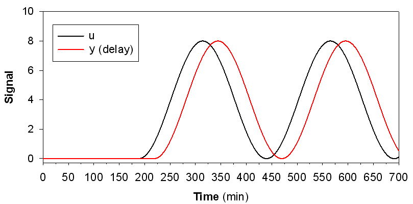
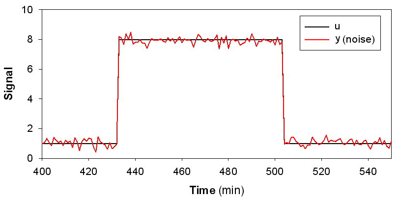
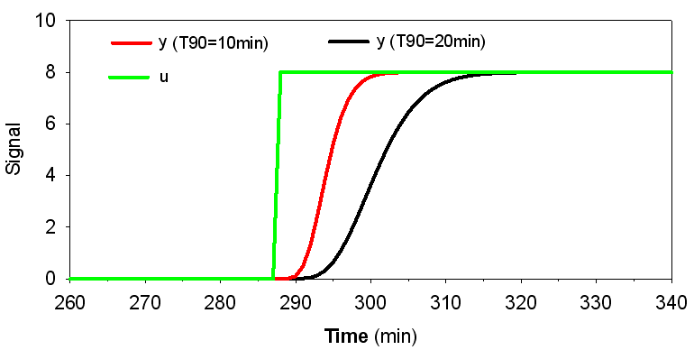
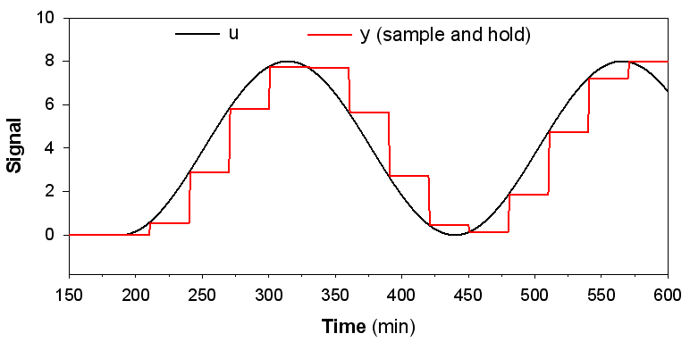
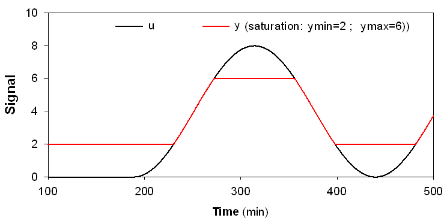

---
tags:
  - block-reference
  - sensors
---

# Sensors & Signal Treatment

**Summary:** Sensor and signal processing blocks for instrumentation and control.

**Source:** WEST Models Guide — Sensors (pp. 380–390), Signal Treatment (pp. 396–403), Samplers (pp. 404–410).

Sensor and signal treatment blocks are the interface between process blocks and controllers in a WEST layout. Sensors read state variables from connected process blocks and output them as control signals. Signal treatment blocks condition those signals (filter, limit, delay) before passing them to actuators. All sensor and signal blocks operate in simulation time — they do not add computation overhead beyond the underlying process model.

---

## Sensors

Sensors measure one or more state variables and output them as data signals for use by controllers or data loggers.

| Model | Measures |
|---|---|
| `ASM1.Multiprobe` | Multiple ASM1 variables (DO, NH4, NO3, TSS, etc.) |
| `ASM1.MultiSampler_kVol` | Volume-proportional sampler for ASM1 |
| `ASM2dISS.Multiprobe` | Multiple ASM2dISS variables |
| `ASM2dISS.MultiSampler_kVol` | Volume-proportional sampler for ASM2dISS |
| `ASM2dMod.Multiprobe` | Multiple ASM2dMod variables |
| `ASM2dMod.MultiSampler_kVol` | Volume-proportional sampler for ASM2dMod |
| `PWM_SA.Multiprobe` | Plant-wide model probe |

### DO Sensor

Dissolved oxygen sensor block. Reads the `S_O` (or `S_O2`) state variable from the connected bioreactor or tank block and outputs it as a data signal in units of g O₂/m³ (equivalent to mg O₂/l). An optional first-order lag can be configured via the time constant `tau` to simulate the finite membrane response delay of a physical DO probe — typical values are 30–120 seconds for membrane-covered polarographic or optical sensors. The output signal is suitable for direct connection to a PID or On/Off controller for DO-based aeration control.

**Key parameters:**

| Parameter | Description | Default | Unit |
|---|---|---|---|
| `tau` | First-order lag time constant (sensor response delay) | 0 | s |
| `noise` | Gaussian noise amplitude added to the measurement | 0 | g O₂/m³ |
| `offset` | Calibration offset | 0 | g O₂/m³ |

**Typical use:** Place a DO Sensor inside or downstream of an aerated bioreactor block. Connect its output to a PI controller that adjusts the blower flow set-point or aeration valve position to maintain a target DO concentration.

### NH4 Sensor

The NH4 Sensor measures ammonium (NH4-N) concentration in mg/L within a bioreactor or process stream. It reads the `S_NH` (or equivalent) state variable from the connected block and outputs it as a data signal.

**Output:** The measured `S_NH4` value (mg N/L) is sent to a connected controller (e.g. an aeration or dosing controller) or written to an output sheet for post-processing.

**Parameters:**

| Parameter | Description | Default | Units |
|---|---|---|---|
| `noise` | Gaussian noise amplitude added to the measurement | 0 | mg N/L |
| `t_delay` | Measurement delay (first-order lag or pure delay) | 0 | min |
| `offset` | Calibration offset added to the raw reading | 0 | mg N/L |

**Typical use — NH4-based aeration control:** Connect the NH4 Sensor output to a PI or On/Off controller that adjusts the aeration set-point or blower output. When NH4-N is low (nitrification proceeding well), the controller reduces aeration to save energy. When NH4-N rises above a threshold, aeration is increased to maintain effluent quality. This strategy is known as ammonia-based aeration control (ABAC) and can achieve significant energy savings compared to fixed DO set-point control.

---

## Signal treatment

Signal treatment blocks modify a data signal before it reaches a controller — adding noise, delay, saturation, or sample-and-hold behaviour. Used to simulate real sensor imperfections.

| Model | Effect |
|---|---|
| `Data.Delay` | Adds a time delay to the signal |
| `Data.Noise` | Adds Gaussian noise |
| `Data.NoiseFromFile` | Adds noise from a file |
| `Data.ResponseTime` | First-order lag (sensor response time) |
| `Data.SampleHold` | Sample-and-hold at fixed interval |
| `Data.Saturation` | Clips signal to min/max range |

---

## Signal treatment blocks

Signal treatment blocks manipulate controller signals before they reach actuators. They are inserted in series between a sensor output and a controller input (or between a controller output and an actuator input) to condition the signal. Available blocks include:

- **Limiter (`Data.Saturation`)** — clamps the output to a defined minimum and maximum range, preventing out-of-range demands from reaching an actuator.
- **Dead-band** — suppresses small deviations around a set-point, avoiding unnecessary actuator movement when the error is within an acceptable tolerance.
- **Rate-limiter** — restricts the maximum rate of change of the signal (units per minute), protecting pumps and blowers from abrupt step demands.
- **Moving-average filter** — smooths noisy signals by averaging over a sliding time window, reducing wear on actuators driven by high-frequency noise.
- **Delay (`Data.Delay`)** — introduces a pure time delay, useful for representing transport lag in a sample line or pipeline.

Connect treatment blocks in series between sensor and actuator blocks using the standard data terminal connectors. Multiple blocks can be chained; order matters (e.g. apply delay before rate-limiter for realistic behaviour).

### Data.Delay

Introduces a fixed time delay between the input and output signal. Use to simulate measurement lag or transport delay in a pipe or sample line.

### Data.Noise

Adds Gaussian random noise to the input signal, simulating sensor measurement error or electrical interference. Configure amplitude and seed for reproducibility.

### Data.ResponseTime

Applies a first-order dynamic filter to the input signal, mimicking the finite response time of a physical sensor (e.g. a DO probe with a membrane). Specify the time constant (s) to control how quickly the output tracks a step change.

### Data.SampleHold

Samples the input signal at a fixed interval and holds the value until the next sample, producing a staircase (zero-order hold) output. Useful for simulating PLC-based or SCADA-polled measurements with a finite scan rate.

### Data.Saturation

Clips the output signal to a defined minimum and maximum range, simulating sensor range limits (e.g. a DO probe that reads 0–20 mg O₂/l). Values outside the range are clamped at the boundary.

---

## Samplers

Sampler blocks compute composite or time-averaged sample values from continuous simulation output. The `TimeSampler` outputs the moving average of a signal over a configurable time window (hours). The `FlowProportionalSampler` computes a flow-weighted average. Samplers are used to replicate the behaviour of composite samplers used in plant monitoring, and to compare simulation output with lab grab-sample data.

| Model | Method |
|---|---|
| `Grab` | Instantaneous grab sample |
| `kTime` | Time-proportional composite |
| `kVolume` | Volume-proportional composite |

---

## Related

- [Controllers & Timers](controllers-timers.md)
- [Controllers how-to](../how-to/controllers.md)
