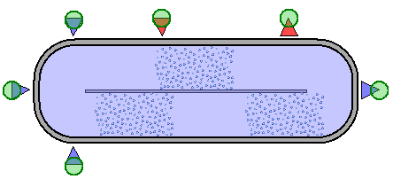
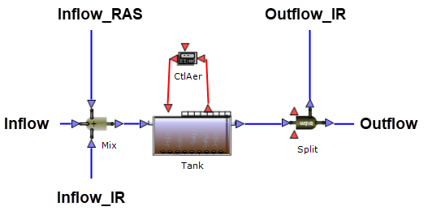
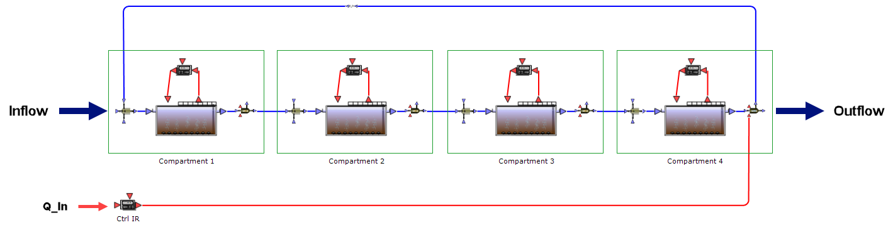
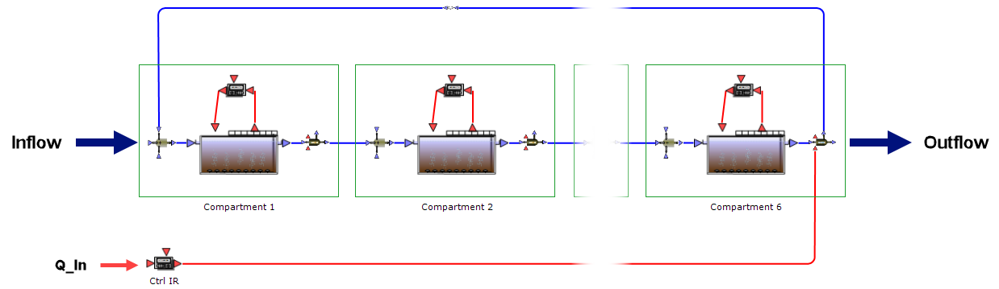
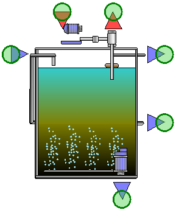

---
tags:
  - block-reference
  - sludge
---

# Sludge Treatment

**Summary:** Thickeners, aerobic digesters, sludge drying, and biogas utilisation block types.

**Source:** WEST Models Guide — Thickeners (pp. 298–303), Aerobic Digesters (pp. 305–307), Sludge Drying (pp. 308–310), Biogas (pp. 311–320).

Sludge treatment blocks model the downstream processing of waste activated sludge (WAS) and primary sludge. The chain typically includes: thickening → digestion → dewatering → disposal. WEST provides blocks for each step, from simple efficiency-based models to the full ADM1 biochemical model for anaerobic digestion. Sludge treatment blocks are connected to the main plant layout via the WAS outlet of secondary clarifiers or activated sludge tanks.

---

## Thickeners

**Palette group:** Separation  
**Category:** `Tanks_Dewater`

| Model | Description |
|---|---|
| `ThickenerDS` | Targets a specified dry solids (DS%) content in the thickened sludge |
| `ThickenerEfficiency` | Targets a specified solids separation efficiency |
| `ThickenerEfficiency2` | Two-stream efficiency thickener |

All thickener models are simplified: they compute the split between clarified water and thickened sludge from either a target DS content or a target separation efficiency.

### ThickenerDS

Solids separation efficiency is back-computed from the desired DS and sludge flow:

$$e_X = \frac{DS \cdot Q_{sl} \cdot \rho_{sl}}{X_{in}}$$

**Parameters:**

| Name | Description | Default | Units |
|---|---|---|---|
| `mode_TSS` | TSS from X_TSS (0) or from X_COD conversion (1) | 0 | — |
| `i_TSS_BM` | TSS/Biomass ratio | 0.9 | — |
| `i_TSS_X_I` | TSS/X_I ratio | 0.75 | — |
| `i_TSS_X_S` | TSS/X_S ratio | 0.75 | — |
| `rho_sludge` | Specific gravity of dewatered sludge | 1.07×10⁶ | g/m³ |

**Interface variables:**

| Name | Terminal | Description | Default | Units |
|---|---|---|---|---|
| `Inflow` | in_1 | Raw sludge influent | — | g/d |
| `Outflow` | out_1 | Clarified water | — | g/d |
| `Outflow2` | out_3 | Thickened sludge | — | g/d |
| `DS` | in_2 | Target dry solids content | 5 | % |
| `Q_Sludge` | in_2 | Desired thickened sludge flow | 10 | m³/d |
| `E_Pump_sp` | in_2 | Pumping energy per unit flow | 0.04 | kWh/m³ |
| `P_Pump` | out_2 | Pumping power | — | kWh/d |
| `e_X` | out_2 | Computed solids separation efficiency | — | — |

### ThickenerEfficiency

Dry solids content is back-computed from the desired efficiency and sludge flow:

$$DS = \frac{X_{in} \cdot (1 - e_X)}{Q_{sl} \cdot \rho_{sl}}$$

Interface and parameters are the same as ThickenerDS, but the `e_X` input drives the split instead of `DS`.

---

## Aerobic digesters

**Category:** `Tanks_AerDig`

| Model | Description |
|---|---|
| `VolumeConstant` | Aerobic digester at constant volume |

The aerobic digester uses the same structure as the activated sludge `VolumeConstant` block, but with aerobic digestion kinetics. Parameters include tank volume (`Vol`), kLa, and temperature. It is connected to an Aeration block the same way as a bioreactor.

---

## Anaerobic digestion (ADM1)

The `AnaerobicDigester.ADM1` block implements the IWA Anaerobic Digestion Model No. 1 (ADM1), a comprehensive mechanistic model with 32 state variables. It covers the full biochemical conversion chain: disintegration and hydrolysis of complex substrates, acidogenesis (sugar and amino acid fermentation), acetogenesis (LCFA and propionate/butyrate oxidation), and methanogenesis (acetoclastic and hydrogenotrophic). Physico-chemical equilibria (acid–base, liquid–gas transfer) are included, enabling pH and biogas composition to be calculated dynamically.

**When to use:** Use `AnaerobicDigester.ADM1` in models where biogas production, methane yield, or digester stability are of interest — for example, plant-wide energy balances, co-digestion studies, or investigations into digester instability (e.g. VFA accumulation, pH drop, foaming risk). For simpler sludge destruction estimates where biogas detail is not required, a lumped empirical model may be sufficient.

**Key block:** `AnaerobicDigester.ADM1`

**Parameters:**

| Parameter | Description | Default | Units |
|---|---|---|---|
| `Volume` | Digester working volume | 3 000 | m³ |
| `T_dig` | Digestion temperature | 35 | °C |
| `SRT_target` | Target solids retention time | 20–30 | d |
| `pH` | pH (calculated from acid–base equilibria) | — | — |
| `Q_gas` | Biogas production rate (output) | — | m³/d |

---

## Sludge drying

| Model | Description |
|---|---|
| `SludgeDrying_Ideal` | Ideal dryer — evaporates water to reach a target dry solids percentage |

The ideal dryer computes the energy required to evaporate moisture from the thickened sludge to reach a target DS content. No reaction kinetics are modelled.

---

## Biogas accumulation and utilisation

These blocks are used in plant-wide models where anaerobic digestion generates biogas.

| Model | Description |
|---|---|
| `GasHolder` | Biogas storage vessel (volume buffer) |
| `GasBoiler` | Combustion boiler for heat recovery |
| `GasEngine` | Combined heat and power (CHP) gas engine |
| `GasTurbine_Simple` | Simplified gas turbine model |
| `Flare` | Biogas flare (waste combustion) |

The `GasEngine` (CHP) model computes:
- Electrical power output (kWh/d)
- Heat output (kWh/d)
- Gas consumption rate (m³/d)

from an electrical efficiency and a heat efficiency applied to the lower heating value of the biogas.

---

## Typical sludge line configuration

A standard sludge treatment train in a WEST model:

1. **Primary clarifier underflow** → Primary sludge
2. **Waste activated sludge (WAS)** from secondary clarifier underflow
3. Both streams → **Thickener** (ThickenerDS)
4. Thickened sludge → **Anaerobic digester** (from Biological Treatment palette)
5. Digester gas → **GasHolder** → **GasEngine** (CHP)
6. Digester effluent (reject water) → back to influent or separate treatment

---

## Related

- [Clarifiers](clarifiers.md)
- [Activated Sludge Tanks](activated-sludge-tanks.md)
- [Advanced Processes](advanced-processes.md)
