---
tags:
  - experiment-types
  - calibration
  - parameter-estimation
---

# Parameter Estimation & Calibration

**Summary:** Automatically fit model parameters to measured plant data using WEST's built-in optimisation.

**Source:** WEST Getting Started Tutorial, Chapter 11.

**Prerequisites:** [Running Simulations](../how-to/running-simulations.md) · [Sensitivity Analysis](sensitivity-analysis.md) · WEST+ licence

---

## Concept

Parameter Estimation (also called Model Calibration) minimises the difference between simulated outputs and measured data by iteratively adjusting selected parameters. WEST uses gradient-based and evolutionary optimisation algorithms.

Two sub-modes are available:
- **Model Calibration** (11.1): minimise deviation from measurement time-series
- **Optimisation** (11.2): minimise an arbitrary objective function (cost, energy, etc.)

---

## Setting up parameter estimation

1. Save a copy of the TwoASU project.
2. Go to **Project | Virtual Experiments → Parameter Estimation** and select the base Dynamic experiment.
3. Open **Analysis Properties**.

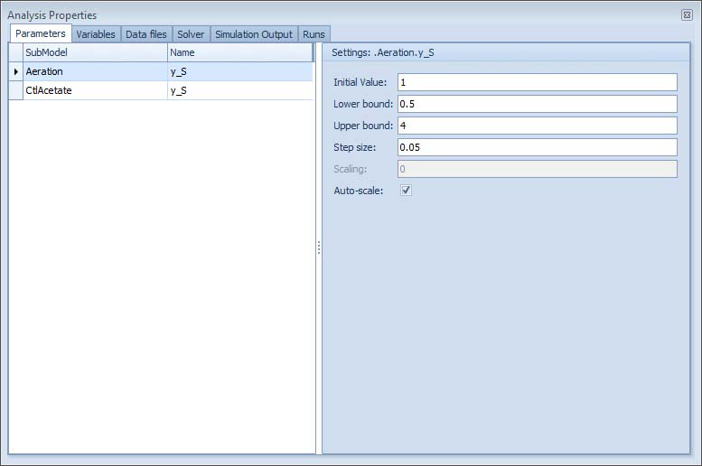

4. In the **Parameters** tab, drag the parameters to calibrate (e.g. `Clarifier.r_P`, `Clarifier.v0`, internal recycle flow). Set bounds for each.

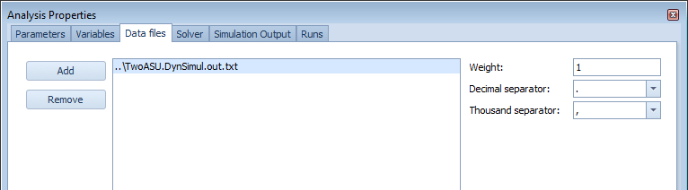

5. In the **Variables** tab, drag measured data series (from a data file) and the corresponding model outputs. Configure the **Objective** criterion for each pair (e.g. AbsSquared).
6. In the **Solver** tab, select the optimisation algorithm and settings.
7. Click **Execute**. WEST runs multiple simulations, adjusting parameters toward the optimum.
8. In the **Runs** tab, select the best run and click **Copy Values** to apply the calibrated parameters to the simulation.

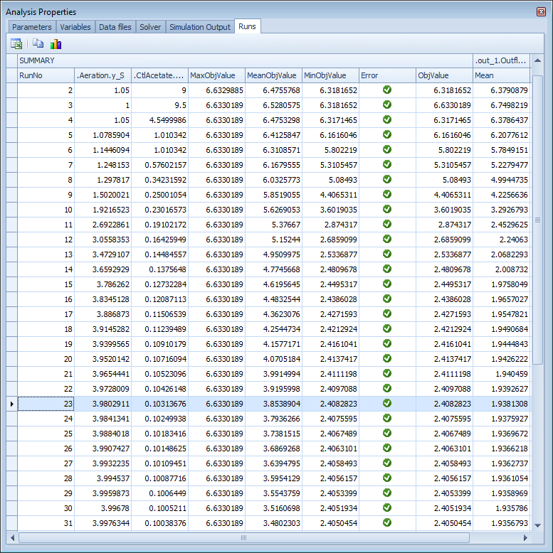

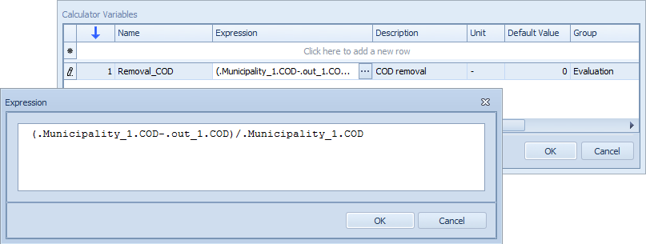

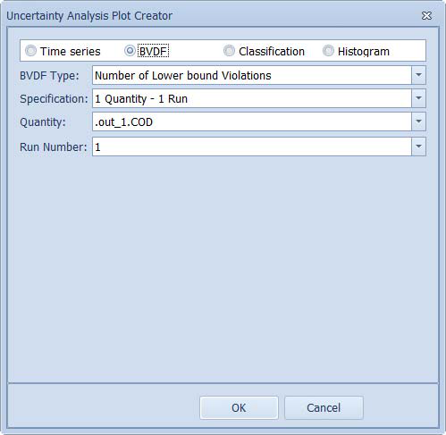

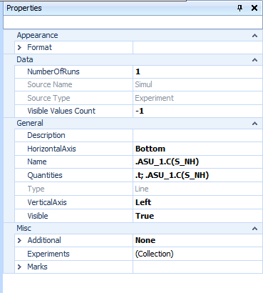

---

## Algorithm options

WEST provides two solvers selectable in the **Solver** tab of Analysis Properties:

### Simplex (Nelder-Mead)

The **Simplex** solver implements the Nelder-Mead downhill simplex method. It is a derivative-free, direct-search algorithm that navigates the parameter space by reflecting, expanding, and contracting a geometric simplex around the current best point.

- Best suited to problems with a small number of parameters (fewer than ~10) and a smooth, unimodal objective surface.
- Converges quickly when started near the optimum.
- Can be used in **Constrained Optimisation** mode, which enforces the parameter bounds specified in the Parameters tab throughout the search.
- The tutorial example (ch. 11.1) uses the Simplex solver with Constrained Optimisation to calibrate `K_NO` and `K_OA` against measured anoxic-tank nitrate data, converging in approximately 70 runs.

### Differential Evolution (evolutionary global search)

When **Differential Evolution** is selected, WEST samples the parameter space globally using a population-based stochastic search. This is more robust against local minima and suitable for larger parameter sets or highly non-linear objective surfaces, but requires significantly more simulation runs.

**Choosing between solvers:**
- Use Simplex when sensitivity analysis has already identified a small, well-constrained parameter set and the model has been initialised close to the solution.
- Use Differential Evolution when the parameter space is wide, interactions are unknown, or earlier Simplex runs converged to physically implausible values.

---

## Objective function options

The objective for each measured variable is configured in the **Variables** tab under the **Time series Criterion** drop-down. Available options include:

| Criterion | Description |
|---|---|
| **Mean Difference** | Mean of (simulated − measured); penalises systematic bias. Used in the tutorial calibration example. |
| **Maximum Difference** | Maximum absolute deviation over the simulation period. |
| **Theil's Inequality Coefficient** | Normalised measure of forecast accuracy; 0 = perfect, 1 = no better than naïve. |
| **End Value Difference** | Deviation at the final time point only; useful for steady-state targets. |
| **Upper Percentile** | High percentile of the output distribution over time; useful for worst-case effluent compliance objectives. |
| **Mean** / **Lower Percentile** | Statistical summaries used when the objective is defined without a reference data set (pure optimisation mode). |

Multiple objectives across different variables can be combined; each can be given a relative **weight**. The overall `ObjValue` reported in the Runs tab is the weighted sum.

**Note:** By default the "Desired Value" (stop threshold) is set to 0, which is equivalent to requesting a perfect match. Set a realistic non-zero tolerance to avoid unnecessary runs after the model has reached an acceptable fit.

---

## Stopping criteria

The calibration run stops when any of the following conditions is met:

1. **Desired Value reached** — the overall objective `ObjValue` drops below the threshold set in the Variables tab for each criterion. The default of 0 means this criterion is effectively disabled unless changed.
2. **Manual interruption** — the user clicks Stop when the error plot (e.g. the "Error" column chart showing `MeanDiff` vs run number) appears to have reached a plateau (i.e. the objective is no longer improving).
3. **Parameter convergence** — the Simplex simplex collapses to a size below the internal tolerance, indicating that no further improvement is possible within the current starting region.

In practice, monitoring the **Error** plot (Figure 11.3 in the tutorial) is the most reliable stopping indicator: if the bars have levelled off and the parameter traces (Figure 11.4) have stabilised, the calibration is complete even if the Desired Value has not been formally met.

---

## Results interpretation

### Runs tab

The **Runs** tab lists every simulation run with its parameter values and the resulting objective value. The run with the lowest `ObjValue` is highlighted. Click **Copy Values** on the best run to transfer its parameter set back to the simulation.

### Data Fit plot

Set up a **Line** plot with two series:
- Simulated output (dragged from Block Details, e.g. `Anoxic.C(S_NO)`)
- Measured data (added via **Add Series → File** source, pointing to the measurement text file)

A good calibration result shows the simulated line tracking the peaks and troughs of the measured scatter (Figure 11.2 in the tutorial). Systematic offset after convergence suggests a structural model limitation rather than a parameter estimation problem.

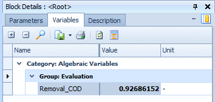

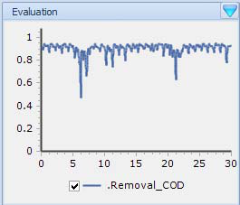

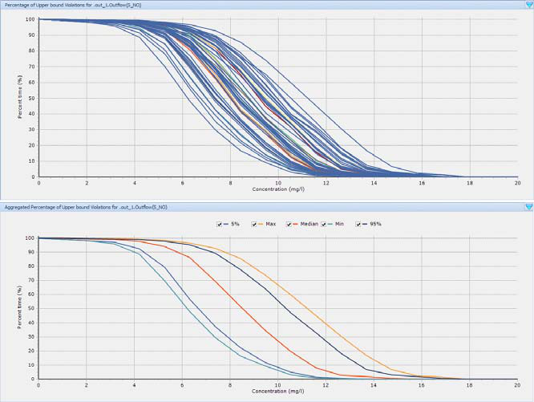

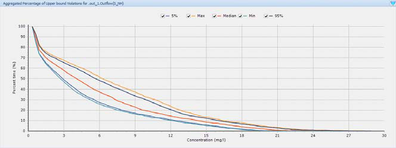

### Error (convergence) plot

A **Column** plot of `MeanDiff` (or whichever criterion was chosen) vs run number shows how the objective has evolved. A healthy optimisation shows a rapidly declining trend in the first 20–30 runs that flattens to a stable low value (Figure 11.3). Continued oscillation without reduction indicates the parameter bounds are too wide or the model is not identifiable from the available data.

### Parameter trajectory plot

A **Line** plot of each calibrated parameter value vs run number (Figure 11.4) shows whether the parameters have stabilised at physically plausible values. In the tutorial example, `K_NO` converges to 0.50 and `K_OA` to 0.40, matching the known ASM1 defaults used to generate the synthetic measurement set (Table 11.1).

### Summary table (example)

| Parameter | Initial value | Calibrated value | ASM1 default | Units |
|---|---|---|---|---|
| `K_NO` | 1.0 | 0.50 | 0.5 | g N/m³ |
| `K_OA` | 1.0 | 0.40 | 0.4 | g O₂/m³ |
| Mean Difference (final) | — | 0.005 | — | g N/m³ |

---

## Practical tips

- **Run LSA/GSA first.** Use [Sensitivity Analysis](sensitivity-analysis.md) to identify which parameters have the largest influence on the calibration targets before setting up parameter estimation. Calibrating insensitive parameters wastes compute time and produces numerically unreliable results.
- **Bound parameters physically.** Always set Lower Bound and Upper Bound to realistic ranges (e.g. `K_NO`: 0.05–2.0 g N/m³). The Simplex solver with Constrained Optimisation enforces these bounds; without them the search may wander into negative or extreme values.
- **Start from a good initial guess.** Set Initial Value to the literature default or a value obtained from a prior steady-state calibration. A poor starting point forces the Simplex to explore a larger region and slows convergence.
- **Limit the calibration set.** Calibrate no more than 3–5 parameters simultaneously unless using Differential Evolution with a large number of shots. Over-parameterisation leads to non-unique solutions and poor predictive performance outside the calibration data period.
- **Enable a slave Steady-State simulation.** In the Solver tab, checking "Run a slave Steady-State simulation prior to Dynamic simulation" initialises the model at a consistent operating point before each dynamic run, reducing the influence of initial conditions on the objective value.
- **Validate after calibration.** Apply the calibrated parameters to an independent data period (different season or loading condition) to confirm that the model generalises rather than overfitting to the calibration dataset.

---

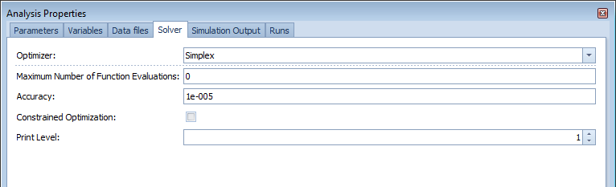

## Related

- [Sensitivity Analysis](sensitivity-analysis.md) — use LSA/GSA first to identify which parameters matter
- [Uncertainty Analysis](uncertainty-analysis.md) — quantify remaining uncertainty after calibration
