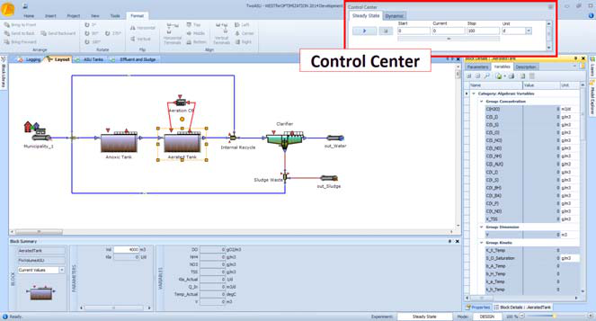
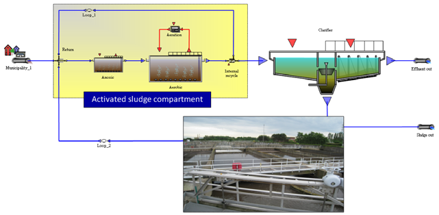
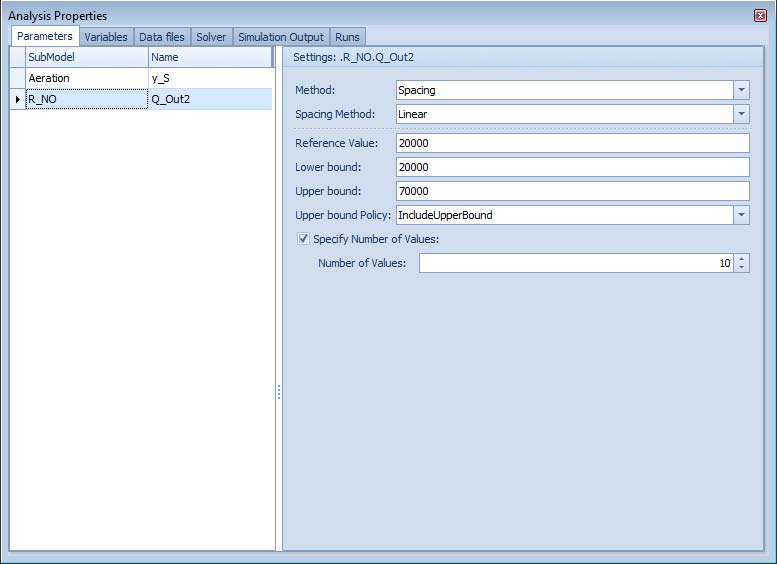
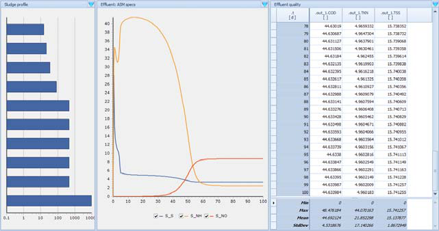
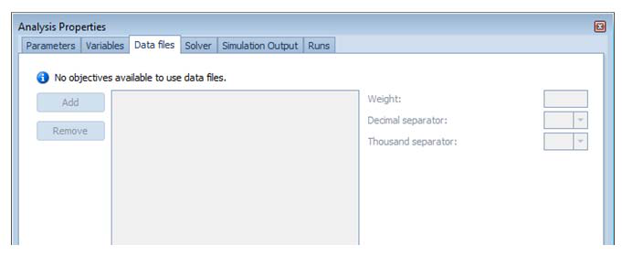
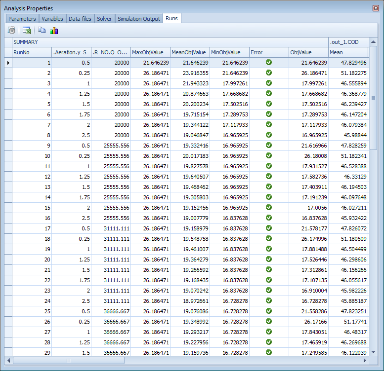
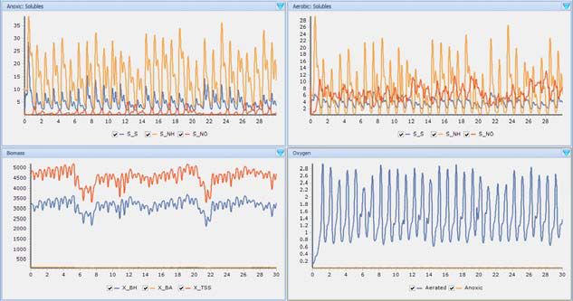
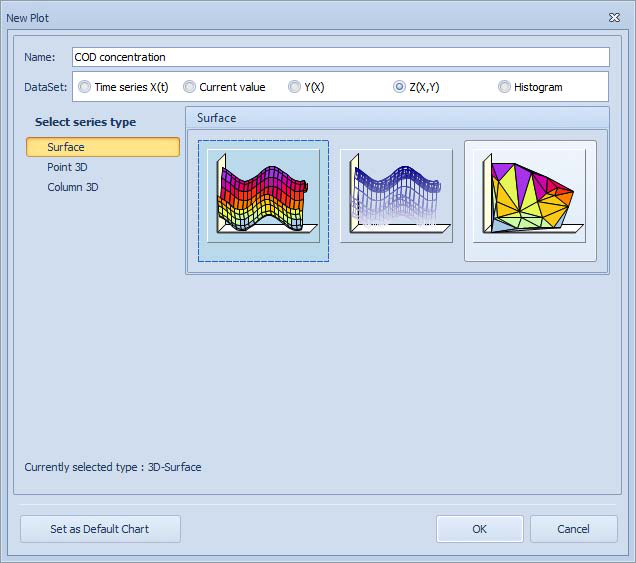
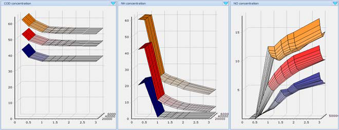
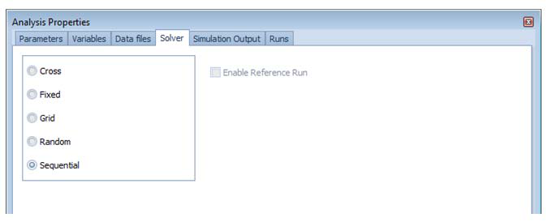

---
tags:
  - experiment-types
  - scenario-analysis
---

# Scenario Analysis

**Summary:** Automatically run simulations for a defined set of parameter value combinations and compare results side by side.

**Prerequisites:** A working dynamic simulation. See [Running Simulations](../manuals/running-simulations.md).

---

## Overview

Scenario Analysis (SA) runs a batch of simulations where each run uses a different combination of parameter values. This lets you compare design alternatives, operating strategies, or boundary conditions without manually re-running the simulation for each case. Results are collected in a **Runs** matrix and the best-performing run is highlighted automatically.

---

## Setting up a scenario analysis

1. Go to **Project → Virtual Experiments** and create or open a **Scenario Analysis** experiment. Select the base dynamic simulation to use.
2. In the **Parameters** tab, add the parameters (or manipulated variables) to vary. Drag them from Block Details or use the **+** button.
3. For each parameter, enter the list of values to test.
4. Choose a **solver type** (see table below) to control how combinations are enumerated.
5. Optionally add **data files** in the Data Files tab for reference time series used in objective calculations. For each file, specify the weight and the decimal/thousand separators.
6. In the **Output** tab, configure whether simulation output files are written:
   - Enable or disable output file writing per run.
   - Set the **file name pattern** (use `{}` as a placeholder for the run number, e.g. `scenario_{}.out`).
   - Set the **communication interval** and toggle **interpolation** as needed.
7. Define **criteria** in the Variables/Criteria tab. Supported criteria: Mean Difference, Max Difference, Theil's IC, End Value Difference (all computed against reference time series from data files).
8. Click **Run**. WEST executes one simulation per row in the runs matrix.

---

## Solver types

The solver type determines how WEST enumerates combinations from the parameter value lists.

| Solver | Behaviour | Total runs |
|---|---|---|
| **Sequential** | Steps through every combination of all parameter values (full factorial). | Product of all list sizes: n1 × n2 × … × np |
| **Random** | Same as Sequential but executes runs in random order. | n1 × n2 × … × np |
| **Fixed** | All parameter lists must be the same size. Takes values at the same position across lists — no cross-combination. Run 1 uses value[0] of every parameter, run 2 uses value[1], etc. | n (size of the lists) |
| **Grid** | Same enumeration as Sequential, but runs are sorted by their distance to a reference point in parameter space. Optionally includes the reference point as an extra run. | n1 × n2 × … × np (+ 1 if reference included) |
| **Cross** | Varies one parameter at a time from the reference point. Does not enumerate all combinations — each parameter sweeps independently. Optionally includes the reference run. | sum(n1 + n2 + … + np) (+ 1 if reference included) |

**Choosing a solver:**
- Use **Sequential** or **Grid** for a full factorial comparison of a small number of parameters.
- Use **Fixed** when you have pre-defined scenario vectors of equal length (e.g. an explicit list of design alternatives).
- Use **Cross** for a "one-at-a-time" sweep to understand individual parameter effects without the combinatorial explosion of a full factorial.

---

## Viewing results

The **Runs** tab shows a matrix with one row per completed run:

- Columns for each varied parameter value used in that run.
- Columns for each computed objective value.
- The **best run** (lowest overall objective) is highlighted.

| Button | Action |
|---|---|
| **Generate** | Re-generate the runs matrix from the current parameter lists and solver settings. |
| **Export** | Export the matrix to Excel (XLS or XLSX). |
| **Print** | Print the runs table. |
| **Copy Values** | Copy the selected run's parameter values back to the base simulation. |
| **Run** | Execute all runs in the matrix. |
| **Plot** | Generate instant histograms of objective values across runs. |

To apply the best-performing scenario to your model, select its row and click **Copy Values**.

---

## Related

- [Uncertainty Analysis](uncertainty-analysis.md)
- [Parameter Estimation](parameter-estimation.md)
- [Results and Output](../manuals/results-output.md)
