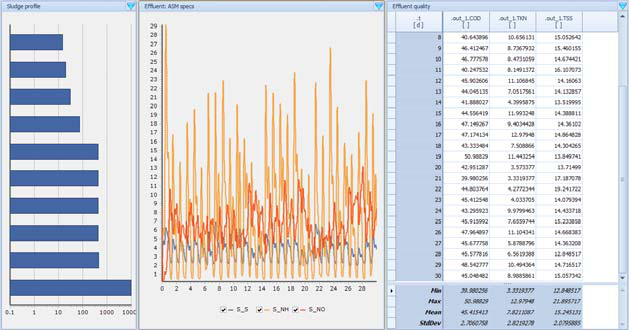
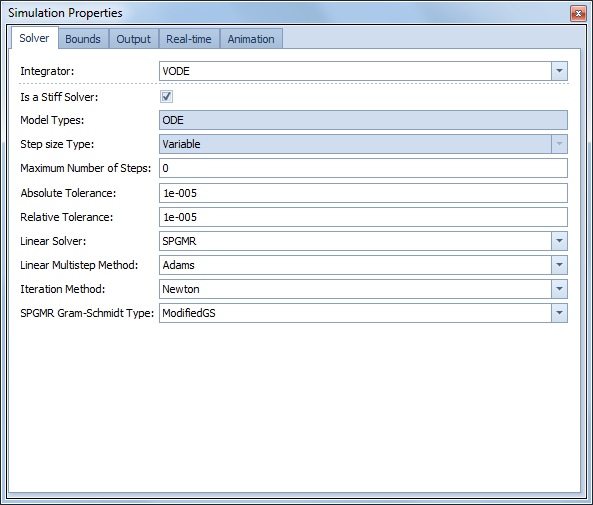
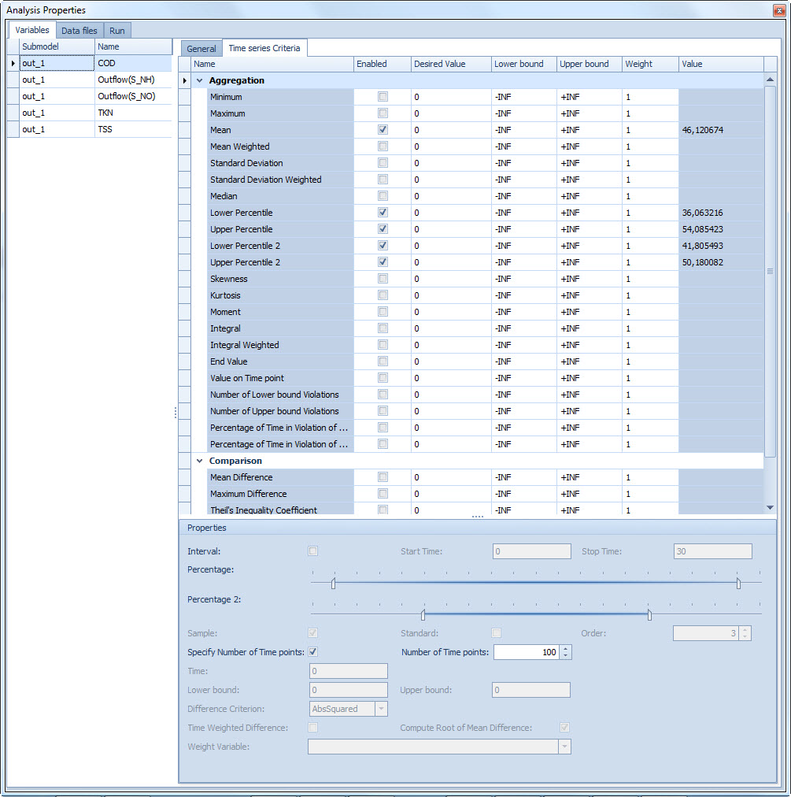
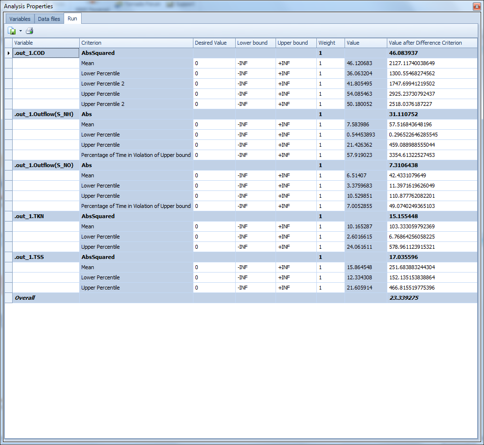
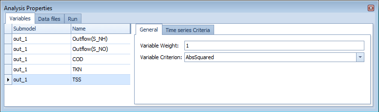
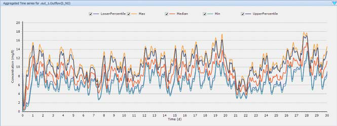

---
tags:
  - experiment-types
  - sensitivity-analysis
---

# Sensitivity Analysis

**Summary:** Quantify how model outputs (e.g. effluent TSS, S_NO) respond to changes in parameters (e.g. DO set-point, sludge settling properties).

**Source:** WEST Getting Started Tutorial, Chapters 9 (Local) and 10 (Global).

**Prerequisites:** [Running Simulations](../how-to/running-simulations.md) · WEST+ licence

---

## Local Sensitivity Analysis (LSA)

A Local Sensitivity Analysis computes a numerical approximation of how state variables, worker variables, or output variables change with respect to parameters or initial conditions, evaluated at a single operating point.

**What it answers:** "If I change parameter X by 1%, how much does output Y change?"

**When to use:** Understanding dominant parameters; identifying which parameters to focus calibration on.

### Setting up an LSA

1. Open (or save a copy of) the TwoASU project.
2. In **Project | Virtual Experiments**, click **Local Sensitivity Analysis** and select the base Dynamic experiment.
3. Open the **Analysis Properties** dialogue.
4. In the **Parameters and Variables** tab, drag the parameters to perturb (e.g. `Aeration.y_S`, `Clarifier.r_P`, `Clarifier.v0`, `InternRecycle.Q_Out2`) from Block Details into the Parameters panel.
5. Drag the output variables of interest (e.g. `out_1.TSS`, `out_1.Outflow(S_NO)`) into the Variables panel.
6. In **Simulation Output** tab, ensure Communication Interval ≠ 0 (e.g. 0.014).
7. Click **Execute**.



### CRS (Central Relative Sensitivity) plots

Results appear in the **Runs** tab. To visualise them, add a Sheet named "CRS" and create Time Series Line plots. In the plot sub-menu choose **Add Series**, set Source Type to **Experiment** and Source Name to **Sens**; then for each series choose `.t` as the X-item and **CRS** as the Y-item, paired with the appropriate sensitivity function (e.g. `SensFunc: .Aeration.y_S` combined with `out_1.TSS`).

**What the CRS plot shows:**

The Central Relative Sensitivity (CRS) function is the time-varying partial derivative of an output variable with respect to a parameter, scaled by the ratio parameter/output so the result is dimensionless:

```
CRS(t) = (∂Y / ∂P) × (P_ref / Y_ref(t))
```

- The **x-axis** is simulation time (days).
- The **y-axis** is the dimensionless relative sensitivity — a value of +50 means a 1% increase in the parameter causes approximately a 0.5% increase in the output at that instant.
- **Large absolute values** indicate high sensitivity: the output changes substantially when the parameter changes.
- **Sign** indicates direction: positive means output increases with parameter; negative means output decreases.
- **Steep or high-amplitude segments** in the time trace correspond to events (e.g. storm peaks, diurnal load peaks) where the model is particularly sensitive to that parameter.
- **Flat traces near zero** identify parameters that have negligible influence on the chosen output and can be fixed at default values during calibration.

Interpretation is complicated by time-varying inputs: a parameter may appear highly sensitive at a specific time point simply because a high-flow event occurs then, not because it is structurally important across all conditions. This is why LSA is complemented by GSA.



### Typical sensitivities for the TwoASU example

| Parameter | Output: Effluent TSS | Output: Effluent S_NO |
|---|---|---|
| `Clarifier.r_P` (sludge compression) | **High** — dominant | Moderate |
| `Clarifier.v0` (settling velocity) | **High** | Moderate |
| `InternRecycle.Q_Out2` (internal recycle) | Low–moderate | **High** — dominant |
| `Aeration.y_S` (DO set-point) | Low | Moderate |
| `R_Sludge.Q_Out2` (sludge wastage) | Moderate | Low |

From the tutorial (ch. 9.1): "The solid concentration (TSS) in the effluent appears to be more sensitive to the sludge characteristics (r_P and v0) and occasionally to the internal recycle; whereas, the nitrate concentration (S_NO), mostly to the internal recycle but also to the sludge characteristics (v0)."

**Implication for calibration:** Prioritise `r_P` and `v0` when calibrating to TSS data; prioritise internal recycle flow when calibrating to effluent nitrate.

### Typical ASM1 sensitivities for effluent NH₄ (nitrification-focused models)

| ASM1 parameter | Sensitivity on effluent NH₄ | Reason |
|---|---|---|
| `mu_AUT` (max autotrophic growth rate) | **Very high** | Directly controls nitrification capacity |
| `K_NH_AUT` (NH₄ half-saturation, autotrophs) | High | Affects rate at low NH₄; governs effluent residual |
| `b_AUT` (autotroph decay rate) | Moderate–high | Reduces net autotrophic growth; competes with mu_AUT |
| `K_O_AUT` (O₂ half-saturation, autotrophs) | Moderate | Significant only when DO is near limiting |
| `Y_AUT` (autotrophic yield) | Low–moderate | Affects sludge production more than effluent quality |
| `mu_H` (max heterotrophic growth rate) | Low | Indirect effect via oxygen competition |
| `k_h` (hydrolysis rate) | Low | Affects COD removal more than nitrogen |
| `K_S` (heterotroph substrate half-sat.) | Very low | Negligible effect on nitrification |

---

## Global Sensitivity Analysis (GSA)

A Global Sensitivity Analysis samples the full parameter space (Monte Carlo) and uses linear regression to rank parameter importance across all operating conditions.

**What it answers:** "Which parameters matter most across the whole plausible range?"

**When to use:** Screening before detailed calibration; understanding uncertainty sources.

### Setting up a GSA

1. Save a copy of the TwoASU project.
2. In **Project | Virtual Experiments**, click **Global Sensitivity Analysis** and select the Dynamic experiment. Enable **Run a slave Steady-State simulation prior to Dynamic simulation**.
3. In **Analysis Properties → Parameters** tab, drag parameters and assign their distributions:

| Block | Parameter | Distribution | Settings |
|---|---|---|---|
| Aeration | `y_S` | Normal | Mean: 1.5, StDev: 0.05 |
| Clarifier | `r_P` | Normal | Mean: 0.00286, StDev: 0.0005 |
| Clarifier | `v0` | Normal | Mean: 474, StDev: 100 |
| Clarifier | `Q_Under` | Uniform | 10 000–30 000 m³/d |
| R_NO (internal recycle) | `Q_Out2` | Uniform | 20 000–70 000 m³/d |
| R_Sludge (wastage) | `Q_Out2` | Uniform | 100–500 m³/d |

4. In **Solver** tab, set Number of Shots to 50.
5. Click **Execute**.



### Interpreting GSA results

- **Linear Regression \| Scalars**: aggregated regression statistics per objective.
- **Linear Regression \| Vectors**: regression coefficients (LCC, PCC, SRC) — create a Tornado plot by selecting an objective and clicking **Plot**.
- **Runs tab**: objective values for each Monte Carlo run; best run is highlighted.



### Tornado plot interpretation

A Tornado plot is a horizontal bar chart generated from the **Linear Regression | Vectors** tab. To create one: select the objective of interest (e.g. Upper Percentile of TSS) in the left-hand tree, click **Plot**, and choose the regression coefficient vector (e.g. LCC — Linear Correlation Coefficient).

**How to read a Tornado plot:**

- Each horizontal bar represents one parameter. Parameters are ranked from most influential (top) to least influential (bottom), giving the chart its tornado shape.
- **Bar length** indicates the strength of the linear association between that parameter and the objective across all Monte Carlo runs. A longer bar means a stronger effect.
- **Bar direction (sign)** indicates the direction of influence: a bar extending to the **right** (positive coefficient) means increasing the parameter increases the objective value; a bar extending to the **left** (negative coefficient) means increasing the parameter decreases the objective.
- **Near-zero bars** (very short) identify parameters that can be fixed at their default values without significantly affecting model predictions — these are not worth calibrating.



**TwoASU GSA findings (from Tutorial ch. 10.1):**

For the **Upper Percentile of TSS** in the effluent (Figure 10.5):
- `Clarifier.r_P` has the longest positive bar — sludge compressibility is the dominant factor driving peak TSS.
- `Aeration.y_S` and `Clarifier.Q_Under` also show positive bars of moderate length.
- `Clarifier.v0` and `InternRecycle.Q_Out2` have near-zero bars for TSS.
- `SludgeWaste.Q_Out2` shows a negative bar — higher wastage reduces sludge inventory and therefore TSS.

For the **Upper Percentile of nitrate (S_NO)** in the effluent (Figure 10.6):
- `InternRecycle.Q_Out2` has the longest negative bar — higher internal recycle delivers more nitrate to the anoxic zone, reducing effluent nitrate.
- `SludgeWaste.Q_Out2` also shows a negative bar.
- `Clarifier.r_P` shows a modest positive bar.
- `Clarifier.v0`, `Clarifier.Q_Under`, and `Aeration.y_S` have small effects on nitrate.

**Using Tornado plots for calibration prioritisation:** Focus measurement effort and parameter estimation on the 2–3 parameters with the longest bars for the effluent quality indicators that matter most for the project. Parameters with short bars across all objectives can be fixed at literature defaults.



---

## Related

- [Parameter Estimation](parameter-estimation.md)
- [Running Simulations](../how-to/running-simulations.md)
- [TwoASU Worked Example](../worked-examples/twoasu-mle.md)
