---
tags:
  - getting-started
  - interface
---

# The WEST Interface

**Summary:** An orientation to the WEST graphical environment — sheets, blocks, terminals, the Block Library, and the included example projects.

**Source:** WEST User Guide, Chapter 2.

---

## Overview of the workspace

When WEST opens you see a multi-panel environment built around a central sheet area flanked by dockable system windows. The main areas are:

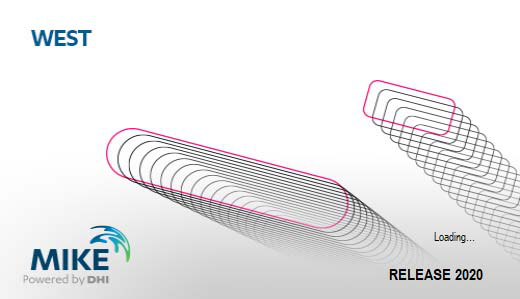

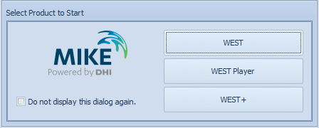

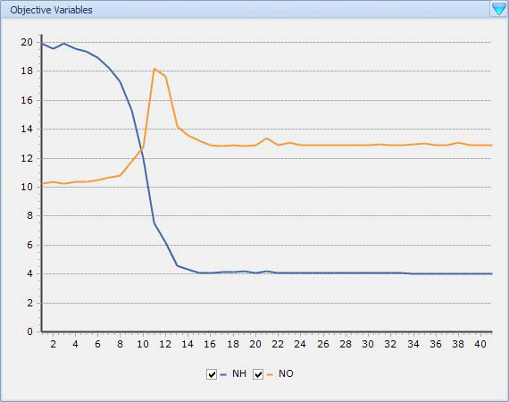

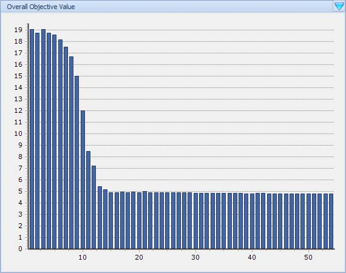

| Area | Description |
|---|---|
| **Sheet area** | The large central canvas. Shows whichever sheet tab is active (Layout, Dashboard, Interface, or Web Browser). |
| **Block Library** | Left-hand palette of all available process-block categories. Drag blocks from here onto the Layout Sheet. |
| **Properties window** | Shows and edits graphical properties (position, size, colour, label) of the selected layout object. |
| **Block Details window** | Shows the Parameters and Variables of the selected block. |
| **Model Explorer** | Tree view of the entire project: project → blocks → sub-models → variables. |
| **Control Center** | Run panel: select experiment type, start/stop simulations, view progress. |
| **Layers panel** | Manage visibility layers for organising complex layouts. |
| **Logging window** | Solver messages, warnings, and errors during a simulation run. |
| **Menu bar** | Tabbed ribbon: Home, Insert, Project, View, Tools, Format. |
| **Status bar** | Shows current experiment type, edit mode, and zoom level. |

On first launch, the **Getting Started pane** is shown instead of the Layout Sheet. It provides quick access to recent projects, example projects, templates, and tutorials.

The **News Headlines** panel displays links pulled automatically from the MIKE Powered by DHI website, so you always see the latest DHI announcements without leaving WEST.

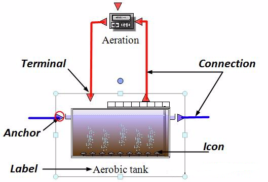

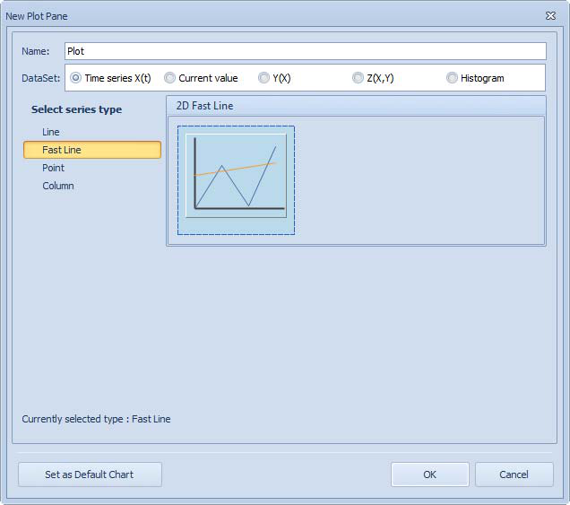

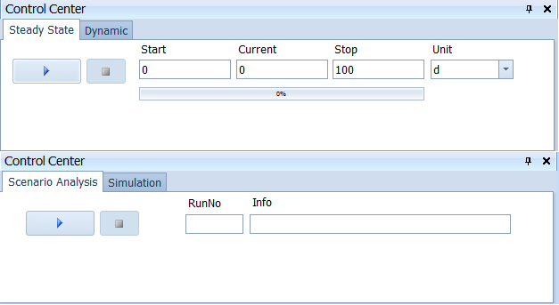

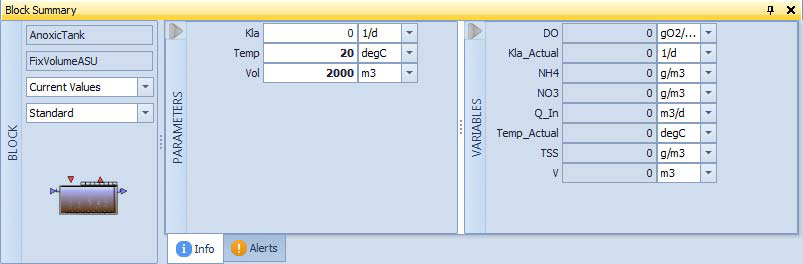

---

## Sheets

Four classes of sheet are available in a project:

| Sheet type | Purpose | Quantity |
|---|---|---|
| **Layout Sheet** | The drawing canvas where blocks are placed and wired together to represent the plant. | One per project |
| **Interface Sheets** | Tab pages for influent fractionation (Influent Sheet) and effluent de-fractionation (Effluent Sheet). | One per Input/Output block |
| **Dashboard Sheets** | Contain Input widgets (sliders, numeric fields) and Output widgets (plots, tables, gauges) for interactive use during runs. | Multiple allowed |
| **Web Browser Sheets** | Display the DHI website, WEST forum, or local documentation inside the WEST window. | Multiple allowed |

To add a sheet: **Insert → Sheets group → Add Sheet**.

---

## The Layout Sheet — blocks, terminals, and connections

### Blocks

A **Block** is the graphical representation of a unit-process model (e.g. a CSTR bioreactor, a settler, an influent generator). Each block consists of three parts:

- **Icon** — the visual symbol on the canvas.
- **Terminals** — connection anchor points around the icon edge.
- **Label** — the block's display name, shown beneath or beside the icon.

Blocks are placed by dragging from the **Block Library** onto the Layout Sheet.

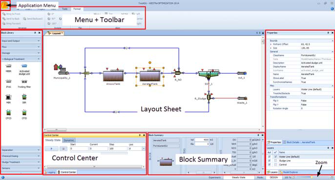

### Terminals

Hovering the mouse over a terminal shows a tooltip with five properties:

| Property | Meaning |
|---|---|
| **Name** | Internal identifier of the terminal |
| **Type** | Data type of the signal carried |
| **Description** | Human-readable explanation |
| **Causality** | Input or Output |
| **Maximum Number of Connections** | How many connections this terminal accepts |

Two visual terminal types exist:

- **Blue arrows** — mass-flux terminals: carry the wastewater flow vector between process units.
- **Red squares** — data terminals: carry control signals or sensor outputs (scalar values).

### Connections

Connections are drawn between compatible terminals. Use **Insert | Connections** (or the right-click context menu) and choose **Polyline** or **Orthogonal** routing before clicking the start terminal. After a connection is made an **Interface Link** dialog may appear, allowing you to map specific variables from the source terminal to variables on the destination terminal (e.g. a sensor output to a controller manipulated variable). Double-click any connection to review or modify its Interface Links.

---

## Block Library

The Block Library panel (left side of the screen) lists all process-block categories installed with WEST. Categories include biological reactors, settlers, influent/effluent generators, sensors, controllers, and more. Expand a category to see individual block icons; drag one onto the Layout Sheet to create an instance.

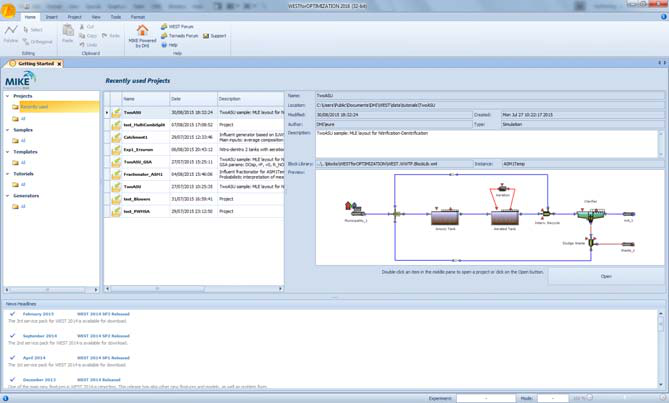

---

## Block Details and Properties windows

### Block Details

Select a block to populate the **Block Details** window with two tabs:

- **Parameters** — editable model constants (volumes, kinetic coefficients, etc.). Changes here take effect at the next run.
- **Variables** — read-only model state variables (concentrations, flows, etc.) populated after a run.

Drag any variable from Block Details onto a Dashboard Sheet to create a live plot or table widget.

### Properties window

The **Properties window** shows graphical properties of the selected object (block, connection, or sheet element): position, size, colour, label font, and the **ClassName** property (the underlying model class, changeable via a dropdown to swap the process model without redrawing the layout).

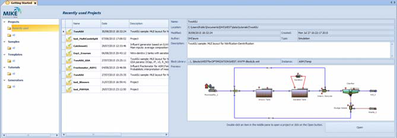

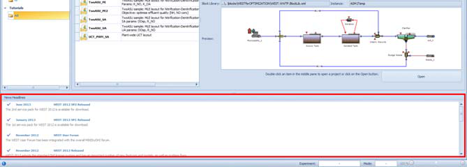

### Top-Level Parameters

Top-Level Parameters group kinetic or operational parameters that are shared across several blocks (e.g. the same `mu_max` for multiple CSTR units). Assigning a value to a top-level parameter automatically propagates it to all linked sub-model parameters.

To create them manually: right-click the Layout Sheet (with no block selected) → **Top-Level Parameters**.
To create them quickly from existing blocks: select one or more blocks → in Block Details select the common parameters → click **Easy Create Parameters** → confirm in the dialog.

### Calculator Variables

Calculator Variables are user-defined expressions computed from other model variables. They are useful for derived performance indices (e.g. COD removal efficiency combining influent and effluent COD).

To add one: right-click the Layout Sheet → **Calculator Variables** (or via **Project | Miscellaneous → Calculator Variables**). Each variable has the properties:

| Property | Description |
|---|---|
| **Name** | Unique identifier (letters, digits, underscores) |
| **Expression** | Formula using model variable paths; type `.` to activate a dropdown of available quantity names |
| **Description** | Optional free text |
| **Unit** | Display unit |
| **Default Value** | Used when the variable cannot yet be evaluated |
| **Group** | Organises variables in Block Details |
| **Bounds** | Lower and upper validity limits |

Once created, a calculator variable appears in Block Details at the project level and can be plotted, used as an analysis objective, or referenced in other expressions.

---

## Results viewer

After a simulation completes, results can be viewed directly in the results panel.

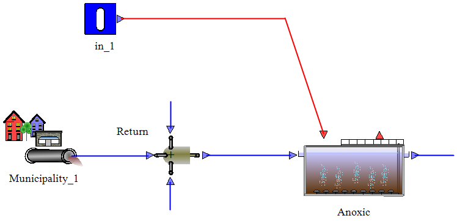

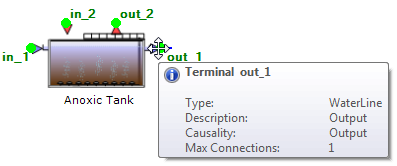

---

## Menus and toolbars

### Menu bar

The WEST ribbon provides access to all commands across several tabs.

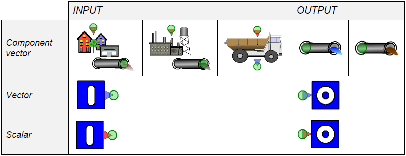

### Toolbar

The toolbar provides quick access to the most frequently used commands.

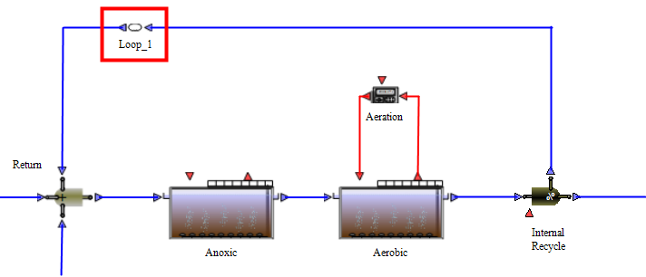

---

## Example projects

WEST ships with several ready-to-run example projects accessible from the **Getting Started pane**:

| Project | Description |
|---|---|
| **TwoASU** | Basic activated sludge for carbon and nitrogen removal; two compartments (anoxic + aerobic). Good starting point for learning WEST. |
| **Galindo_OL** | Galindo WWTP open-loop model. Daily average flow 345,600 m³/d; C and N removal; 6 identical treatment lines. Can be operated as RDN or DRDN configuration. |
| **Galindo_CL** | Galindo WWTP with closed-loop advanced control. Extends Galindo_OL with controllers. |
| **Orbal** | Nutrient removal plant in Athens, Georgia, USA. Calibrated on NO₃, O₂, NH₄, and PO₄ measurements. |
| **OUR_MSL** | Demonstrates calibration of K_S and µ_max parameters from OUR (oxygen uptake rate) measurements. |
| **TestCase_CEPT** | Demonstration of the CEPT (Chemically Enhanced Primary Treatment) model. |

Open an example via the Getting Started pane or **File → Open → Samples**.

---

## Related

- [Quick Start Tutorial](quick-start.md)
- [Building a Plant Layout](../how-to/building-layouts.md)
- [Running Simulations](../how-to/running-simulations.md)
