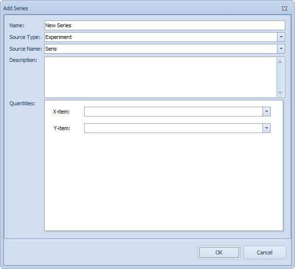
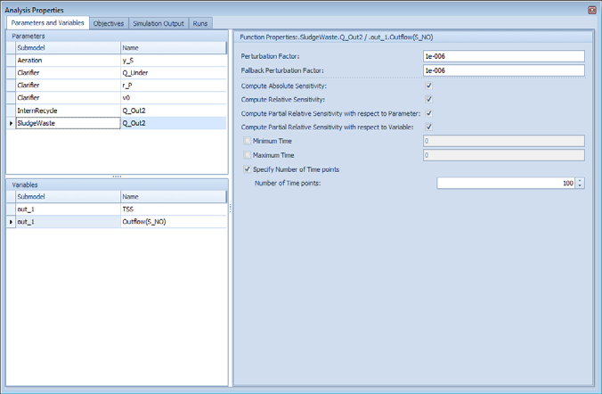
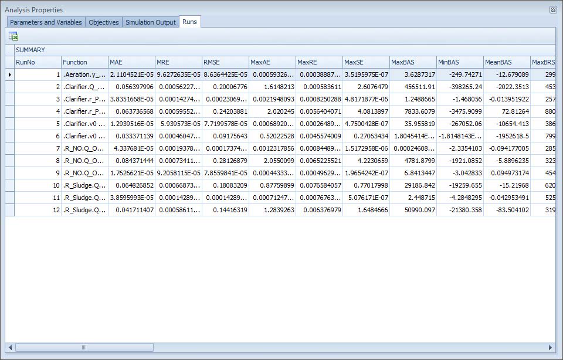
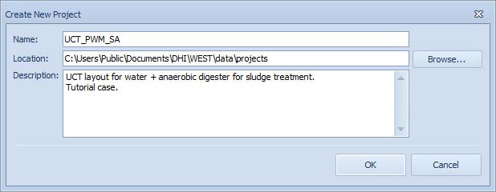
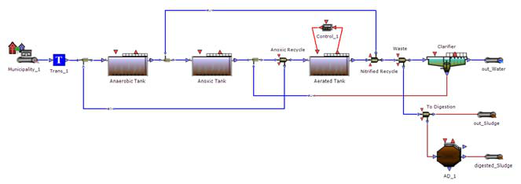

---
tags:
  - how-to
  - controllers
---

# Controllers

**Summary:** How to set up feedback control loops in a WEST layout.

**Source:** WEST User Guide, Chapter 5.2.15; WEST Models Guide — Controllers section.

**Prerequisites:** [Building a Plant Layout](building-layouts.md)

---

## Overview

WEST implements control loops by connecting:
1. A **sensor** (or direct block output) → controller input (`y_m`)
2. A **controller block** → computes control signal `u`
3. Controller output `u` → manipulated variable of the process block (e.g. `kLa`)

This is wired through **Interface Links** on each connection.

---

## Available controller types

From the WEST Models Guide (Controllers category):

| Model | Type | Description |
|---|---|---|
| `Controllers.PI_Saturation` | PI | PI with anti-windup saturation |
| `Controllers.PID_Saturation` | PID | PID with saturation |
| `Controllers.PID_SaturationAW` | PID | PID with anti-windup |
| `Controllers.OnOff` | On/Off | Simple bang-bang control |
| `Controllers.OnOff_Band` | On/Off | On/Off with dead-band |
| `Controllers.Ratio` | Ratio | Output = Gain × input |
| `ControllerOp.PID_SRT` | SRT | Sludge retention time controller |

---

## Step-by-step: DO control loop

The following walkthrough sets up a PID controller to maintain dissolved oxygen (DO) at 2 mg/L in an aerobic tank by manipulating the oxygen transfer coefficient (`kLa`) of the aerator or blower.

### 1. Add a DO sensor to the aeration tank

1. Open the Layout containing your aerobic tank block.
2. In the **Block Library**, expand **Sensors** and drag a **DO Sensor** block onto the canvas next to the aerobic tank.
3. Draw a **flow connection** from the aerobic tank's liquid outlet to the DO sensor's inlet, and back from the sensor's outlet to any downstream block (the sensor is inserted inline, or connected via a side-stream tee depending on your model variant).
4. Alternatively, if your aerobic tank block already exposes a direct `S_O` terminal on its interface, you can wire from that terminal directly without a separate sensor block.

### 2. Add a PID controller block

1. In the **Block Library**, expand **Controllers** and drag **PID_Saturation** (or **PI_Saturation** for a PI-only loop) onto the canvas.
2. Position it near the aerobic tank for clarity.

### 3. Connect the sensor output to the controller measurement input

1. Draw a **data connection** (dashed line) from the DO sensor's output terminal to the PID controller's input terminal.
2. Double-click the connection to open the **Interface Link** dialogue.
3. In the left-hand list (source), select `S_O` (dissolved oxygen, mg O₂/L).
4. In the right-hand list (destination), select `y_m` (measured process variable).
5. Click **OK**.

### 4. Connect the controller output to the blower/aerator manipulated variable

1. Draw a **data connection** from the PID controller's output terminal to the aerobic tank's aeration input terminal.
2. Double-click the connection → **Interface Link** dialogue.
3. Map `u` (controller output) → `kLa` (volumetric oxygen transfer coefficient, d⁻¹).
4. Click **OK**.

> **Note:** `kLa` is the standard manipulated variable for aeration control in ASM-based models. If your layout drives a blower speed or airflow rate instead, map `u` to the corresponding blower input variable and use a secondary gain block to convert units.

### 5. Set the setpoint

1. Double-click the PID controller block to open **Block Details**.
2. In the **Parameters** tab, set `y_S` (setpoint) to **2.0** mg O₂/L. This is the standard design target for aerobic nitrification; adjust to 1.5–3.0 mg/L depending on process requirements.
3. Set `u_min` (minimum output) to **0** d⁻¹ and `u_max` (maximum output) to a value matching the maximum aeration capacity of your tank — typically **200–400 d⁻¹** for fine-bubble diffusers at design flow.

### 6. Set PID parameters

The table below gives typical starting values for a DO control loop. Tune further using a step-test on `kLa` and the process reaction curve method, or by trial and error in a dynamic simulation.

| Parameter | Symbol | Typical starting value | Notes |
|---|---|---|---|
| Proportional gain | `K_P` | 5–20 (d/mg O₂) | Start at 10; increase if response is slow |
| Integral time | `T_I` | 0.01–0.05 d (≈ 15–70 min) | Start at 0.02 d; decrease if offset persists |
| Derivative time | `T_D` | 0 d | Leave at zero for a PI loop initially; add derivative (0.001–0.005 d) only if overshoot is excessive |
| Anti-windup limit | `u_max` | Match tank `kLa` max | Prevents integrator windup when aeration is saturated |

For a **PI controller** (`PI_Saturation`), `T_D` is not applicable — set `K_P` and `T_I` only.

### 7. Run a dynamic simulation and verify controller response

1. Open the **Experiments** panel and configure a **Dynamic** simulation of at least 5–10 days to allow the controller to stabilise.
2. Add a Dashboard Sheet and drag `S_O` from the aerobic tank's Block Details onto the sheet to create a time-series plot.
3. Also drag `kLa` (or the controller's `u` output) onto the same or a second panel to observe manipulated variable movement.
4. Run the simulation (**F5** or the **Run** button).
5. Expected behaviour:
   - `S_O` should rise toward 2.0 mg/L within the first 0.5–2 days and stabilise close to setpoint.
   - `kLa` should settle at a steady value that delivers the required oxygen transfer rate.
   - If `S_O` oscillates persistently, reduce `K_P` or increase `T_I`.
   - If `S_O` is slow to reach setpoint, increase `K_P` or decrease `T_I`.
6. For a load disturbance test, increase the influent flow or COD load mid-simulation and confirm the controller brings `S_O` back to setpoint.

---

## Using a slider for manual control

For interactive set-point adjustment during a simulation, drag a manipulated variable (e.g. `y_S`) from Block Details onto a Dashboard Sheet. WEST creates a Slider widget.

---

## Related

- [Running Simulations](running-simulations.md)
- [Controllers & Timers reference](../block-reference/controllers-timers.md)
- [Quick Start Tutorial](../getting-started/quick-start.md)
