---
tags:
  - how-to
  - influent
  - input-data
---

# Managing Input Data

**Summary:** How to create influent input files, configure fractionation models, and import time-series data.

**Source:** WEST User Guide, Chapters 2.9 and 5.4.

**Prerequisites:** [Building a Plant Layout](building-layouts.md)

---

## Input block types

| Block type | Use |
|---|---|
| Municipal / Industrial / Truckload | Wastewater input — fractionation of measurements into model state variables |
| Data Input | Time-series file driving a single scalar manipulated variable |
| Vector Input | Time-series file driving a full component vector (for coupled models) |

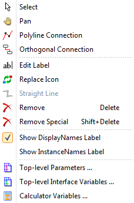

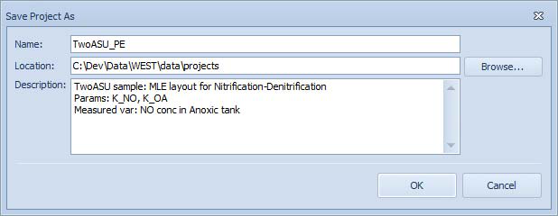

---

## Wastewater input — Standard ASM vector

Use when you have standard measurements (flow, COD, TKN, TSS) and want WEST to fractionate them into ASM state variables automatically.

1. Double-click the Municipal (or Industrial / Truckload) block on the Layout Sheet to open the Influent Sheet.
2. **General tab:**
   - Choose **Standard**.
   - Add or remove components from the Input Components list; mark one as the **Solvent** (typically the flow/water component).
   - Select the **Output Category** (e.g. ASM2d, ASM1 — must match the project Instance).
   - Leave **Enable F2C conversion** checked to work in concentrations (mg/l) rather than fluxes (g/d).
3. **Data Import tab:**
   - Choose a **Time Policy**: `Time Series In` (use timestamps from a file), `Generate` (auto-generate at a set interval), or `Manual`.
   - Click **Add** to load source files (`.txt` or `.xls`). Set the column, decimal, and thousand separators for each file.
   - If Time Policy = `Time Series In`, mark one file as the time reference with the **Time** radio button.
   - Drag column headers from the file viewer into the **Time Series Out** table and match each header to the correct component. Matching is automatic when the header name equals the component name.
   - Verify units in the **Unit** column.
   - Toggle **Interpolate** and **Extrapolate** as needed.
   - Uncheck **Synchronize** if you want separate files for steady-state and dynamic runs.
4. **Generate and Review tab:** Click **Generate** to produce the `.Steady State.in.txt` and `.Dynamic.in.txt` files in the project folder. Review the output tables and plots; edit individual values if needed. Click **Save** to preserve the settings.

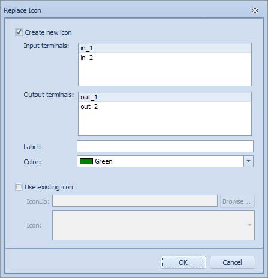

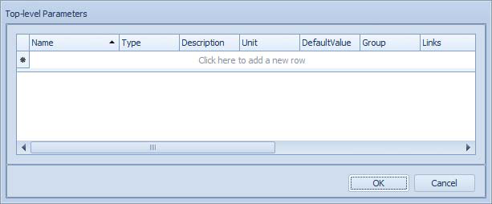

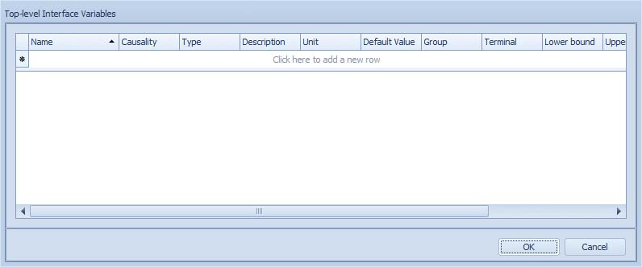

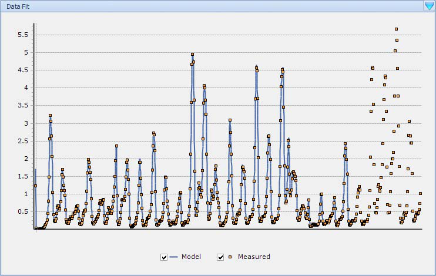

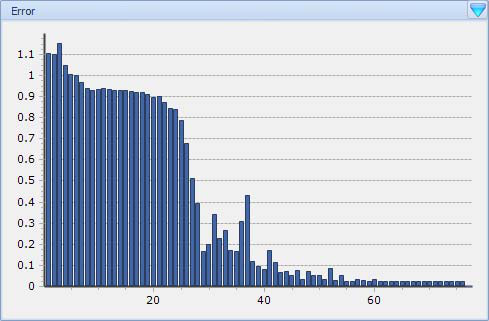

---

## Wastewater input — Custom vector

Use when your measurements do not map directly to ASM components (e.g. only BOD and TSS available, or a non-standard fractionation).

1. Open the Influent Sheet as above.
2. **General tab:** Choose **Custom**. Add custom input components (e.g. BOD, COD, TKN, TSS). Mark the Solvent. Select the Output Category.
3. **Fractionation tab:** Build or import a fractionation layout:
   - Drag **Input** blocks (blue) for each custom component, and **Output** blocks (green) for each ASM state variable.
   - Draw connections between them and assign weights by double-clicking a connection and entering an expression. Use `parameters.<Name>` or `state.<Name>` to reference parameters or variables.
   - To add fractionation parameters, right-click the canvas → **Parameters…**
   - Alternatively, load a default layout with the **Open** button on the toolbar.
4. Complete **Data Import** and **Generate and Review** as for the Standard vector.

---

## Data input (single scalar variable)

Use a **Data Input** block to drive a single manipulated variable (e.g. a time-varying flow rate or kLa) from a CSV/TXT file.

1. Double-click the Data Input block on the Layout Sheet.
2. **General tab:** Select the target top-level interface variable from the list. If none appear, click **Top-level Interface Variables** to create one (set Causality = Input).
3. **Data Import tab:** Load the source file and drag the relevant column to the Time Series Out section.
4. **Generate and Review:** Click **Generate** to produce the input file.

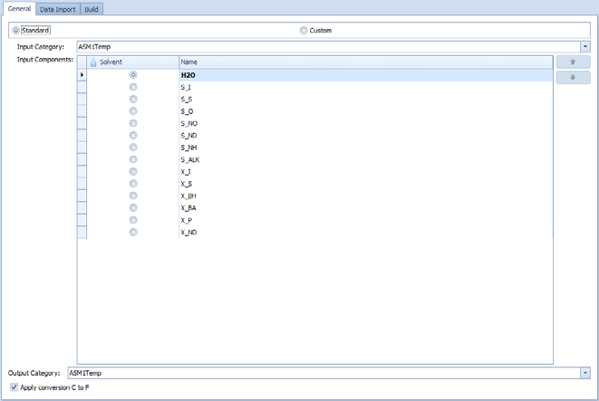

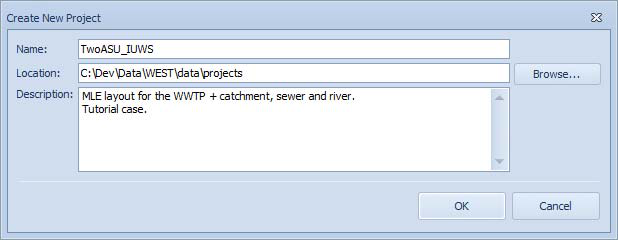

---

## Vector data input

Drives a full component vector from a file — used in coupled-model (hierarchical) workflows. Setup mirrors the scalar Data Input, but a vector variable and a Category must be selected in the General tab.

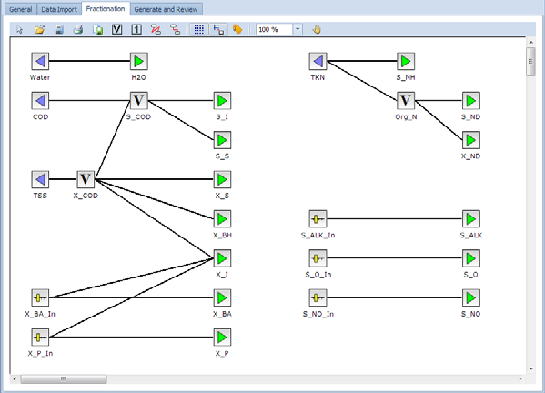

---

## Merging multiple data sources

The Influent Tool supports combining files at different time resolutions (e.g. 5-minute flow data merged with daily COD grab samples):

1. Add all source files in **Time Series In**.
2. Set column/decimal/thousand separators for each file independently.
3. Choose a **Time Policy** (e.g. `Generate` with a defined output interval, or `Time Series In` referencing the highest-frequency file).
4. Drag columns from each file into **Time Series Out** separately. WEST interpolates or holds values as needed to match the output time resolution.

---

## Adjusting parameters via dashboard widgets

Parameter values can also be changed interactively before or during a simulation using Dashboard widgets:

| Widget | Behaviour |
|---|---|
| **Slider** | Set Min/Max/Resolution; drag to adjust value |
| **Input Field** | Type a value directly |
| **Radiobutton** | Select from discrete named options |
| **Combobox** | Select from a labelled drop-down list |
| **Checkbox** | Toggle between 0 and 1 |

To create any widget: drag a parameter from the **Block Details** window onto the corresponding widget pane on a Dashboard Sheet.

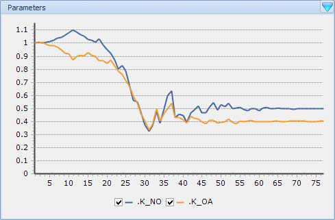

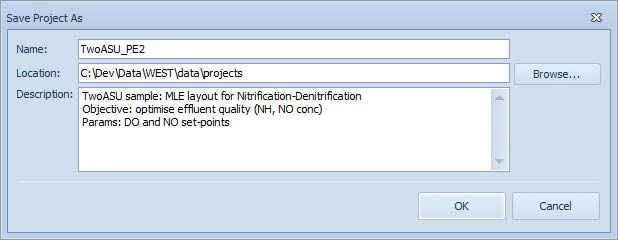

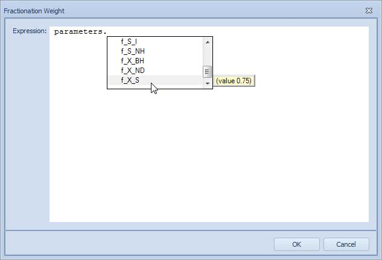

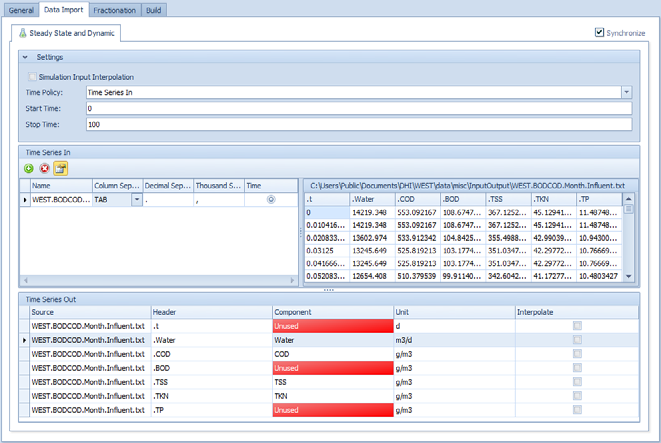

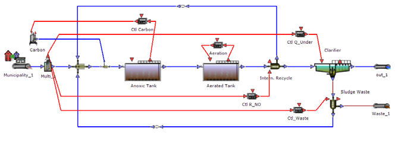

> Note: only **Manipulated Variables** (interface variables) can be changed while the simulation is running. True **Parameters** can only be changed before starting.

---

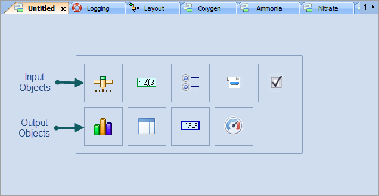

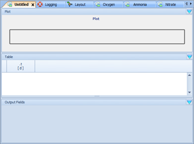

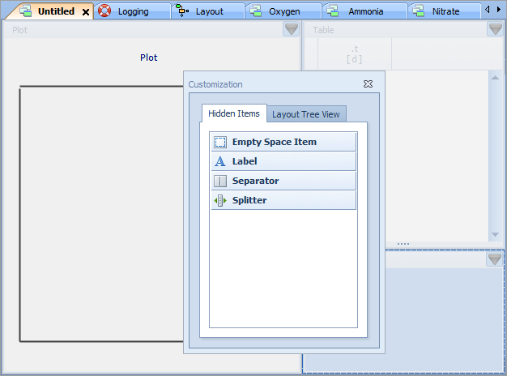

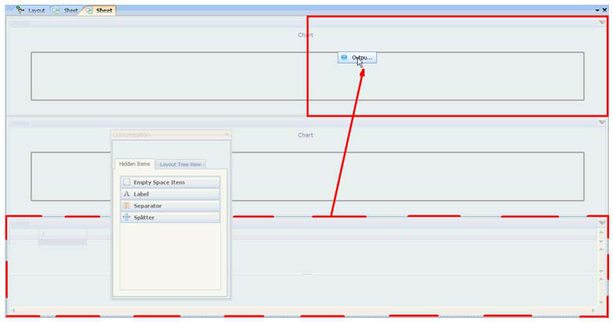

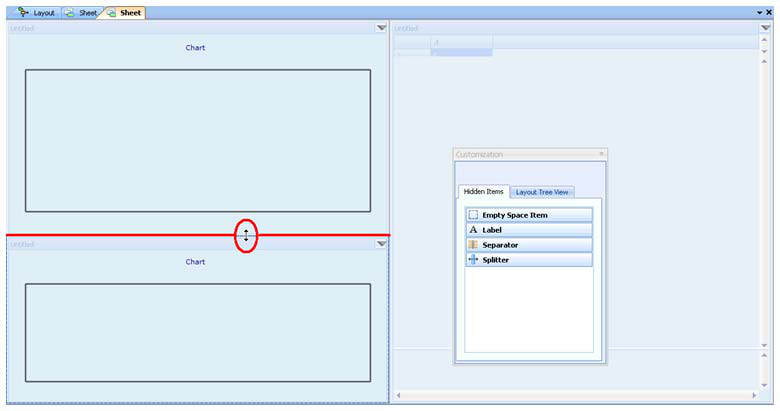

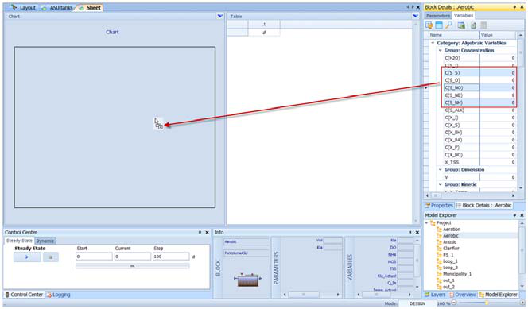

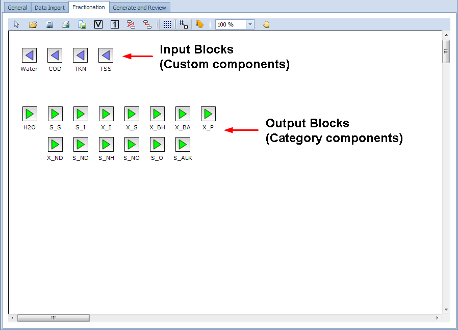

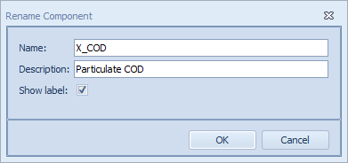

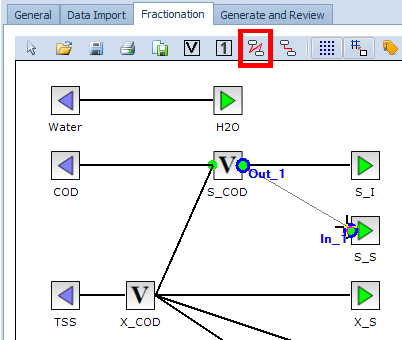

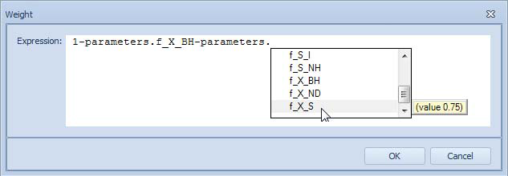

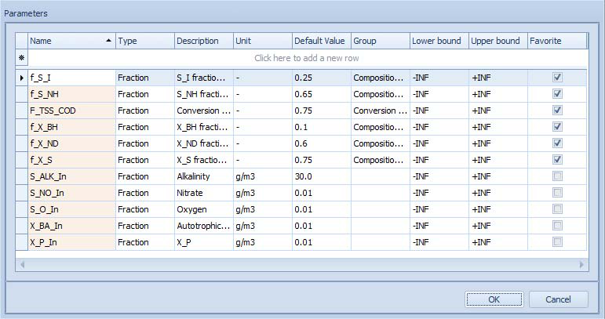

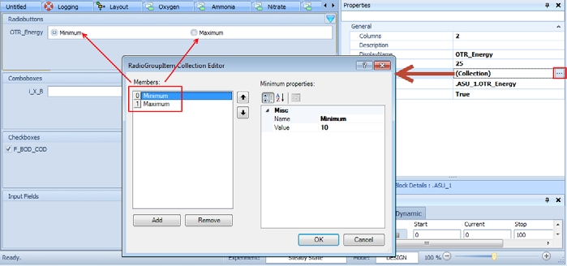

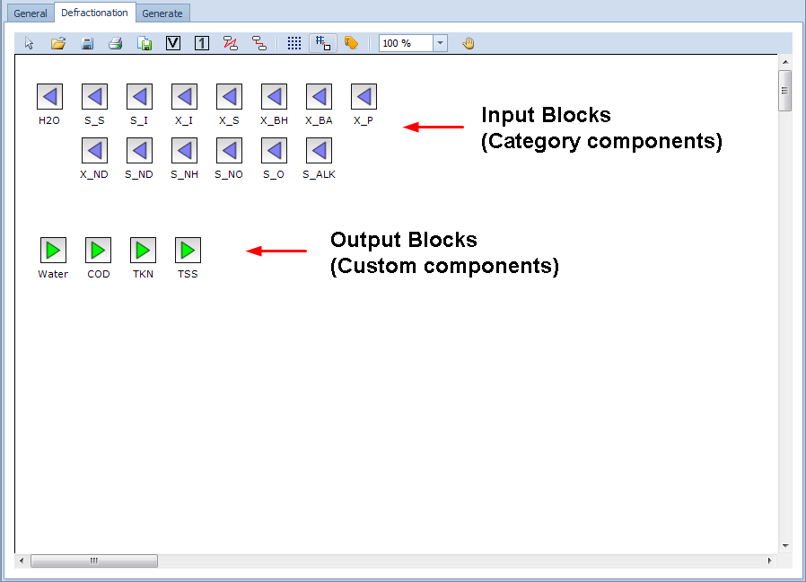

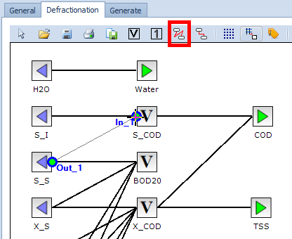

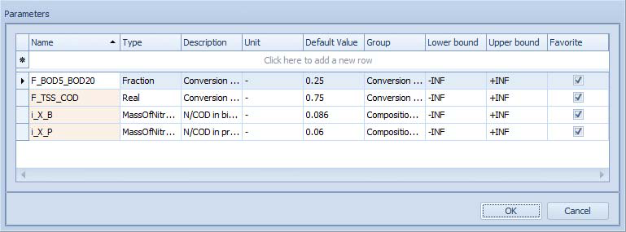

## Related

- [Building a Plant Layout](building-layouts.md)
- [Running Simulations](running-simulations.md)
- [Results and Output](results-and-output.md)
