---
tags:
  - how-to
  - simulation
---

# Running Simulations

**Summary:** How to configure and run steady-state and dynamic simulations in WEST, and how to read results.

**Prerequisites:** [Quick Start Tutorial](../getting-started/quick-start.md)

---

## Simulation types

WEST supports two simulation modes, selected in the **Control Center**:

| Mode | Purpose | Typical use |
|---|---|---|
| Steady-state | Finds the fixed-point solution for constant inputs | Initial calibration, design sizing, starting point for dynamic runs |
| Dynamic | Integrates differential equations over time | Evaluating performance under varying loads, control tuning, compliance assessment |

Always run steady-state first when starting a new project — it provides an initialised state that makes the dynamic run converge faster.

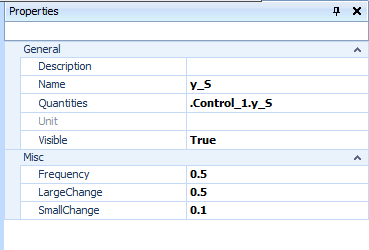

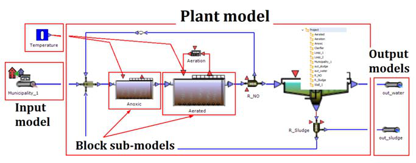

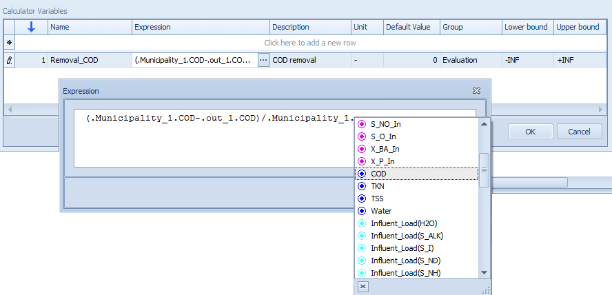


---

## Running a steady-state simulation

### Setup

1. In the **Control Center**, select the **Steady-state** experiment (or create one via **Project | Virtual Experiments → Steady-state**).
2. Verify that the influent generator has produced a `.Steady State.in.txt` input file (see [Quick Start — Step 3](../getting-started/quick-start.md)).
3. Check that all required block parameters are set (volumes, temperatures, flow rates).

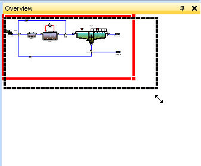

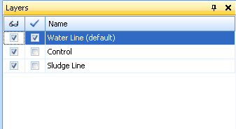

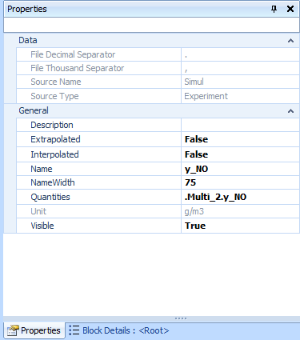

### Running

1. Click **Start** in the Control Center.
2. WEST uses a Newton-Raphson solver to iterate toward the equilibrium solution.
3. A green progress bar indicates successful convergence. A red bar indicates the solver failed to converge — see [Convergence failures](#convergence-failures) below.

### Viewing results

Once a steady-state run is complete, all variables in the model hold their equilibrium values. To inspect them:

- Open the **Model Explorer** and expand any block node to see its variable tree.
- Click a variable name to see its current value in the **Block Details** pane.
- Drag a variable from Block Details onto a Sheet to create a constant-value plot.

---

## Running a dynamic simulation

### Setup

1. In the Control Center, select or create a **Dynamic** experiment.
2. Set the **simulation duration** (e.g. 30 days).
3. Make sure the influent generator's **Data Import** tab points to a time-series input file (e.g. `WEST.BODCOD.Month.Influent.txt`). This file drives the time-varying influent load.
4. Optionally, run a slave steady-state simulation first: tick **Run a slave Steady-State simulation prior to Dynamic simulation** in the experiment settings. This automatically initialises the model from steady-state before integrating.

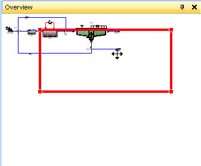

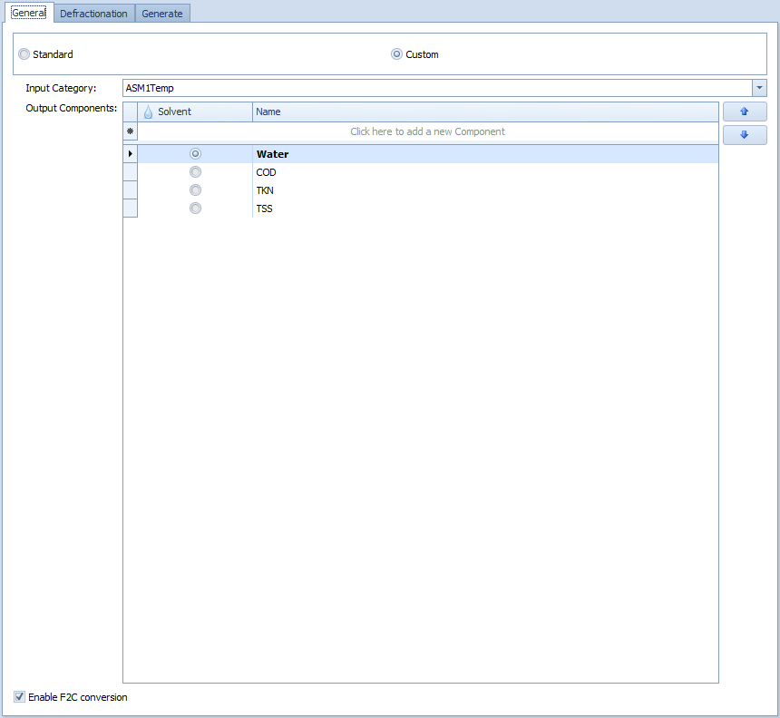

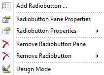

### Choosing an integrator

The integrator is set in **Project | Simulation Properties → Solver** tab.

| Integrator | Stiff? | Speed | When to use |
|---|---|---|---|
| `RK4ASC` | No | Moderate | Simple models, non-stiff systems |
| `VODE` | Yes | 3–4× faster | Biological models (ASM1/2d/3), recommended default |

For activated sludge models, always use **VODE** with **Is a Stiff Solver** checked. The additional solver options (Adams multistep method, Newton iteration, SPGMR linear solver) can remain at their defaults.

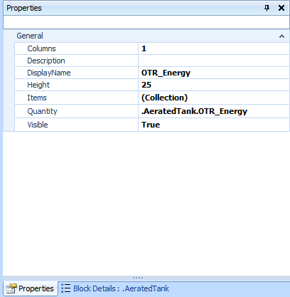

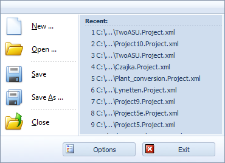

### Running

1. Click **Start**. The plots on your Sheets update in real-time.
2. You can pause the simulation, inspect values, and then continue.
3. When complete, all plots show the full time-series.

---

## Reading results

### Time-series plots

Drag variables from the **Model Explorer** or **Block Details** pane onto any Sheet to create or add to a time-series plot. Right-click a plot for options:

- **Crosshairs** — hover to read exact values at a point in time.
- **Export** — save the series data as a CSV or image.
- **Add Series** — overlay multiple variables on one plot.

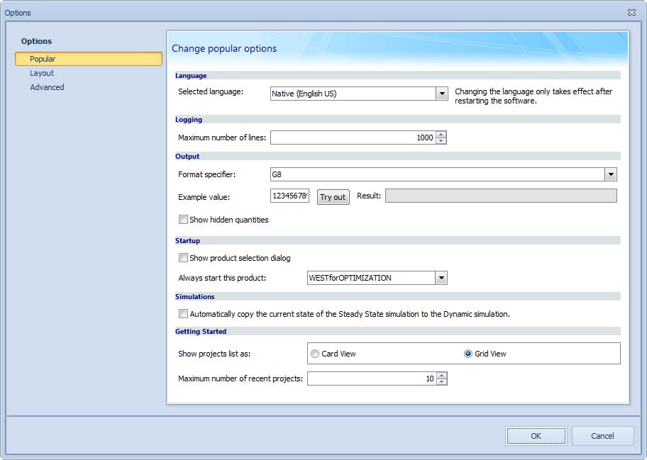

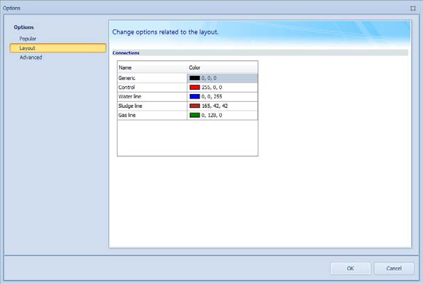

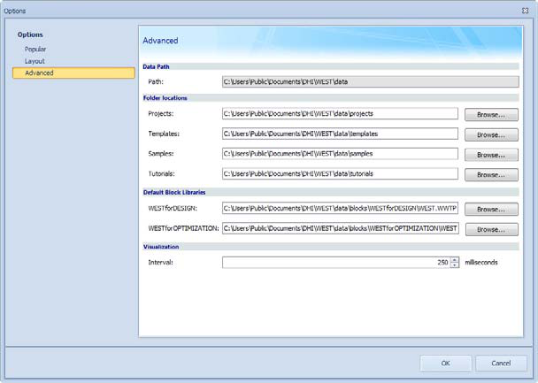

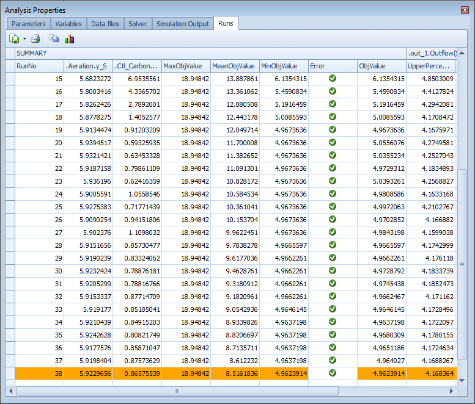

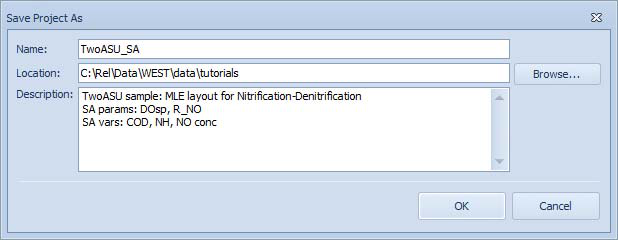

### Key effluent variables

In the effluent block, the most commonly monitored variables are:

| Variable | Description | Typical limit |
|---|---|---|
| `COD` | Chemical oxygen demand | ≤ 125 mg/l (EU Urban Wastewater directive) |
| `TKN` | Total Kjeldahl nitrogen | — |
| `Outflow(S_NH)` | Effluent ammonia | ≤ 5 mg/l (sensitive areas) |
| `Outflow(S_NO)` | Effluent nitrate | ≤ 10 mg/l (sensitive areas) |
| `TSS` | Total suspended solids | ≤ 35 mg/l (EU directive) |

### Analysis objectives

For compliance assessment over a dynamic run, use the **Analysis Properties** dialogue:

1. In the Control Center, select the dynamic experiment.
2. Go to **Project | Properties → Analysis** button.
3. Drag effluent variables (COD, TKN, TSS, `Outflow(S_NO)`, `Outflow(S_NH)`) from Block Details onto the dialogue.
4. On the **Time series Criteria** tab, configure the statistics to compute for each variable:
   - **Mean** and **Upper/Lower Percentiles** (5th and 95th by default)
   - **Percentage of Time in Violation** of an upper bound
5. Re-run the simulation. The **Runs** tab in Analysis Properties shows all computed objective values.

**Typical results for the TwoASU sample (30-day dynamic run):**

| Variable | Mean ± StDev | 5–95 percentile | Limit | Compliance |
|---|---|---|---|---|
| COD | 46.1 ± 5.8 mg/l | 36.1–54.1 | — | — |
| NHx | 7.6 ± 6.3 mg/l | 0.5–21.4 | 5 mg/l | 42.1% |
| NOx | 6.5 ± 2.1 mg/l | 3.4–10.5 | 10 mg/l | 93.0% |
| TKN | 10.2 ± 6.5 mg/l | 2.6–24.1 | — | — |
| TSS | 15.9 ± 3.0 mg/l | 12.3–21.6 | — | — |

---

## Calculator variables

Calculator variables let you define derived quantities — expressions over existing model variables — that WEST then tracks like any other variable.

Example: COD removal efficiency

```
Removal_COD = (.Municipality_1.COD - .out_1.COD) / .Municipality_1.COD
```

To add one:

1. Click anywhere in the Layout that is not a Block or link, or click the top-most node in the Model Explorer.
2. In **Block Details → Variables** tab, click **Calculator Variables**, or right-click the Layout and choose **Calculator Variables** from the context menu.
3. In the dialogue, click the empty row at the top and fill in:
   - **Name** — e.g. `Removal_COD`
   - **Expression** — e.g. `(.Municipality_1.COD-.out_1.COD)/(.Municipality_1.COD)`
   - **Description**, **Unit**, **Group** (all optional)
4. Click **OK**. The variable appears in Block Details at the project level and can be plotted or used as an analysis objective.

---

## Controlling model parameters during a run

WEST distinguishes two classes of parameters:

- **True parameters** — constants defined in model code. Can only be changed *before* a run starts (e.g. tank volume, kinetic coefficients).
- **Manipulated (interface) variables** — flagged as inputs in the model. Can be changed *during* a run.

### Sliders

Drag a manipulated variable from Block Details onto a **Slider** widget on a Sheet. Adjust the slider during a running simulation to see the effect in real-time. Useful for manual set-point experiments (e.g. varying the DO set-point `y_S`).

### Control loops

Connect a sensor output → control block input → control block output → manipulated variable input. In the **Interface Link** dialogues, map:

- Measured variable → `y_m` input of the control block.
- Control output `u` → the manipulated variable (e.g. `kLa` of the aerobic tank).

### Data input files

Drop a **Data Input** block on the Layout and define a **Top-level Interface Variable** (right-click Layout → context menu). Link the Data Input block to bioreactor blocks via Interface Links. The input file then drives the manipulated variable over time (e.g. a measured temperature profile).

---

## Generating a report

1. Go to **Project | Miscellaneous → Reports**.
2. A new empty report named "Report 1" is created.
3. Tick the elements to include — recommended subset:
   - General | Information
   - Layout
   - Sheets: your key plots (e.g. "Anoxic: Solubles", "Aerobic: Solubles", "Effluent: ASM specs")
   - Input files: the steady-state input file
4. Preview in the **Preview** tab, then **Print** or **Save** (RTF format).

!!! warning
    Do not tick the top-most "Report" checkbox to include everything — generating the complete report can take a very long time on large projects.

---

## Sensitivity analysis panel

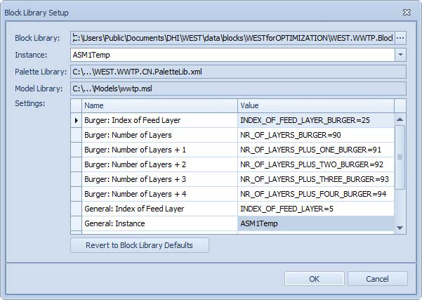

---

## Convergence failures

| Symptom | Likely cause | Fix |
|---|---|---|
| Newton solver diverges | Poor initial guess or flow imbalance | Check that all splitter fractions sum to 1 |
| Negative concentrations | Parameter out of range | Check volumes > 0, all flow rates > 0 |
| Licence error at start | Licence not found or expired | Check the WEST licence server connection |
| Dynamic run stops early | Integrator step too large | Switch to VODE integrator or reduce absolute tolerance |

---

## Related

- [Quick Start Tutorial](../getting-started/quick-start.md)
- [Controllers](controllers.md)
- [Advanced Simulations](../experiment-types/index.md)
- [Results and Output](results-and-output.md)
- [Biological Models](../block-reference/biological-models.md)
