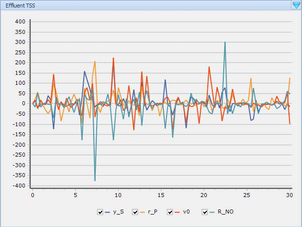
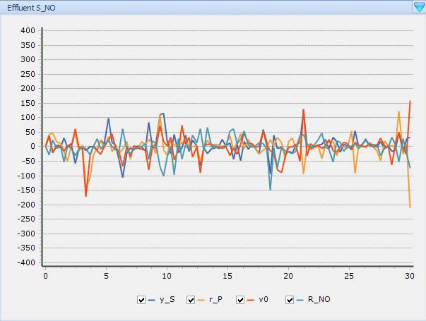
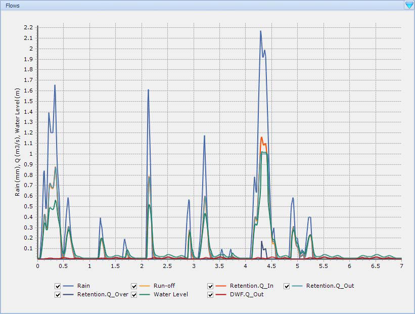
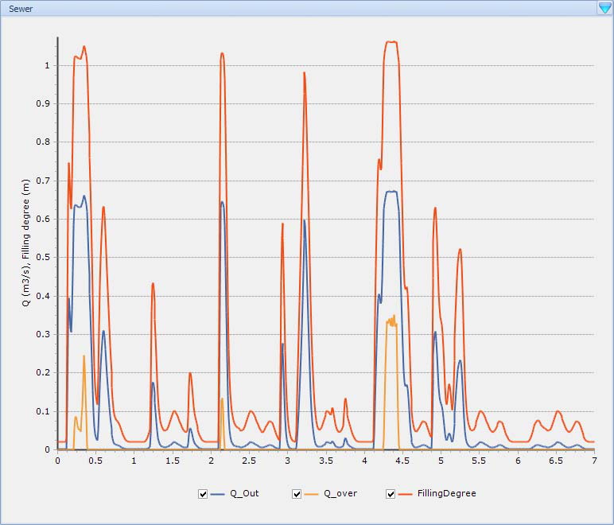
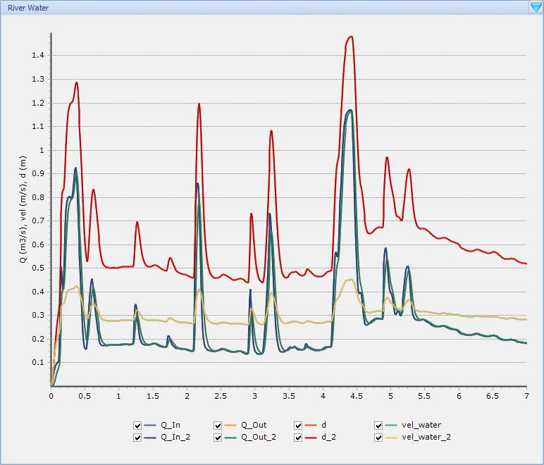
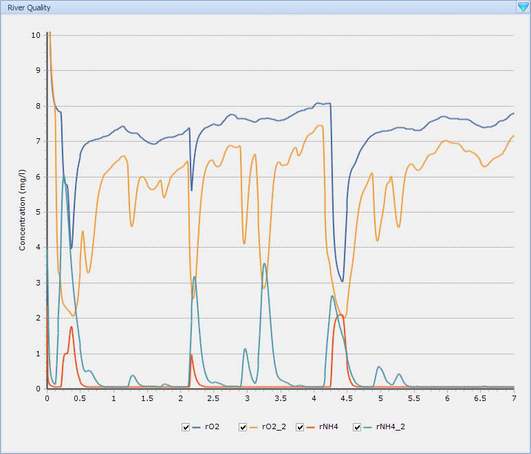

---
tags:
  - manuals
  - simulation
  - advanced
---

# Advanced Simulations

**Summary:** Warm-starting, sensitivity analysis, parameter sweeps, and optimisation runs.

**Prerequisites:** Familiarity with [Running Simulations](running-simulations.md).

---

## Warm-starting a dynamic run from steady-state

A common workflow is to first converge a model to steady-state and then use that converged state as the initial condition for a dynamic (time-varying) simulation. This avoids a long transient period at the start of the dynamic run and produces more physically meaningful results from time zero.

### Automatic copy (recommended)

WEST can copy the end state of a steady-state simulation to the initial state of a dynamic simulation automatically:

1. Open **Options** (menu: **Tools → Options**) and go to the **Popular** tab.
2. Enable the checkbox **Automatically copy the current state of a Steady-State simulation to the initial state of a Dynamic Simulation**.
3. Run your steady-state experiment first (**Control Center → Start**). Wait for convergence.
4. Switch to (or create) a dynamic experiment on the same model. Because the option is enabled, WEST will automatically seed it with the steady-state end state.
5. Start the dynamic simulation. The model begins from the converged steady-state rather than from the default initial conditions defined in the model.

### Manual initialisation

If the automatic option is disabled, you can initialise manually via the **Initialize Simulation** button in the Control Center. Four transfer directions are available:

| Option | Description |
|--------|-------------|
| **From Steady-State to Dynamic** | Copy SS end state → Dynamic initial state (warm-start) |
| **From Dynamic to Steady-State** | Copy a dynamic snapshot → SS initial guess |
| **From Steady-State to Steady-State** | Re-use a previous SS result as the next SS initial guess |
| **From Dynamic to Dynamic** | Continue or re-seed a dynamic run from a saved snapshot |

For a warm-start, select **From Steady-State to Dynamic** after the steady-state run has completed successfully.

!!! tip
    Saving the project after the steady-state run preserves the converged state. You can reuse it as the warm-start point for multiple dynamic experiments without re-running steady-state each time.

### When warm-starting matters most

- Models with slow biological dynamics (e.g., nitrification) where reaching a realistic biological state from cold initial conditions could take many days of simulated time.
- Scenario comparisons where you want all dynamic runs to start from the same reference operating point.
- Sensitivity or uncertainty analyses built on top of a dynamic experiment — seeding them from steady-state keeps the focus on the perturbation rather than the initialisation transient.

---

## Sensitivity analysis

WEST provides two built-in sensitivity experiment types, accessible from **Project → Virtual Experiments**. Both are built on top of a base steady-state or dynamic simulation experiment.

### Local Sensitivity Analysis (LSA)

The LSA experiment uses a **finite difference** approach: it perturbs each selected parameter by a small amount (one at a time) and records the change in selected output variables. This gives a local, linearised measure of sensitivity around the current operating point.

**Typical workflow:**

1. Ensure your base simulation (steady-state or dynamic) runs and converges correctly.
2. In the **Project** toolbar, click **Add Local Sensitivity Analysis**.
3. In the **Analysis Properties → Parameters** tab, drag the parameters of interest from the **Block Details** window into the parameter list. Set the perturbation magnitude for each (default is a percentage of the nominal value).
4. In the **Analysis Properties → Variables** tab, select the output variables to monitor.
5. Run the experiment. WEST executes one simulation per parameter (plus the reference run).
6. Review ranked sensitivity indices in the results table or export them for plotting.

### Global Sensitivity Analysis (GSA)

The GSA experiment samples parameter space using **Latin Hypercube Sampling (LHS)** and fits a linear regression model to the results. Unlike LSA, GSA captures non-local effects and interactions.

1. Add a **Global Sensitivity Analysis** experiment to your base simulation.
2. Define parameter ranges (min/max) rather than a single perturbation value.
3. Set the number of samples (more samples = better coverage, longer run time).
4. Run the experiment. WEST spawns multiple simulation runs in parallel where licences and cores allow.
5. Inspect the standardised regression coefficients (SRC) to rank parameter influence.

!!! note
    For a detailed description of all analysis property tabs and result metrics for both LSA and GSA, see the **Experiment Types** chapter of the WEST User Guide.

**Related:** [Calibration](../advanced-topics/calibration.md) — parameter estimation builds on the same virtual experiment framework.

---

## Parameter estimation / calibration

See [Calibration](../advanced-topics/calibration.md) for the full calibration workflow.

---

## Scenario comparison

The **Scenario Analysis (SA)** experiment lets you run a series of simulations on the same model using different parameter or input values for each run, then compare results side by side — without maintaining separate project files for each alternative.

### Setting up a Scenario Analysis experiment

1. Confirm your base simulation experiment is configured and runs correctly.
2. In the **Project** toolbar, click **Add Scenario Analysis**.
3. Open **Analysis Properties → Parameters**. Drag the parameters you want to vary (manipulated variables, model parameters, or initial conditions) from the **Block Details** window into the parameter list.
4. For each parameter, enter the value it should take in each scenario. Each column in the table represents one scenario run.
5. *(Optional)* In the **Data Files** tab, attach measured data files. WEST will compute goodness-of-fit metrics (e.g., Mean Difference, Theil's Inequality Coefficient) for each scenario against the reference data.
6. Run the SA experiment. WEST executes one simulation per scenario column.

### Comparing results

After the run completes:

- Use the **Results** pane to overlay time series from different scenarios on the same plot axis.
- Export the results table (CSV or Excel) for external post-processing.
- If data files were attached, review the automatically computed difference metrics in the **Analysis** results tab to identify the best-performing scenario quantitatively.

### Solver options for parameter combinations

When multiple parameters are varied simultaneously the SA experiment offers two combination strategies:

| Solver | Behaviour |
|--------|-----------|
| **Grid** | All combinations of the supplied value vectors (full factorial). Use for small numbers of parameters and values. |
| **Cross** | Varies one parameter at a time from a reference vector (one-at-a-time sweep). More efficient for large numbers of parameters. |

!!! tip
    Scenario Analysis is well suited for design alternative comparisons (e.g., different aeration strategies or SRT targets). Keep the number of scenarios manageable — each additional scenario adds a full simulation run to the total wall-clock time.
