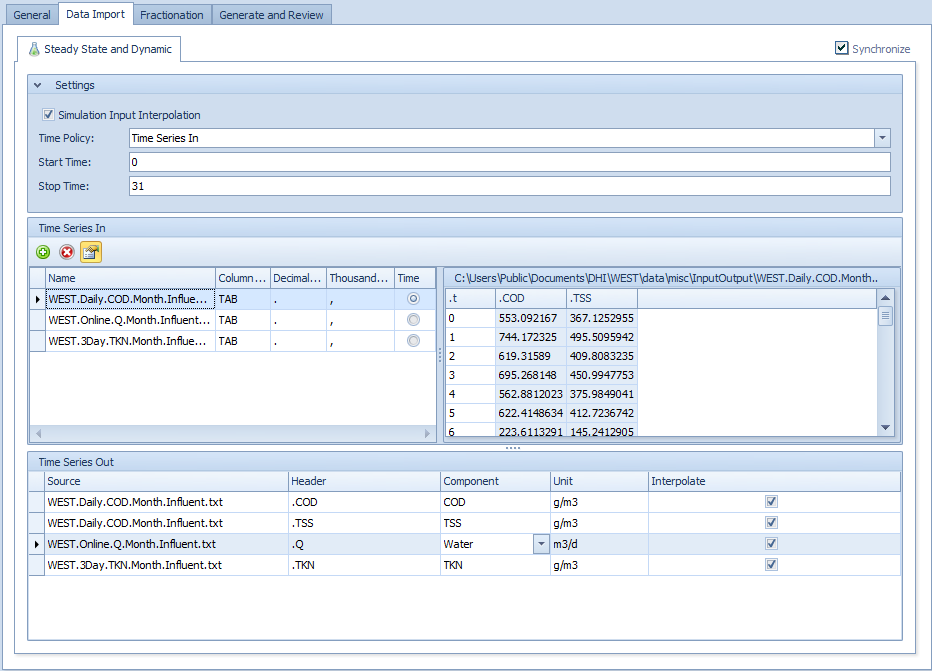
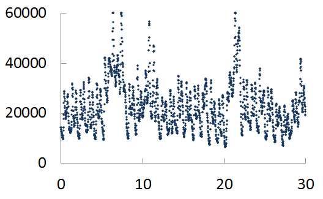
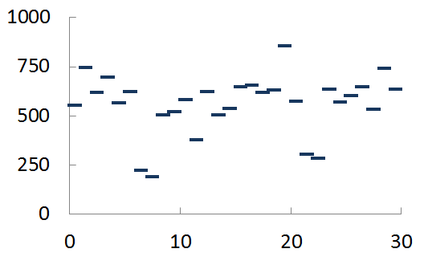
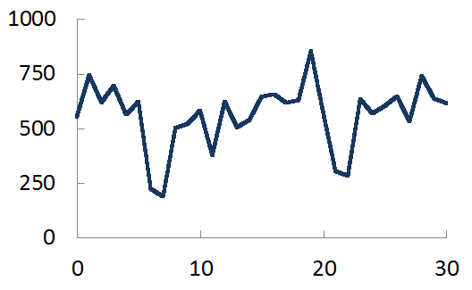
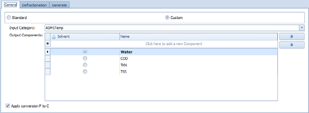
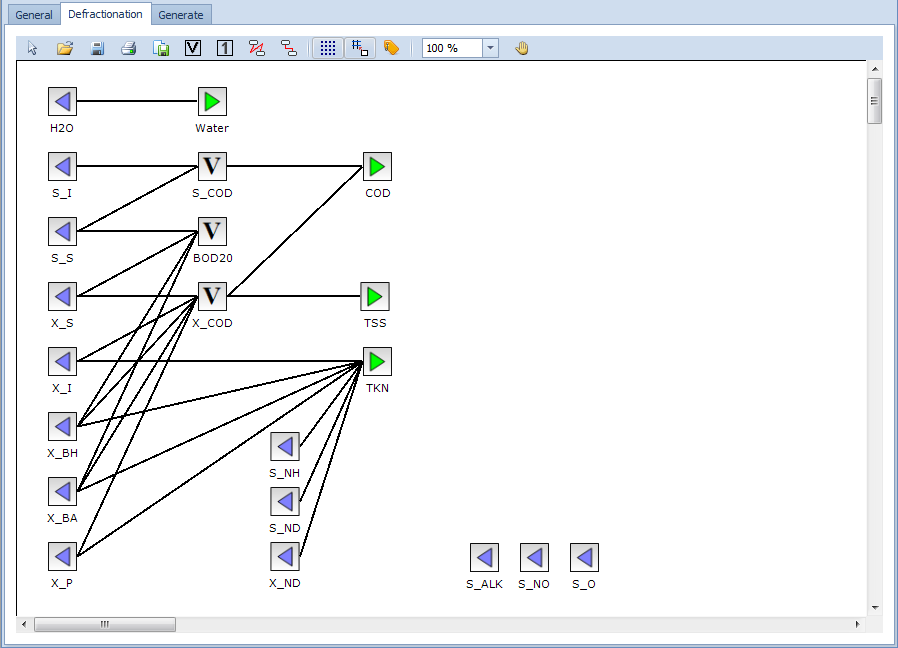
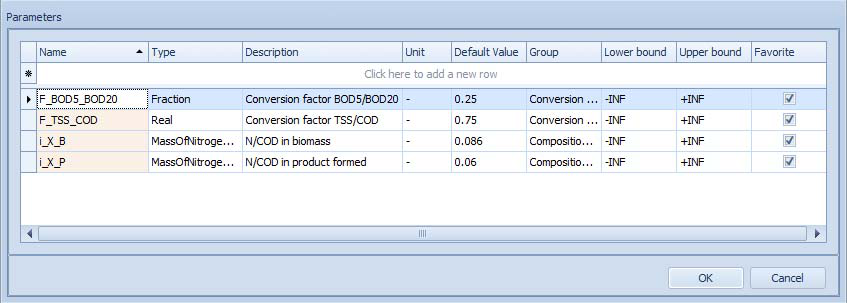

---
tags:
  - manuals
  - control
---

# Controllers

**Summary:** Adding and configuring controller blocks in WEST — connecting sensors to manipulated variables, understanding interface links, and working with top-level parameters.

**Prerequisites:** A plant layout with at least one process unit. See [Building a Plant Layout](plant-layout.md).

---

## What controllers do in WEST

Controllers adjust **manipulated variables** (e.g. airflow rate, recycle flow, dosing rate) in response to **sensor signals** (e.g. measured DO, NH4, NO3). They close the control loop between a measurement and an actuator without requiring manual parameter changes between runs.

Controllers connect to the rest of the model via **data terminals** (shown as red squares), which carry signal values. These are distinct from **mass flux terminals** (shown as blue arrows), which carry flows of material between process units.

---

## Connecting a controller

1. Drag a controller block from the component library onto the plant layout canvas.
2. Draw a connection line from the **sensor output terminal** (red square on the sensor block) to the **input terminal** of the controller.
3. Draw a second connection line from the **controller output terminal** to the **manipulated variable terminal** on the target process unit.
4. When you complete a connection, the **Interface Links** dialog opens automatically.





---

## Interface Links dialog

The Interface Links dialog maps signals across the connection. Use the two dropdowns to specify:

| Field | What to select |
|---|---|
| **From** | The sensor output signal being passed to the controller (e.g. `DO_measured`, `NH4_effluent`). |
| **To** | The manipulated variable on the receiving block that will be driven by this signal (e.g. `kLa`, `Qr`, `Qdos`). |

Multiple links can be configured on a single connection if the blocks expose more than one signal. Click **OK** to confirm.

---

## Controller types overview

| Type | Description |
|---|---|
| **PID** | Proportional-Integral-Derivative controller. Drives the manipulated variable to maintain a setpoint. Configure Kp, Ki, Kd, output limits, and setpoint. |
| **On/Off** | Switches the manipulated variable between two fixed values based on threshold crossings. |
| **Feed-forward** | Adjusts the manipulated variable based on a measured disturbance rather than a feedback error. Often combined with PID. |

---

## PID controller

The PID controller block computes an output signal `u` from the error between a measured process variable and a setpoint:

```
u(t) = Kp · e(t) + (Kp/Ti) · ∫e dt + Kp · Td · de/dt
```

where `e(t) = SP − y_m(t)`.

### Parameters

| Parameter | Description | Typical starting value |
|---|---|---|
| **Kp** | Proportional gain. Higher values give a faster but potentially oscillatory response. | 1.0 |
| **Ti** | Integral time constant (days). Controls how quickly steady-state error is eliminated. Lower values give stronger integral action. | 0.1 d |
| **Td** | Derivative time constant (days). Adds damping by reacting to the rate of change of error. Often left at zero to avoid amplifying sensor noise. | 0.0 d |
| **SP** | Setpoint — the target value for the controlled variable (e.g. 2.0 mg/l DO). | — |
| **output_min** | Minimum allowed controller output. Prevents the actuator from being driven below a physical limit (e.g. 0 m³/h airflow). | 0.0 |
| **output_max** | Maximum allowed controller output. Prevents the actuator from being over-driven. | — |
| **sample_time** | Controller sampling interval (days). How often the error is computed and the output updated. | 0.000694 d (≈ 1 min) |

### Tuning guidance

A practical manual tuning procedure for a DO control loop:

1. Set **Ti = ∞** (or a very large value) and **Td = 0** to start with proportional-only control.
2. Increase **Kp** from 1.0 until the DO response is fast without sustained oscillation. If the output oscillates, halve Kp.
3. Once Kp is acceptable, reduce **Ti** from a large value (e.g. 1.0 d) toward 0.1 d until the steady-state offset is eliminated within a few hours.
4. Add a small **Td** only if the response still overshoots significantly; start with Td = Ti / 10.

### Anti-windup

The WEST PID block includes built-in **anti-windup**: when the controller output hits `output_min` or `output_max`, the integrator is frozen. This prevents the integral term from accumulating (winding up) while the output is saturated, which would cause a large overshoot when the constraint is released.





---

## On/Off controller

The On/Off controller switches the output between two fixed values when the measured signal crosses threshold bounds.



---

## Timer block

Use a Timer block to generate scheduled on/off or step signals independent of sensor feedback.



---

## Feed-forward controller

A feed-forward controller adjusts the manipulated variable based on a measured disturbance before the effect reaches the controlled variable.



---

## Parameters vs manipulated variables

WEST distinguishes between two types of adjustable values on a block:

| Type | Description |
|---|---|
| **Parameters** | Fixed values set before a run. Edited in the **Block Details** window via an Input Field or a Slider. Cannot receive live signals during a simulation. |
| **Manipulated variables** | Values that can change during a simulation. Can receive data from **Data Input** blocks (file-driven schedules), **controllers**, or **timers**. |

When building a control scheme, always connect to a manipulated variable — not a parameter — otherwise the controller signal will be ignored.

---

## Top-level parameters tip

**Top-level parameters** are shared parameter values that propagate to multiple blocks simultaneously. For example, a single `kLa_top` parameter can drive the aeration constant in every aeration zone, so changing one value updates all zones.

**Two ways to create a top-level parameter:**

- **Easy Create:** Right-click a parameter in Block Details and choose **Create Top-Level Parameter**. WEST generates the shared parameter and links the block automatically.
- **Manual:** Right-click on an empty area of the canvas and choose **Top-Level Parameters**, then add the parameter and manually assign it to blocks via their Block Details windows.

Top-level parameters appear in the top-level Block Details window and can be varied in Scenario Analysis and Parameter Estimation experiments like any other parameter.

---

## Related

- [Running Simulations](running-simulations.md)
- [Results and Output](results-output.md)
- [Scenario Analysis](../experiment-types/scenario-analysis.md)
