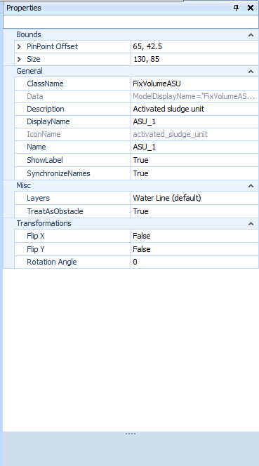

---
tags:
  - manuals
  - installation
---

# Installation

**Summary:** How to install WEST and activate your licence on a Windows machine.

**Prerequisites:**

- A valid WEST licence provided by DHI.
- Administrator rights on the target machine.

---

## System requirements

| Component | Minimum | Recommended |
|-----------|---------|-------------|
| Operating system | Windows 10 64-bit | Windows 11 64-bit |
| RAM | 8 GB | 16 GB or more |
| Disk space | 5 GB free | 10 GB free (for projects and results) |
| Display | 1280 × 800 | 1920 × 1080 or higher |
| .NET Framework | 4.0 full profile | Latest available |
| Internet | Required for licence activation | — |

!!! note
    WEST is a 64-bit Windows application. It is not supported on macOS or Linux.

For the Modelica compilation feature, Visual Studio Build Tools 2019 or later are required. During that installation, select **Desktop development with C++** and enable all optional features (build tools and Windows SDK).

---

## Download the installer

1. Log in to the [DHI Customer Portal](https://customerportal.dhigroup.com) with your DHI credentials.
2. Navigate to **Downloads → WEST** and select the release version that matches your licence.
3. Download the installer package (`.exe`). The file is typically named `WEST_<version>_Setup.exe`.
4. Verify the file checksum if a SHA-256 hash is provided on the download page.

If you do not have a Customer Portal account, contact [DHI Support](mailto:west@dhigroup.com) to request installer access.

---

## Run the installer

1. Right-click `WEST_<version>_Setup.exe` and choose **Run as administrator**.
2. Accept the DHI Software Licence Agreement and click **Next**.
3. Choose an installation folder (default: `C:\Program Files\DHI\<year>\WEST`). Click **Next**.
4. Select the components to install. For most users the default selection is correct. Click **Next**.
5. Review the installation summary and click **Install**.
6. When the installer finishes, leave **Launch WEST** ticked and click **Finish**.

!!! tip
    Keep the default installation path unless your organisation requires a non-system drive. Changing it does not affect project file locations.

---

## Licence activation

After installation, activate your licence by opening WEST and navigating to **Help → Licence Manager**. For a **USB dongle**: insert the dongle before launching WEST — it is detected automatically. For a **network (floating) licence**: enter the hostname or IP address of the DHI licence server and click **Connect**. For a **cloud/VDI deployment**: contact DHI support for a virtual licence configuration. The Licence Manager displays the product edition, expiry date, and number of concurrent seats available.

WEST licences are managed by **WIBU Systems CodeMeter**. Two licence types are common:

### USB dongle (CmDongle)

1. Insert the WIBU CmDongle into a USB port before starting WEST.
2. Windows will install the CodeMeter runtime automatically on first use, or install it manually from `<install folder>\CodeMeter\CodeMeterRuntime.exe`.
3. Open **CodeMeter Control Center** (system tray icon) and confirm the dongle is listed under **Licenses**.
4. Start WEST — the licence is detected automatically.

### Network (floating) licence server

1. Ensure the CodeMeter Network Server is running on the licence server machine.
2. On the client machine, open **CodeMeter Control Center → WebAdmin → Configuration → Server Search List**.
3. Add the hostname or IP address of the licence server. Click **Send**.
4. Start WEST — it will find an available licence seat on the server.

!!! warning
    Firewall rules must permit TCP port **22350** between client and server for network licences.

### Online activation (soft licence)

If you received a licence ticket (alphanumeric code):

1. Open **CodeMeter Control Center → Licence Update Wizard**.
2. Select **Activate licence** and enter your ticket code.
3. Ensure the machine has internet access and follow the prompts to complete activation.

---

## Verify the installation

1. Launch WEST from the Start menu or desktop shortcut.
2. On the **Getting Started** screen, confirm the product name and version match your expected release.
3. Open **Help → About WEST** and check that the **Licence** field shows a valid expiry date (or "Unlimited" for perpetual licences).
4. Create a new project with **File → New Project**, place a simple block (e.g. a CSTR) on the layout canvas, and run a steady-state simulation. A completed simulation with results confirms the installation is fully functional.

---

## Updating WEST

DHI releases updates as full installer packages. Patch updates do not require uninstalling the previous version unless the release notes state otherwise.

1. Download the new installer from the DHI Customer Portal (see [Download the installer](#download-the-installer)).
2. Close all open WEST sessions.
3. Run the new installer as administrator. It will detect the existing installation and update it in place.
4. After the installer completes, open WEST and verify the version number in **Help → About WEST**.

!!! tip
    Keep a record of the version installed before updating. If a project was saved with a newer version it cannot be opened by an older one.

---

## Troubleshooting

**License not found**: Ensure the WEST license server address is correctly set under Help → License Manager. Check that port 27000 (default FlexNet) is open in the firewall.

**Installer fails on Windows**: Run the installer as Administrator. Disable antivirus real-time scanning during installation.

**Missing Visual C++ runtime**: Download and install the Microsoft Visual C++ Redistributable (x64) matching the WEST version year from the Microsoft website.

**WEST crashes on startup**: Delete the `%APPDATA%\DHI\WEST` folder to reset user preferences, then restart.

### WEST does not start / licence not found

1. Check that the DHI Licence Manager service is running: open Windows Services (`services.msc`) and look for **"DHI HASP Licence Manager"**. Start it if stopped.
2. Verify the licence server address in WEST: **Help → Licence Manager → Server**. For a local dongle, the address should be `localhost`. For a network licence, enter the hostname or IP of the licence server.
3. Check firewall rules: port **1947** (HASP) must be open between client and licence server.
4. Try a different USB port if using a hardware dongle. Reinstall the HASP driver from the WEST installation media if the dongle is not detected.

Additional checks:

- Confirm the CodeMeter runtime is installed and running (look for the CodeMeter icon in the system tray).
- For dongle licences: check **CodeMeter Control Center** for the dongle entry.
- For network licences: verify the server hostname is correct and that port 22350 is open.
- Run **CodeMeter Control Center → WebAdmin → Licence** to inspect which licences are available.

### Installer fails midway

1. Run the installer as Administrator (right-click → **Run as administrator**).
2. Temporarily disable antivirus real-time scanning — some AV products block installer file writes.
3. Ensure at least **5 GB free disk space** on the target drive.
4. Check the installer log at `%TEMP%\DHI_WEST_install.log` for the specific error.
5. If a previous WEST version is installed, uninstall it first via **Control Panel → Programs** before running the new installer.

### .NET Framework errors on launch

WEST requires .NET Framework 4.8 or later. If WEST fails to launch with a .NET error:

1. Open **Windows Update** and install all pending updates — .NET 4.8 is delivered via Windows Update on Windows 10/11.
2. Alternatively, download the **.NET Framework 4.8 offline installer** directly from Microsoft.
3. After installing .NET, **restart Windows** before launching WEST again.

### Floating windows disappear after changing monitor resolution

Open the relevant window via **View → Windows** in the menu. Floating windows that go off-screen can always be recovered this way.

### WEST starts but Modelica compilation fails

Install Visual Studio Build Tools 2019 with the **Desktop development with C++** workload and all optional features (see [System requirements](#system-requirements)).

**Related:** [FAQ — Licensing](../starter-kit/faq.md#licensing-and-installation)
