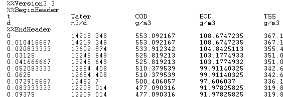
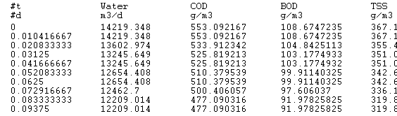
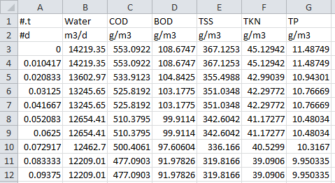
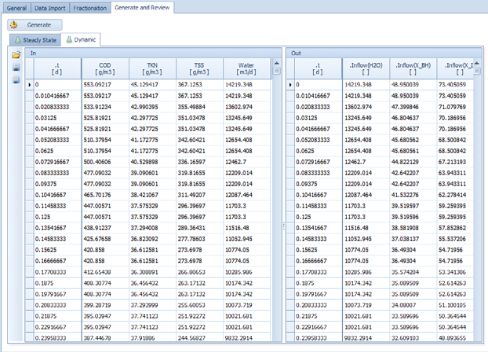
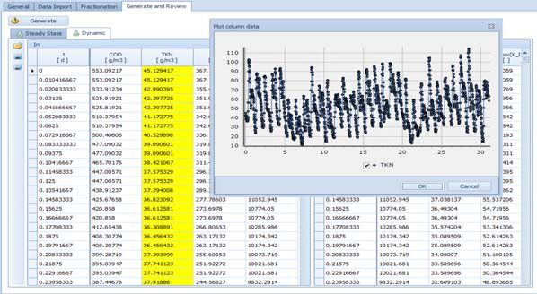
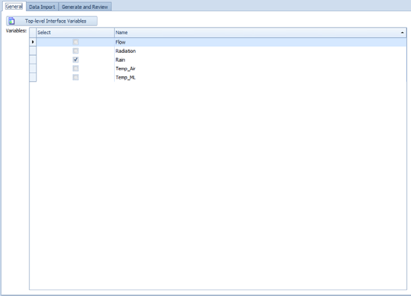
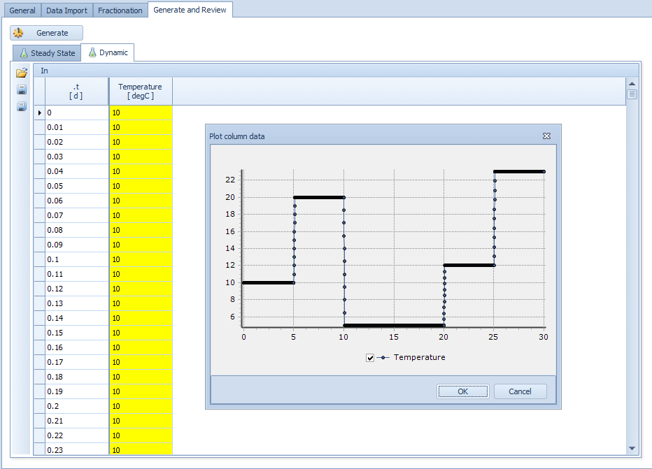
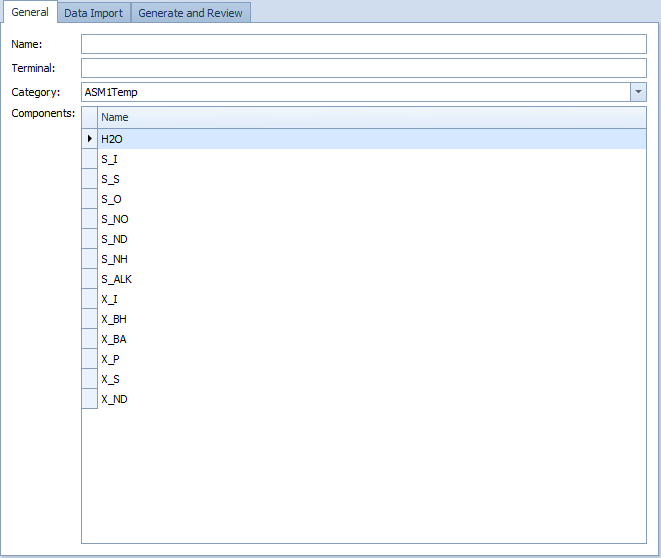

---
tags:
  - manuals
  - results
---

# Results and Output

**Summary:** How WEST writes simulation output to files, how to view results after a run, and how to export data to Excel.

**Prerequisites:** A configured simulation or advanced experiment (SA, UA, PE). See [Running Simulations](running-simulations.md).

---

## Overview

WEST writes simulation results to output files as a run executes. Each experiment has an **Output** tab in its Simulation Properties where you configure which quantities are recorded and at what interval. After a run completes, results can be inspected in the **Runs** tab, plotted as time series, or exported to Excel.

---

## Configuring simulation output

Open the **Output** tab of Simulation Properties to configure what is recorded.

### Output file settings

| Setting | Description |
|---|---|
| **File name pattern** | Base name for the output file. Use `{}` as a placeholder for the run number (e.g. `run_{}.out`). |
| **Communication interval** | How often WEST writes a value to the file (in simulation time units). |
| **Interpolation** | When enabled, WEST interpolates values at the exact communication interval rather than using the nearest solver step. |
| **Use Display Units** | When enabled, values are written in the display units configured for each quantity rather than the model's internal units. |

### Adding quantities to record

Quantities can be added to the output in two ways:

- **Drag and drop** a variable from the **Block Details** or **Block Summary** window onto the Output tab.
- Use the **+** / **–** buttons in the Output tab to add or remove quantities manually.

### Buffer output (WESTforAUTOMATION)

Buffer output is a separate output mode used with WESTforAUTOMATION. Additional settings:

| Setting | Description |
|---|---|
| **Start time** | Simulation time at which buffered output begins. |
| **Stop time** | Simulation time at which buffered output ends. |
| **Communication interval type** | **Linear** (fixed interval) or **Log** (logarithmically spaced intervals). |

---

## Viewing results after a run

### Results plot panel

After a run completes, open the Results tab to view time-series plots.

### Table output

Results can also be viewed as a table of values.

### Gauge widget

Dashboard gauges provide a real-time numeric readout of key variables during or after a run.

### Runs tab (advanced experiments)

In Scenario Analysis, Uncertainty Analysis, and Parameter Estimation experiments, the **Runs** tab displays a matrix with:

- One row per completed run.
- Columns for each varied parameter value used in that run.
- Columns for each computed objective value.
- The **best run** (lowest overall objective) is highlighted.

From the Runs tab you can:

| Button | Action |
|---|---|
| **Generate** | Create a new sample or parameter grid. |
| **Export** | Export the runs matrix to Excel (XLS or XLSX). |
| **Print** | Print the runs table. |
| **Copy Values** | Copy the selected run's parameter values back into the simulation. |
| **Run** | Execute the experiment. |
| **Plot** (SA only) | Generate instant histograms of objective values across runs. |

---

## Criteria types

Criteria define how raw time-series output is aggregated into scalar objective values. WEST supports four types:

### Time series criteria

Aggregate simulated data **across time** for a single run. Examples: mean effluent NH4 over the last 7 days of a run, maximum TSS over the entire run.

### Run criteria

Aggregate data **across runs** for a given time point. Available statistics:

- Minimum and maximum
- Mean and standard deviation
- Median
- Percentiles (user-defined)
- Skewness and kurtosis

### BVDF criteria (Bound Value Duration Frequency)

Analyse how often and for how long a variable violates upper or lower bounds. Reports:

- Number and percentage of lower-bound violations.
- Number and percentage of upper-bound violations.
- The same cross-run statistics as Run criteria (min, max, mean, std dev, median, percentiles, skewness, kurtosis).

### Classification criteria

Classify output values into user-defined classes (e.g. "good / acceptable / poor"). The same cross-run aggregation statistics as Run criteria are available for each class.

---

## Exporting results

### Export to CSV

### Export to Excel

### Output file configuration

### Export runs matrix to Excel

1. Open the **Runs** tab of the experiment.
2. Click **Export**.
3. Choose XLS or XLSX format and a save location.
4. The exported file contains one row per run with parameter values and objective values.

### Copy best run back to simulation

1. In the **Runs** tab, select the highlighted best run (or any run of interest).
2. Click **Copy Values**.
3. The parameter values for that run are written back to the base simulation, ready for further analysis or a single confirmatory run.
