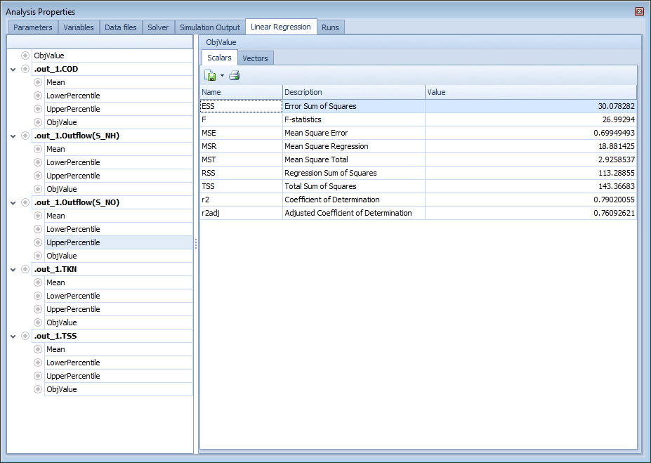
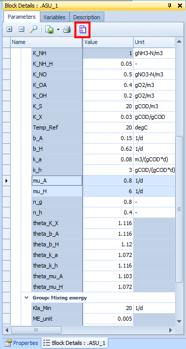

---
tags:
  - west-tools
  - block-editor
---

# Block Editor

The Block Editor is used to create and edit Block Icons — the graphical representations of process models that appear in WEST plant layouts. Block icons are distinct from the underlying mathematical models: a single model can have multiple icon representations. Users who build standard WEST simulations with the existing block library will not need this tool; it is relevant when introducing new models or customising the visual appearance of existing ones.

## How to access

**Project menu → Tools → Block Editor**

## Key features

- Create new block icons (graphical shape, colour, and label)
- Define the number, type, and position of terminals on each icon
- Manage existing block icon libraries (`.wbl` files)
- Published icons appear in the Block Library under a user-defined palette group, making them available in the layout canvas

## Related

- [Model Editor](model-editor.md)
- [Building a Plant Layout](../how-to/building-layouts.md)
