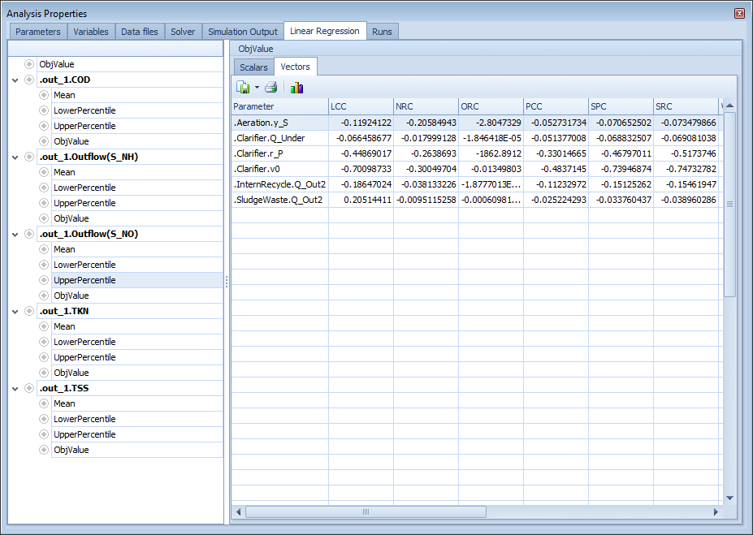
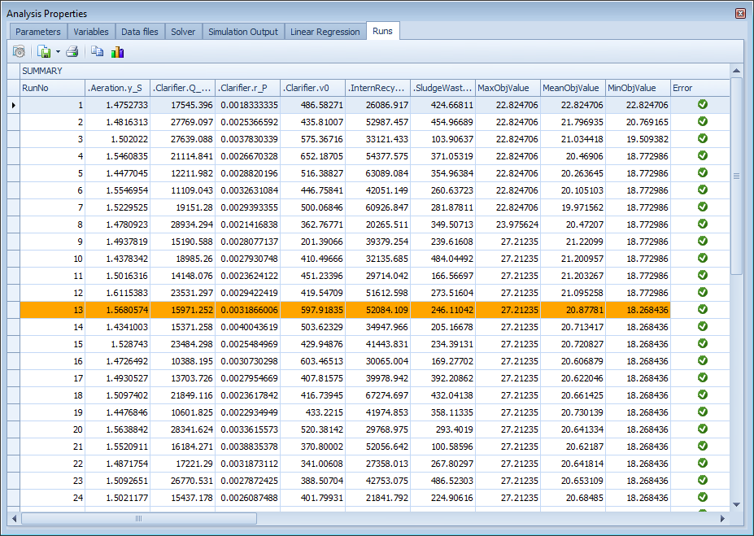
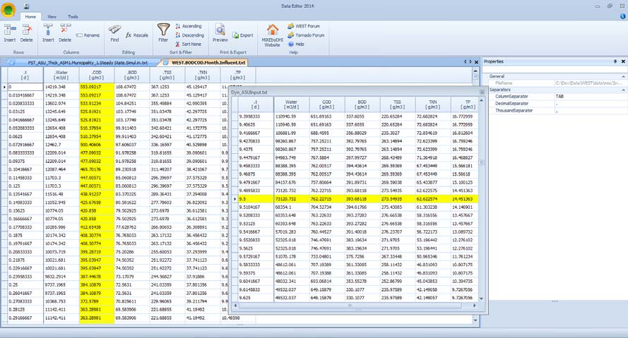

---
tags:
  - west-tools
  - data-editor
---

# Data Editor

The Data Editor is a spreadsheet-like tool for creating, viewing, and editing the input data files consumed by WEST simulations — primarily the `.txt` or `.xls` time-series files used by the Influent Tool. It is useful for any WEST user who needs to prepare or inspect influent data before running a simulation.

## How to access

- **File menu → New → Data**, or
- Double-click a data file in the project tree.

## Key features

- Create new time-series data files from scratch
- Import existing `.txt` or `.xls` files
- Edit individual data values in a tabular grid
- Plot time series for visual inspection of the data
- Check data file format and header consistency before use in a simulation

## Related

- [Managing Input Data](../how-to/managing-input-data.md)
- [Designer](designer.md)
