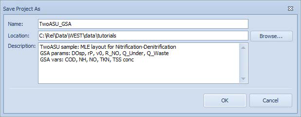
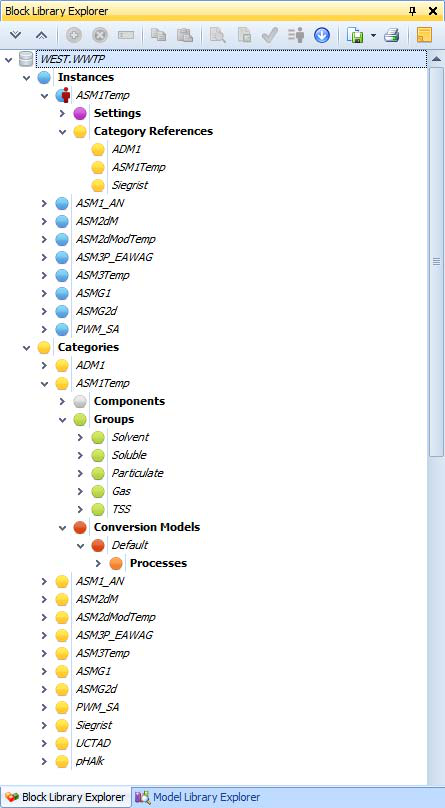
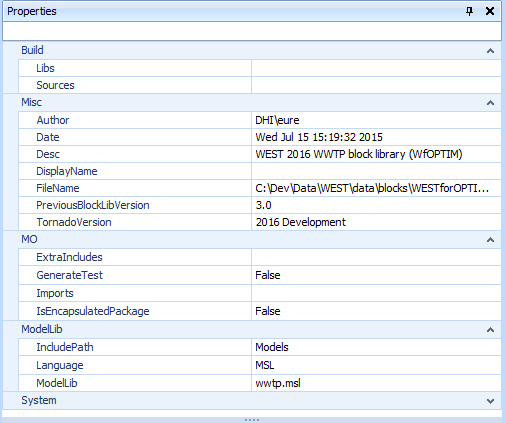
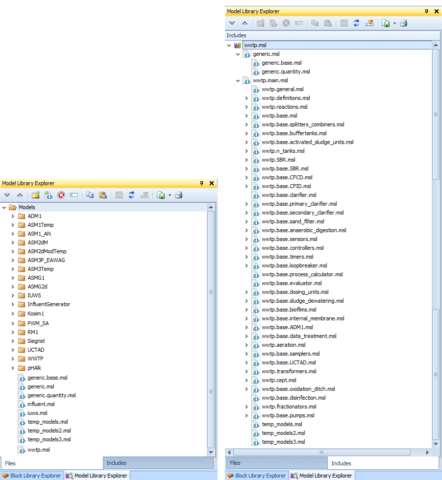
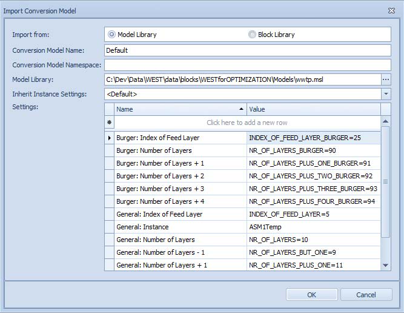
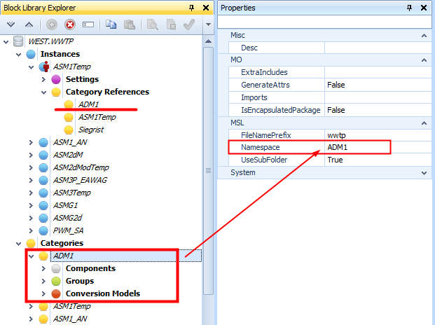

---
tags:
  - west-tools
  - model-editor
---

# Model Editor

The Model Editor is a text editor and compiler for WEST process models written in MSL (a Modelica-based modelling language). It is the primary tool for users who need to create or customise mathematical process models beyond what the built-in model library provides. Most standard WEST users will not need it; it is intended for advanced users and model developers who want to extend the model library.

## How to access

**Project menu → Tools → Model Editor**

## Key features

- Syntax-aware text editor for MSL (WEST model specification language)
- Built-in syntax checker that highlights errors before compilation
- Compilation of MSL source to optimised C++ for fast simulation execution
- Gujer matrix (stoichiometry/kinetics matrix) graphical editor — define biokinetic models without writing code directly
- Organised model library with **Categories** (groups of related model variants) and **Instances** (a category bundled with a temperature correction model)

## Typical workflow

1. Open the Model Editor from the Project menu.
2. Create or open a Block Library.
3. Add a new Category (new model) or import an existing one.
4. Edit the model in the Code Editor or the Matrix Editor.
5. Run syntax check, then generate/compile code.

## Related

- [Block Editor](block-editor.md)
- [Unit Editor](unit-editor.md)
- [Block Reference — Biological Models](../block-reference/biological-models.md)
