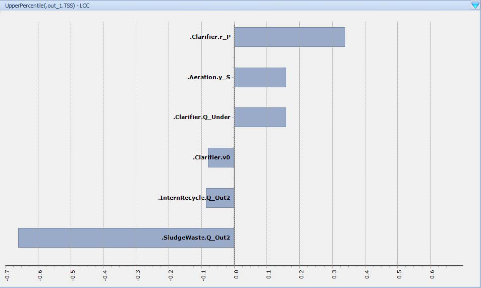

---
tags:
  - west-tools
  - unit-editor
---

# Unit Editor

The Unit Editor manages unit definitions and unit conversion factors within WEST. Most users will never need to open it — it is relevant only when working with non-standard data formats that require custom unit definitions, or when existing conversion factors need to be adjusted.

## How to access

**Project menu → Tools → Unit Editor**

## Key features

- View all units registered in WEST (e.g. m³/d, g COD/m³, °C)
- Edit conversion factors between unit systems
- Add custom units for non-standard or project-specific parameters
- Modify existing unit conversions without touching model source code

## Related

- [Model Editor](model-editor.md)
- [Data Editor](data-editor.md)
