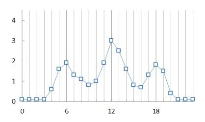
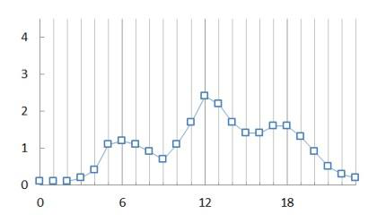
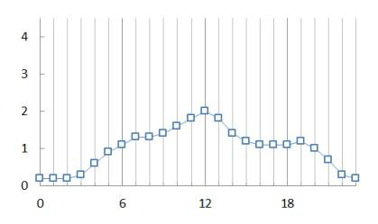
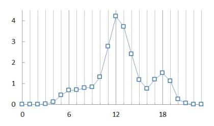
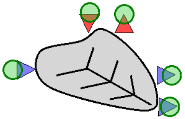
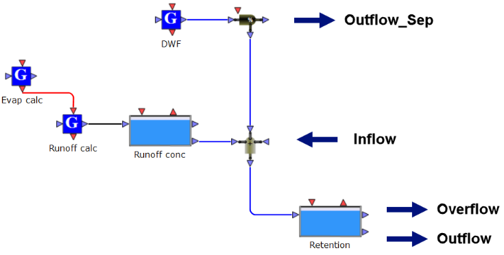
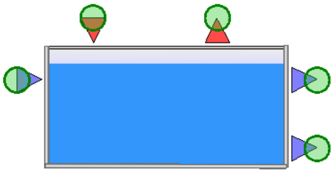
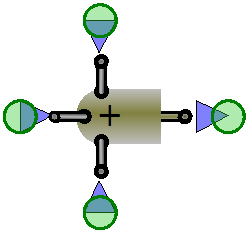
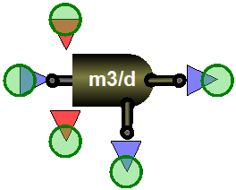
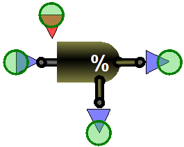

---
tags:
  - worked-examples
  - iuws
  - catchment
---

# Integrated Urban Water System (TWOASU_IUWS)

**Summary:** Extend the TwoASU model with a catchment, sewer network, and receiving river — modelling the full urban water cycle in one layout.

**Source:** WEST Getting Started Tutorial, Chapter 15.

**Prerequisites:** [TwoASU MLE Layout](twoasu-mle.md)

---

## What is an IUWS model?

An Integrated Urban Water System model connects:

1. **Catchment** — rainfall-runoff, surface runoff loads
2. **Sewer** — combined/separate sewer transport and storage
3. **WWTP** — the TwoASU treatment plant
4. **River** — receiving water quality

This allows assessment of combined sewer overflows (CSOs), storm events, and their downstream impact.

---

## Layout extension steps

### Step 1 — Adapt the WWTP layout

Start from the TwoASU project. Modify the influent block to accept:
- Dry weather flow (from DWF2 Generator)
- Storm runoff (from Catchment blocks)


The standard TwoASU layout has a single influent stream feeding the Combiner before the Anoxic tank. To accept both dry-weather and wet-weather inputs you need to restructure the influent end of the layout:

1. **Remove** the existing single `Influent` block.
2. **Add** a `DWF2` Generator block — this replaces the static influent file and generates a diurnal dry-weather flow pattern parameterised by average daily flow and load.









3. **Add** a `Combiner` (if not already present) immediately upstream of the Anoxic tank. This combiner will receive:
   - The DWF2 output (dry weather flow)
   - The sewer network overflow/overflow bypass stream (from Step 2)
4. **Add** a **storm bypass** path: connect a `FlowSplitter` at the inlet of the primary clarifier (or directly before the Anoxic tank) to a bypass channel that routes excess flow around the biological treatment when hydraulic capacity is exceeded. The bypass outlet rejoins the effluent stream before the final discharge point.
   - Set the bypass threshold flow (e.g. `Q_bypass_threshold = 3 × DWF`) in the splitter's control rule.
5. In the `DWF2` block properties, set:
   - `Q_avg` — average daily dry weather flow (e.g. 20 000 m³/d)
   - `Diurnal pattern` — select the default municipal diurnal curve or import a site-specific pattern
   - Pollutant concentrations (COD, NH4, TSS) consistent with the TwoASU influent characterisation


The WWTP layout is now ready to receive variable-flow inputs from the upstream sewer model.

---

### Step 2 — Set up the catchment and sewer layout

Add on a second layout region (or a linked sub-model) for:

- `DWF2` Generator — dry weather flow characterisation
- `Catchment.Combined_NoVol` or `Combined_WithVol` — surface runoff
- `SewerTank.Freeflow` / `Retention_NoVol` — sewer transport and CSO tank

**Catchment block (`Catchment.Combined_NoVol`):**



This block converts a rainfall timeseries into a runoff flow and pollutant load using a simple conceptual model.

| Parameter | Description | Typical value |
|---|---|---|
| `Area` | Total catchment area | 500–2 000 ha |
| `Imperviousness` | Fraction of impervious surface | 0.40–0.70 |
| `tc` | Time of concentration (sewer travel time) | 15–45 min |
| `C_COD` | Runoff COD concentration | 100–300 mg/l |
| `C_NH4` | Runoff ammonium | 1–5 mg N/l |
| `C_TSS` | Runoff TSS | 100–400 mg/l |

Connect the rainfall timeseries input file (`.txt` with columns: time [d], intensity [mm/h]) to the `Rainfall` input port of the catchment block.

Use `Combined_WithVol` if you want to model sewer storage explicitly within the catchment (adds a detention volume parameter `V_sewer`).

**Sewer network blocks:**




Use `Combined_WithVol` for sewer layouts that include in-network storage:




The sewer block combines the DWF2 flow and catchment runoff, routes it through the network, and triggers a CSO discharge when the combined flow exceeds the sewer capacity.

| Parameter | Description | Typical value |
|---|---|---|
| `V_tank` | Sewer retention volume | 500–5 000 m³ |
| `Q_overflow_threshold` | Flow above which CSO occurs | 3–5 × DWF |
| `Q_to_WWTP_max` | Maximum flow forwarded to WWTP | 3 × DWF |
| `tc_network` | Network routing delay | 10–30 min |

Connect the sewer block outputs:
- **To WWTP** port → Combiner at the WWTP inlet (replaces or supplements the DWF2 stream)
- **CSO overflow** port → River block CSO input port (Step 3)

**Combiners and splitters:**








---

### Step 3 — Set up the river layout

Add river blocks downstream of the WWTP effluent and CSO discharge points. The river is modelled as one or more `River.CSTR` (continuously stirred) or `River.PlugFlow` reaches in series.

**Minimum layout:**

```
WWTP effluent ──────────────────────────────┐
                                             ↓
CSO discharge point → River Reach 1 (upstream) → River Reach 2 (downstream) → ...
                            ↑
                   Background river flow (upstream boundary)
```

**Add blocks:**

1. **`River.Upstream_Boundary`** — sets the upstream river conditions (flow and quality before any WWTP/CSO inputs).
2. **`River.CSTR` or `River.PlugFlow`** (one per reach) — models transport, dilution, reaeration, and in-stream BOD/N/DO processes.
3. **`Combiner`** nodes — mix the upstream river flow with WWTP effluent and CSO inputs at the correct reach.

**Key parameters per river reach:**

| Parameter | Description | Typical value |
|---|---|---|
| `Q_river_upstream` | Background river flow | 1–50 m³/s |
| `Volume` (or `Length` + `Width` + `Depth`) | Reach volume | 5 000–50 000 m³ |
| `kLa` | Reaeration rate constant | 0.5–5 /d (higher for shallow, turbulent rivers) |
| `DO_upstream` | Upstream DO concentration | 8–10 mg O₂/l |
| `NH4_upstream` | Upstream ammonium | 0.1–1.0 mg N/l |
| `Temperature` | River water temperature | 10–20 °C |

For DO sag assessment, enable the **Streeter-Phelps** sub-model within the river reach block (checkbox in block editor: "Include carbonaceous BOD and reaeration").

---

### Step 4 — Run the simulation

**Inputs required:**

- A rainfall event timeseries (`.txt` file, columns: `time [d]`, `rainfall [mm/h]`) — use the tutorial file `WEST.Rainfall.Event.txt` or a synthetic 1-hour storm of 15 mm/h peak.
- Upstream river boundary conditions (constant or timeseries).

**Simulation procedure:**

1. Set the simulation type to **Dynamic** (Experiment → Dynamic Simulation).
2. Set the **simulation period** to cover at least one storm event plus 2–3 days of recovery, e.g. 7 days.
3. Use the **VODE** or **LSODA** integrator (recommended for stiff systems with fast catchment dynamics and slow biological dynamics).
4. Set `t_start = 0 d`, `t_end = 7 d`, with output reporting every 15 minutes (`dt_output = 0.01 d`).
5. Click **Run**.

**What to observe:**

| Output | Expected behaviour during storm |
|---|---|
| Sewer flow to WWTP | Rapid rise to `Q_to_WWTP_max`, plateau, then recession |
| CSO discharge flow | Spikes when sewer threshold exceeded; integrated volume = CSO event load |
| WWTP effluent NH4 | Rises during storm as HRT shortens and biological treatment is diluted/bypassed |
| WWTP effluent TSS | Spike from bypass flow carrying unsettled solids |
| River DO (Reach 1) | DO sag 12–24 h after CSO discharge due to BOD load; recovers via reaeration |
| River NH4 (Reach 1) | Concentration peak, then dilution and nitrification recovery |

**Typical results for a 1-hour, 15 mm/h storm on a 1 000 ha catchment (40 % impervious):**

- CSO volume: ~20 000–40 000 m³
- River DO minimum: 4–6 mg O₂/l (sag occurs ~6–12 km downstream or ~18 h later)
- WWTP effluent NH4 peak: 15–25 mg N/l during bypass period
- Recovery to normal effluent quality: 12–24 h after storm

Use the **Time Series** plot panel to overlay CSO flow, WWTP effluent quality, and river DO on a single timeline for reporting.

---

## Related

- [TwoASU MLE Layout](twoasu-mle.md)
- [Advanced Processes — Catchment blocks](../block-reference/advanced-processes.md)
