---
tags:
  - worked-examples
  - twoasu
---

# TwoASU MLE Layout

**Summary:** The standard WEST sample project — a Modified Ludzack-Ettinger (MLE) layout with two activated sludge tanks, a secondary clarifier, and DO control.

**Source:** WEST Getting Started Tutorial, Chapters 7–8.

---

## Layout

The TwoASU project models a typical municipal WWTP for biological nitrogen removal:

```
Municipal influent → Combiner → Anoxic tank (2 000 m³) → Aerobic tank (4 000 m³) → Clarifier
                          ↑                                                               |
                    Loop breaker ← Internal recycle splitter (55 338 m³/d) ←────────────┘
                                                                                         |
                                                       Wastage (385 m³/d) → Effluent (sludge)
```

**Model Instance:** ASM1Temp  
**Biological model:** ASM1 (nitrification + denitrification, no P removal)  
**Controller:** PI controller maintaining aerobic tank DO at 1.5 mg O₂/l

For build instructions, see the [Quick Start Tutorial](../getting-started/quick-start.md).

---

## Starting a new project

Open WEST and select **File → New Project**. In the New Project dialog, choose the template **"Blank project"**, set the project name to `TwoASU_MLE`, and select the model Instance **ASM1Temp**. Click **OK**. WEST creates the project and opens an empty canvas. Save the project immediately to a local folder using **File → Save**.

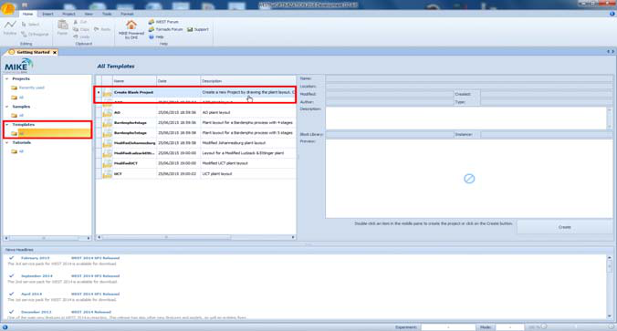

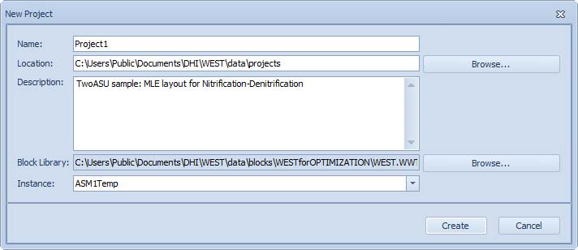

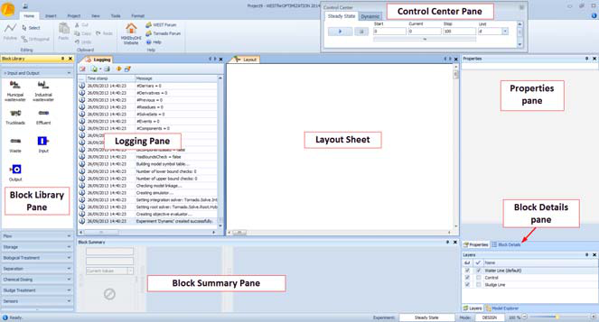

---

## Building the layout

Build the MLE layout by dragging blocks from the Block Library onto the canvas and connecting them in order:

1. **`Influent`** block — from the *Input and Output* palette. This is the entry point for the municipal wastewater feed.
2. **`VolumeConstant` (AnoxicZone)** — from the *Biological Treatment* palette. Rename the block `AnoxicZone`. This represents the anoxic (pre-anoxic) tank used for denitrification.
3. **`VolumeConstant` (AerobicZone)** — add a second `VolumeConstant` block and rename it `AerobicZone`. This is the nitrification tank with DO control.
4. **`SecondaryClarifier.Takacs_SVI`** — from the *Clarifiers* palette. Provides 1D settling with SVI-corrected settling velocity.
5. **`Effluent`** block — from the *Input and Output* palette. Receives the treated effluent from the clarifier overflow.
6. **`Splitter2` (RAS splitter)** — from the *Splitters* palette. Added at the clarifier underflow to split the return activated sludge (RAS) from the waste activated sludge (WAS). Connect the RAS outlet back to the `AnoxicZone` inlet; connect the WAS outlet to a second `Effluent` block (waste sludge).
7. **`Splitter2` (IR splitter)** — add a second `Splitter2` at the `AerobicZone` outlet to create the internal recirculation (IR) stream. Connect one outlet back to the `AnoxicZone` inlet and the other forward to the clarifier inlet.

Final connection sequence: **Influent → AnoxicZone → IR Splitter → AerobicZone → Clarifier → Effluent**; clarifier underflow → RAS Splitter → AnoxicZone (RAS) and Effluent (WAS); IR Splitter recycle → AnoxicZone.

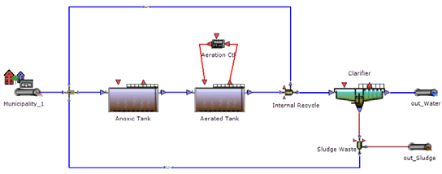

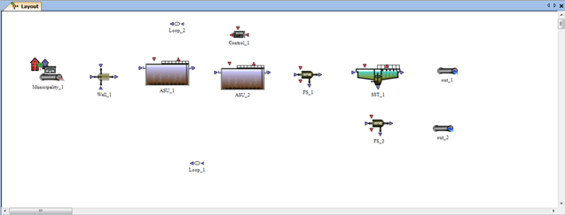

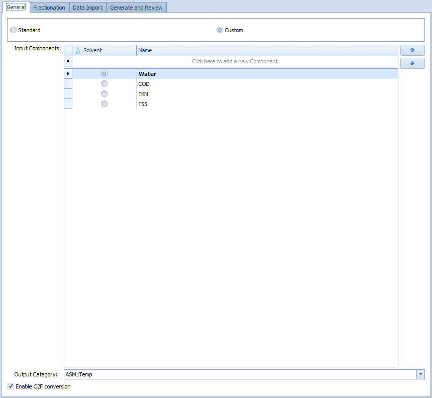

---

## Configuring influent fractionation and input data

Double-click the **Influent** block to open its settings, then navigate to the **Fractionation** tab. Select the **"Municipal wastewater"** template from the drop-down list. Enter the following bulk influent concentrations:

| Parameter | Value | Units |
|---|---|---|
| Flow rate Q | 10 000 | m³/d |
| COD | 450 | g/m³ |
| TKN | 45 | g/m³ |
| TSS | 300 | g/m³ |

Click **"Generate fractionation"**. WEST automatically splits the bulk characterisation into the ASM1 model components: `S_S` (readily biodegradable COD), `X_S` (slowly biodegradable COD), `X_BH` (active heterotrophs), `X_I` (inert particulate COD), `S_NH` (ammonium-N), `S_ND` (soluble organic nitrogen), and `X_ND` (particulate organic nitrogen). Review the generated fractions and adjust if site-specific data are available. Close the dialog to apply the settings.

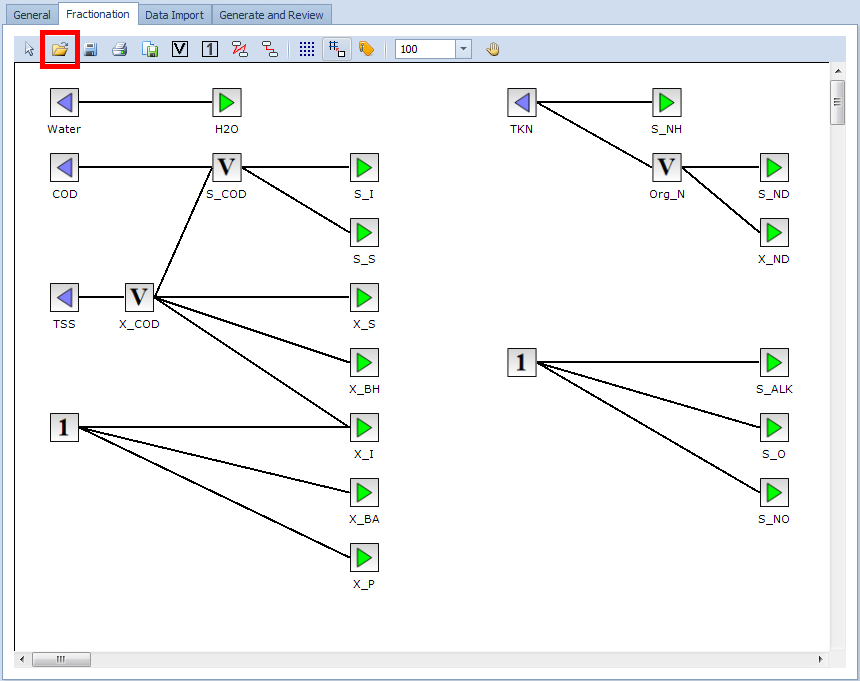

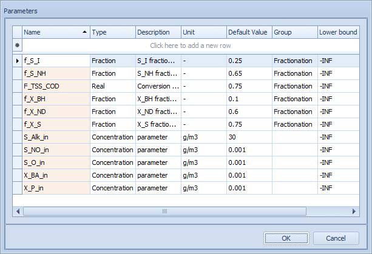

---

## Key parameters

| Block | Parameter | Value |
|---|---|---|
| Anoxic tank | Volume | 2 000 m³ |
| Aerobic tank | Volume | 4 000 m³ |
| Aerobic tank | DO set-point | 1.5 mg O₂/l |
| Clarifier | Underflow Q | 18 831 m³/d |
| Internal recycle | Flow | 55 338 m³/d |
| Wastage | Flow | 385 m³/d |

---

## Steady-state results

Typical effluent concentrations at steady-state:

| Variable | Value |
|---|---|
| COD | ~46 mg/l |
| NHx | ~7.6 mg/l |
| NOx | ~6.5 mg/l |
| TSS | ~15.9 mg/l |

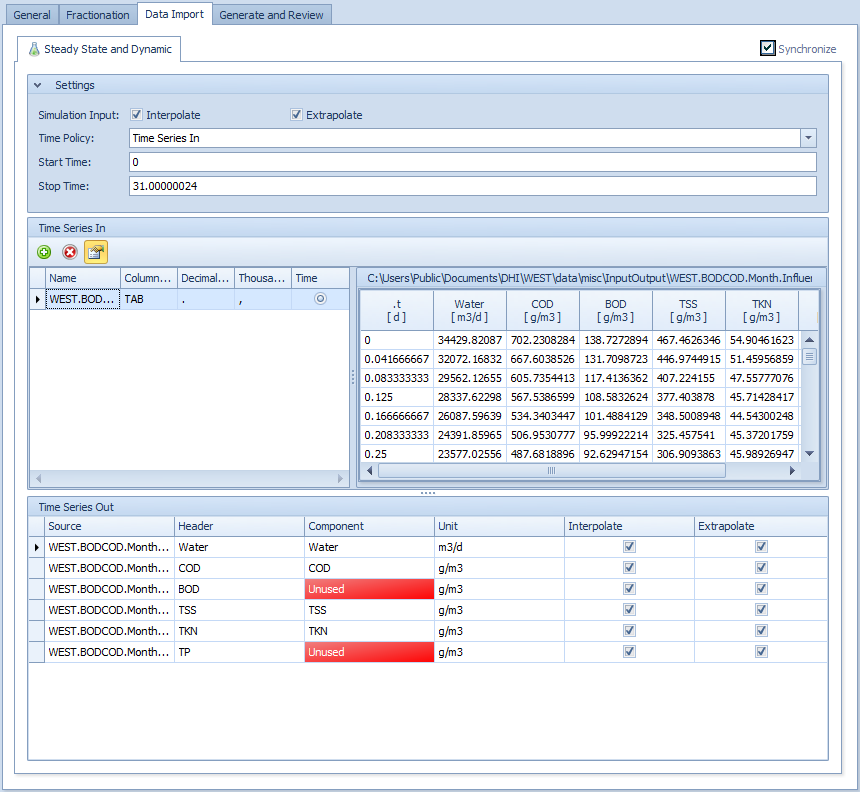

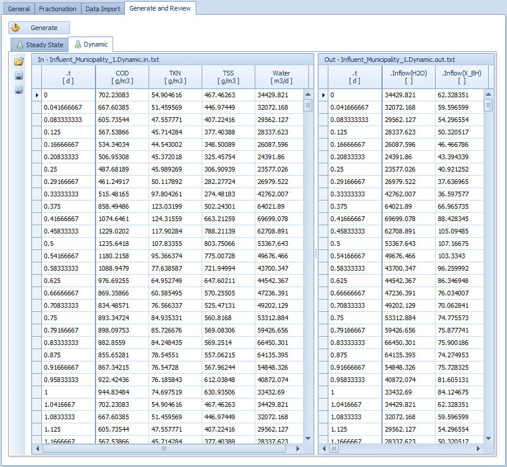

---

## Dynamic results (30-day run)

Running with `WEST.BODCOD.Month.Influent.txt` (monthly load variation, VODE integrator):

| Variable | Mean ± StDev | 5–95 percentile |
|---|---|---|
| COD | 46.1 ± 5.8 mg/l | 36.1–54.1 |
| NHx | 7.6 ± 6.3 mg/l | 0.5–21.4 |
| NOx | 6.5 ± 2.1 mg/l | 3.4–10.5 |
| TSS | 15.9 ± 3.0 mg/l | 12.3–21.6 |

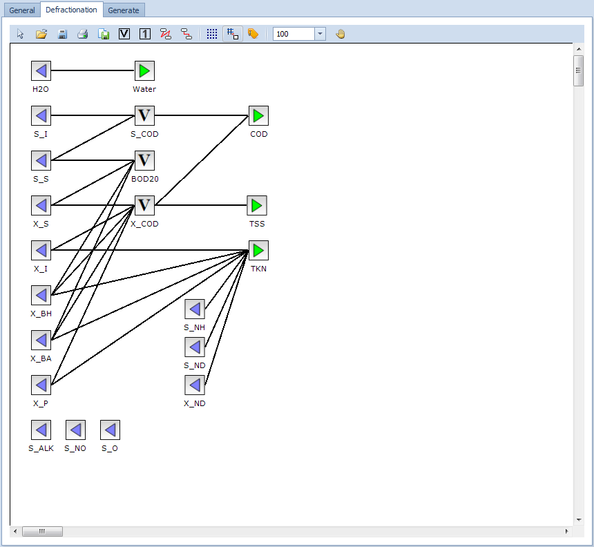

---

## Further analysis

This project is the starting point for the advanced experiment tutorials:

- [Sensitivity Analysis](../experiment-types/sensitivity-analysis.md) — which parameters drive TSS and NO?
- [Parameter Estimation](../experiment-types/parameter-estimation.md) — calibrate to real plant data
- [Scenario Analysis](../experiment-types/scenario-analysis.md) — compare operating strategies
- [Uncertainty Analysis](../experiment-types/uncertainty-analysis.md) — propagate parameter uncertainty

---

## Related

- [Quick Start Tutorial](../getting-started/quick-start.md) — step-by-step build instructions
- [Running Simulations](../how-to/running-simulations.md)
